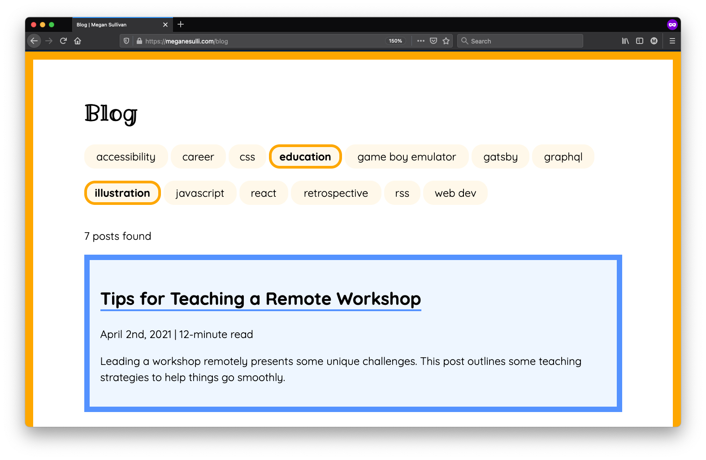

I recently added a new feature to my blog page: post filters! Now, you can see the different topics I've written about, and you can click one or more of the tags to filter the list of posts.

In this post, I'll talk through how I tested and updated this new feature to make sure it was accessible for assistive technology users. I'll talk about:

* Live regions and why they are important to assistive technology users
* The `aria-live` attribute
* The `aria-atomic` attribute
* The status message role and how it relates to `aria-live` and `aria-atomic`

## Initial Behavior

To make sure this new feature was accessible before releasing it, I tested it out with a screen reader. I wanted to make sure that it was clear to assistive technology users what happened on the page when they clicked a tag button.

// Describe the feature
// Describe how it worked initially. You could click the buttons, but the screen reader just said "selected" (double-check the behavior).

When I clicked on a post filter, the screen reader would just say, "Selected." Visual users would be able to see that the list of posts updated to include different content. But screen reader users wouldn't have any way of knowing what effect clicking the filter button had on the rest of the page.

// Why is this a problem? It's not clear for a screen reader user that there was another effect of clicking the button (updating the list of posts)

Instead, it would be better if screen reader users could hear an update after pressing a filter button, so they would know that the filter was applied and that the list of posts updated. 

> For more information on this behavior, see [WCAG Success Criterion 4.1.3: Status Messages](https://www.w3.org/WAI/WCAG22/quickref/?showtechniques=413#status-messages).

## Adding `aria-live` to Create a Live Region

Initially, I added "aria-live=polite" to the post counter paragraph, so that assistive technologies (AT) would read out an update after users selected/deselected a filter.

But when I tested it out, VoiceOver just read out the number. Like "7" or "5". No context. 7 what?

It turns out that, with aria-live, AT only reads out the content that changed.

So when the user adds a new filter and the post count text changes from "5 posts found" to "7 posts found", React doesn't rerender the "posts found" part, which means it won't get read out by AT.

## Adding `aria-atomic` to Read the Full Post Count Text

To make the screen reader say the full paragraph, I needed an additional ARIA attribute: aria-atomic.

This tells the screen reader to always read out the entire live region, even if only one piece of the content changed.

So now selecting a filter says, "[X] posts found."

Here's a tiny CodePen to highlight the difference.

Try commenting out the aria-atomic attribute on the paragraph element to hear the difference when you click the button with a screen reader.

<iframe style="width: 100%; border: none; min-height: 400px;" title="aria-live example (with aria-atomic) (in React)" src="https://codepen.io/meganesu/embed/preview/eYgaoRW?height=265&theme-id=dark&default-tab=js,result" loading="lazy" allowtransparency="true" allowfullscreen="true">
  See the Pen <a href='https://codepen.io/meganesu/pen/eYgaoRW'>aria-live example (with aria-atomic) (in React)</a> by Megan Sullivan
  (<a href='https://codepen.io/meganesu'>@meganesu</a>) on <a href='https://codepen.io'>CodePen</a>.
</iframe>

## Summary

## Additional Resources

* [ARIA Live Regions](https://developer.mozilla.org/en-US/docs/Web/Accessibility/ARIA/ARIA_Live_Regions) (MDN)
* [WCAG 2.2 Success Criterion 4.1.3: Status Messages](https://www.w3.org/TR/WCAG22/#status-messages) (W3C Web Accessibility Initiative)
* [Understanding Success Criterion 4.1.3](https://www.w3.org/WAI/WCAG22/Understanding/status-messages.html) (W3C Web Accessibility Initiative)
* [How to Meet WCAG 4.1.3 (Quick Reference)](https://www.w3.org/WAI/WCAG22/quickref/#status-messages) (W3C Web Accessibility Initiative)

---

http://meganesulli.com/blog

Along the way, I learned some new things about ARIA attributes for live content updates in React.

Initially, I added "aria-live=polite" to the post counter paragraph, so that assistive technologies (AT) would read out an update after users selected/deselected a filter.

But when I tested it out, VoiceOver just read out the number. Like "7" or "5". No context. 7 what?

It turns out that, with aria-live, AT only reads out the content that changed.

So when the user adds a new filter and the post count text changes from "5 posts found" to "7 posts found", React doesn't rerender the "posts found" part, which means it won't get read out by AT.

To make the screen reader say the full paragraph, I needed an additional ARIA attribute: aria-atomic.

This tells the screen reader to always read out the entire live region, even if only one piece of the content changed.

So now selecting a filter says, "[X] posts found."

Here's a tiny CodePen to highlight the difference.

Try commenting out the aria-atomic attribute on the paragraph element to hear the difference when you click the button with a screen reader.

<iframe style="width: 100%; border: none; min-height: 400px;" title="aria-live example (with aria-atomic) (in React)" src="https://codepen.io/meganesu/embed/preview/eYgaoRW?height=265&theme-id=dark&default-tab=js,result" loading="lazy" allowtransparency="true" allowfullscreen="true">
  See the Pen <a href='https://codepen.io/meganesu/pen/eYgaoRW'>aria-live example (with aria-atomic) (in React)</a> by Megan Sullivan
  (<a href='https://codepen.io/meganesu'>@meganesu</a>) on <a href='https://codepen.io'>CodePen</a>.
</iframe>

---

I added post filters to my blog. I got the main functionality working, and then wanted to make it accessible.

Along the way, I learned about two ARIA attributes: `aria-live` and `aria-atomic`.

## Problem

When someone uses assistive technology to read out what's happening on the page, it's not clear what happens when you click one of the filter buttons. You can't see that the list of posts or post count has updated. That's where `aria-live` comes in.

// CODE EXAMPLE WITHOUT ARIA

## `aria-live`

You can set the `aria-live` attribute on an element to turn it into a [live region](https://developer.mozilla.org/en-US/docs/Web/Accessibility/ARIA/ARIA_Live_Regions). That means that when the content in that element changes, assistive technologies will read out an extra message with the new content.

It has two main settings: `polite` and `assertive`. You use polite for most things, which means the assistive technology will wait until the current message is done being read before reading out the update. If you use assertive, the message will interrupt whatever is currently being read to broadcast the updated content. You should only use that for things like error messages or warnings.

By adding `aria-live="polite"` to my post count paragraph, it would read out the following update when a user clicks a new filter:

// POST VIDEO OF INTERACTION
// VIDEO DESCRIPTION COLLAPSIBLE SECTION (alt)

Now it reads out an update with the new number of posts. But just the number "8" on its own isn't enough context to really understand what was updated. That's where `aria-atomic` comes in.

// CODEPEN WITH ARIA LIVE

## `aria-atomic`

With aria-live, only the content that changes will be read out. In our case, the number of posts being displayed. But what I wanted was for the full post count element to be read out. "7 posts found."

You can use `aria-atomic` to tell assistive technologies that an element should be treated as a whole. To do that, set `aria-atomic` to `"true"`. (It's `false` by default.)

Now when you select or deselect a filter, assistive technologies will read out the full post count text the update: "7 posts found."

// CODEPEN WITH ARIA ATOMIC

## `role="status"`

You can use `role="status"` instead of `aria-live` and `aria-atomic`. It does the same thing. (Sets `aria-live="polite"` and `aria-atomic="true"`.)

https://www.w3.org/WAI/WCAG21/Techniques/aria/ARIA22

* WAI-ARIA 1.2 `status` role definition: https://www.w3.org/TR/wai-aria-1.2/#status

## Wrap It Up

If your MVP isn't accessible, it isn't done. You can use ARIA to improve the user experience for assistive technology users.

## Additional Resources

* [MDN Docs: ARIA Live Regions](https://developer.mozilla.org/en-US/docs/Web/Accessibility/ARIA/ARIA_Live_Regions)
