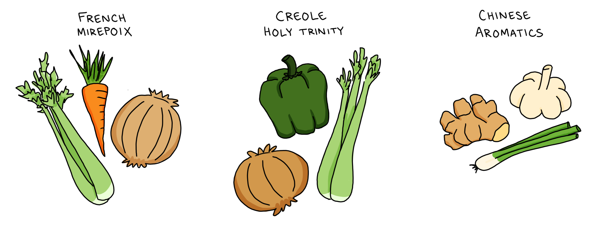
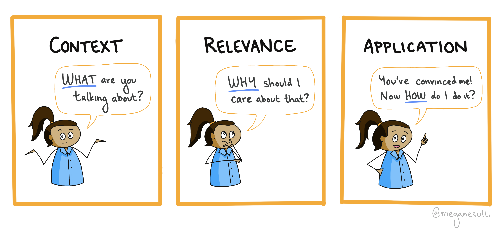

## Introduction

Let's talk about cooking. Specifically, let's talk aromatics. (Stay with me, it's going to tie into educational content, I promise.)

In many recipes, you start by cooking the aromatics—the vegetables and herbs that form the flavor base for the rest of the dish. Each culture has its own signature set of aromatics. French dishes use mirepoix: celery, carrots, and onions. Creole dishes use the Holy Trinity: green bell peppers, celery, and onions. Chinese dishes use ginger, garlic, and scallions. These aromatic combinations lay a strong foundation of flavor that the rest of the ingredients can build on.

Similarly, a compelling piece of educational content includes three key ingredients: **context**, **relevance**, and **application**. Together, these ingredients add layers to your writing that engage readers and add interest to even the driest technical concepts. In this article, I'll show you how to use this framework to improve your next documentation reference, blog post, or video script.

<CalloutBox>
  Special shoutout to [Sarah Hutt](https://www.cavepro.com/about), who introduced me to this framework when I was a curriculum developer at Girls Who Code.
</CalloutBox>

## The Framework: Context, Relevance, Application

Let's start by taking a closer look at each of these ingredients:

### **Context**: What are you talking about?

When someone lands on your content, they're coming in with their own background and experiences. They don't know what your post is going to be about. You have to set the stage for them, to build a shared understanding before you dive into the details of your post.

How can you provide context?

- In your introduction, take a step back and explain the high-level view of what you're going to be talking about.
- Define any key terms or concepts that readers will need to understand. Be conversational, and avoid jargon as much as possible.
- Link out to resources for any prerequisite knowledge you're assuming readers will possess.

### **Relevance**: Why should I care about that?

This is where you motivate your readers to keep reading. Convince them that what you're talking about will help them. What's the value add? How will it make their lives easier?

Usually, the relevance follows naturally from the context. Start by introducing what your topic is, then transition into why it's important.

### **Application**: How do I do it?

Once you've convinced readers that your topic is worth talking about, show them the real-world application. Use code examples and self-contained demos. (This is the piece that most technical writing already does well!)

## Putting the Framework to Use

When I outline a new post, I start by figuring out the context, relevance, and application for the piece. I write them on a sticky note or at the top of my doc so that I can keep them top of mind as I work. If I get stuck trying to decide whether or not to include something in my post, I look back at those notes and ask myself if the topic ties back into one of those three key ingredients.

Once I'm writing out actual content, I tend to put my context and relevance in the introduction, to help the reader get situated. Then the main body of my post focuses more on application. But you can also sprinkle in more context and relevance as needed! For example, if your post has code snippets, you can include some text beforehand to explain what the code does and why that's useful.

## A Real-World Example

Let's see this framework in action! This example is from a blog post I wrote on [How to Run a Sprint Retrospective](https://meganesulli.com/blog/how-to-run-a-retro/).

### Context

> A retrospective (or retro, for short) is a type of meeting where teammates reflect back on how they worked together over a period of time. Typically, retros are run at the end of an Agile sprint, usually every 2-4 weeks. In a retro, the team looks back on their accomplishments and brainstorms ways to make work more efficient and enjoyable in future sprints.

This paragraph from the introduction quickly tells readers what a retro is and what kinds of activities a retro includes. It doesn't get into any of the details yet. The goal right now is to provide just enough of a high-level overview so that readers can understand the big idea.

### Relevance

> When you work on a team for a while, sometimes there's friction. Building software is hard, both from the technology side and the people side. There's a lot to balance—clashing personalities, different working preferences, team norms and expectations. But it's not always easy to bring up those issues when you're in the middle of the day-to-day grind. Sprint retrospectives provide a consistent safe space where teammates can bring up the challenges they're facing and find ways to work through them together.

This paragraph explains the benefit of retros: they provide set times for teammates to acknowledge and work through conflicts so that they can work together better in the future.

### Application

The application spans the rest of the post, which explains how to facilitate a retrospective. To help readers digest the information, the instructions are broken down into sections for what to do before, during, and after the meeting. Those sections are then broken down further into smaller steps.

<CalloutBox>
  **Another Example**

  Let's get a little meta. Here's the framework applied to this blog post:

  - **Context** (What): A framework to keep in mind when writing, so that you keep your writing reader-centered.
  - **Relevance** (Why): You want your readers to understand what you're talking about and achieve the learning goals you intended for them.
  - **Application** (How): How to use the framework in practice. Show an example from an existing article.
</CalloutBox>

## Wrap It Up

"Context, Relevance, Application" has become a mantra for me while I'm writing educational content. When I find myself paralyzed by writer's block or struggling to untangle the mess of ideas in my first draft, I come back to those three key ingredients. It's the best way I know to write things that people can actually understand and put to use. Hopefully it helps you too!

Want to learn how to write documentation for a wide variety of users? Check out my post on how to write [Docs for Everyone!](https://meganesulli.com/blog/docs-for-everyone/)
