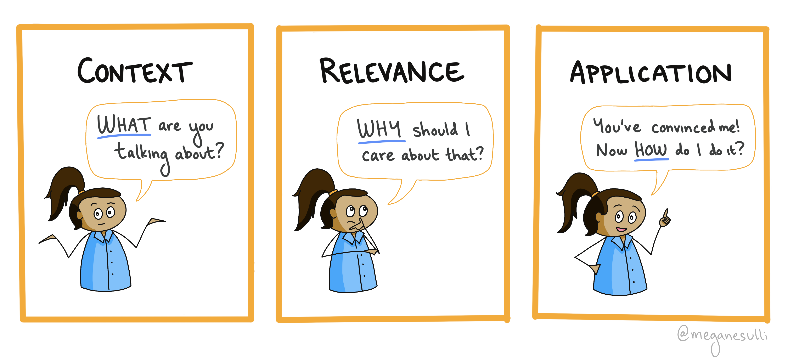

## Introduction

TL;DR: In order to help your users care about what you're writing, you need to put yourself in their mindset. To do that, think about the context, relevance, and application for your content.

TL;DR: Every piece of content should have context, relevance, and application. This makes it easier for readers to follow and engage with your writing.

Context (WHAT): A framework to keep in mind when writing, so that you keep your writing reader-centered.

Relevance (WHY): You want your readers to understand what you're talking about and achieve the learning goals you intended for them.

Context: I used to be a curriculum writer, and Sarah Hutt taught me this framework to use to make our Clubs curriculum more engaging for students.

Relevance: If you're going to put effort into writing something, you should make sure it's good. Using a reader-driven approach to writing helps you be a more effective communicator. It makes sure the post you end up with actually serves a reader's needs. You have to take them on a journey (storytelling).

Application: How to use the three elements. Show an example.

Before I became a full-time software developer, I was a curriculum writer at a non-profit called [Girls Who Code](https://girlswhocode.com). While I was there, I created learning experiences for middle- and high-school girls, to spark an interest in computer science.

One of the challenges of writing for younger audiences is finding ways to make nitty-gritty technical topics exciting. (Have you ever tried to get a room full of 12-year-olds excited about variables?) When you're writing technical content, sometimes you feel like you have to sacrifice conversational language in the name of technical accuracy. Technical content can be dry and sterile, but it doesn't have to be! During my time at Girls Who Code, my team worked with an advisor named [Sarah Hutt](https://www.cavepro.com/about), who helped us put some fun and life back into the curriculum. She gave us a list of three key elements that help readers feel invested in your writing: context, relevance, and application.

// Set up the story. Context: I was writing curriculum at Girls Who Code. Our team worked with an advisor named [Sarah Hutt](https://www.cavepro.com/about) who had lots of experience writing technical content for young audiences. She reviewed our materials for the Clubs curriculum - self-guided learning pathways that taught students foundational programming concepts (variables, loops, conditionals, functions). 

When I was a curriculum developer, an advisor told me that there are three things that every piece of educational content needs:

* Context
* Relevance
* Application

These three elements work together in your writing, to help your learner get from point A to point B. They help put you in your reader's mindset. Think through the journey they're going on as they read your content.

Here's a short post on what they are and how I use them to improve my teaching and technical writing.

## The Framework
### Context: "What are you talking about?" 🤷‍♀️

People who end up on your doc/tutorial/blog post are all coming in with different backgrounds and experience levels.

You have to set the stage for them, to build a shared understanding before you dive into the details of your post. Background information.

How to provide context?

• Give a big picture view of what you're going to be talking about.
• Define any key terms or concepts that readers will need to understand. Be conversational, and avoid jargon as much as possible.

### Relevance: "Why should I care about that?" 🤔

This is where you motivate your readers to keep reading. Convince them that what you're talking about will help them.

What's the value add? How will it make their lives easier?

Usually follows naturally from the Context. Introducing what your topic is, then transition into why it's important.

### Application: "You've convinced me. Now how do I do it?" 💪

Once you've convinced readers that your topic is worth talking about, show them the real-world application. Use code examples and self-contained demos.

(This is the piece that most technical writing already does well!)

## Using the Framework

Application (HOW): Identify your CRA when outlining your post. Write it on a sticky note or at the top of your doc, so you can refer back to it as you write. If you get stuck trying to decide whether to include something, look back at your notes and ask yourself if that information helps your reader get closer to achieving the learning goals.

When I'm outlining a new post, I'll start by writing down the context, relevance, and application for the content.

I like to keep these three pieces in mind from the start of the writing process, because it helps me stay in a reader-centered frame of mind.

When it comes to actually writing the content, I tend to put my context and relevance in the introduction, to help the reader get situated.

Then the main body of my post focuses more on application. (But you can also sprinkle in more context and relevance as needed!)

## See It In Action

Here's an example, based on Part 3 of the new #GatsbyTutorial, which is about adding plugins to your Gatsby site.

(Here's the link, if you want to see it in context:
https://gatsbyjs.com/docs/tutorial/part-3/
)

Context: "A plugin is an npm package that you install to add extra features to your site. Some plugins provide pre-built components, others add analytics, others let you pull data into your site. You can think of a plugin as an accessory for your site."

Relevance (1/2): "You don’t *need* to use plugins - you could build out the same functionality from scratch yourself - but they save you time."

Relevance (2/2): "They’re like those fancy single-purpose cooking gadgets that peel apples or crush garlic. You could accomplish the same task using a regular knife, but it’s often faster to use a tool that’s built to do that one specific job really well."

Application: This is the longer part, where I explain how to install and configure a plugin. I use code blocks with line highlighting, as well as text explaining what the code is doing and what readers should pay attention to.

## Wrap It Up

"Context, Relevance, Application" has become a mantra for me while I'm writing educational content.

It's just one way to think about writing, but it's been helpful for me when creating and reviewing docs.

Hopefully it helps you too! 