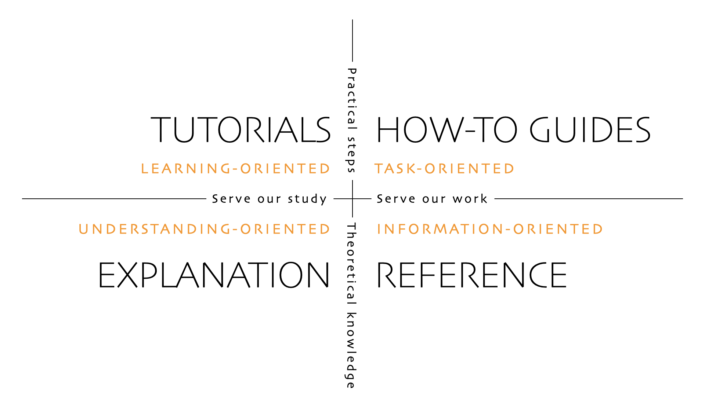
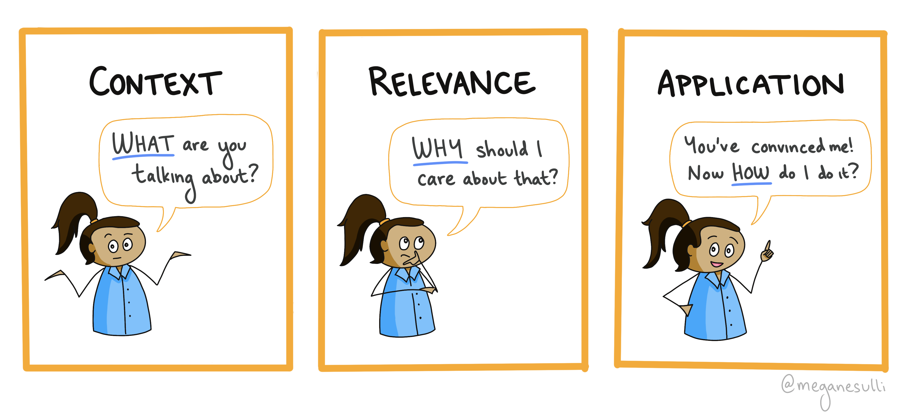
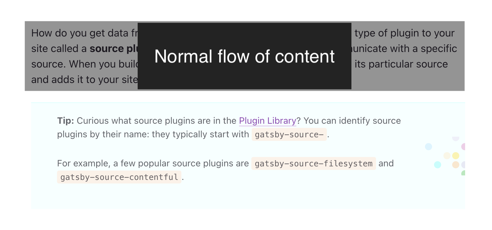

import CalloutBox from '../../src/components/callout-box'
import Collapsible from '../../src/components/collapsible'
import YouTubeEmbed from '../../src/components/youtube-embed'

<CalloutBox>
This article is adapted from a talk I gave at GatsbyCamp Fall 2021, which you can watch below.
</CalloutBox>

<YouTubeEmbed src="https://www.youtube.com/embed/HnBNbG2Csv8" />

In my life before being a developer, I was a teacher and curriculum writer. And one of the best feelings as an educator was helping learners who felt confused or overwhelmed gain confidence in their abilities to create cool things.

Similarly, one of things I love about documentation is that it lets you have that same impact of helping people deepen their skills. But with documentation, you have that impact at a much larger scale than is possible through 1:1 interactions.

<CalloutBox>

**Want numbers?** Last March, I taught an Intro to Gatsby workshop that had around 1000 participants. After the workshop, I rewrote that same curriculum as online documentation (in the form of the new [Gatsby Tutorial](https://www.gatsbyjs.com/docs/tutorial/)), which was getting around 4000 views a day.

With that one set of new docs, I’m able to reach as many students as if I taught four live workshops *every day*.

</CalloutBox>

But as you scale your documentation and your audience grows, there’s a wider and wider variety of people you’re trying to write for. The bare-bones API reference that worked when your team was just a few internal engineers isn’t going to cut it when you have new users trying to use your product for the first time.

So how do you build one documentation site that works for all your users? In this article, I outline my top 5 techniques for creating high quality documentation that serves as many users as possible:

1. [Expose the architecture](#tip-1-expose-the-architecture)
2. [Set the stage](#tip-2-set-the-stage)
3. [Let readers choose](#tip-3-let-readers-choose)
4. [Check for understanding](#tip-4-check-for-understanding)
5. [Get user feedback](#tip-5-get-user-feedback)

<CalloutBox>

**Note:** I’ll mainly look at this challenge through the lens of experience level. In other words, how can you create a documentation site that works for newcomers to your product as well as your existing power users.

</CalloutBox>

## Tip #1: Expose the architecture

In order for your users to make the most of your documentation, they need to understand the big picture of what kinds of information is included in your docs and where to find it. A major factor in that comes down to the **information architecture** of how your docs are organized.

Imagine you’re a user showing up to your product’s docs site for the first time. It might not be obvious to you where to find the information you’re looking for, or even what kinds of information is available to you.

As a documentarian, it’s your job to provide new users with a clear map and signposts that they can use to navigate the content of your docs.

### Define the architecture

One example of an information architecture that you can use to organize your documentation is the [Diátaxis framework](https://diataxis.fr/) by [Daniele Procida](https://twitter.com/evildmp). (This is what the Gatsby docs structure is based on).

The Diátaxis framework splits up documentation into four different categories:

- **Tutorials**: Hold the reader’s hand through their first experience with your product. These are specifically tailored for newcomers who may not know anything about your product or how it works.
- **How-To Guides**: Practical step-by-step guides to help readers accomplish a specific task. (Kind of like a recipe you would use for cooking.)
- **Reference**: Describes the technical details of how your product works (like an API spec or a user manual).
- **Explanation**: Explores more big-picture concepts and helps readers deepen their understanding of a topic. (Gatsby calls these docs “Conceptual Guides”.)

<Collapsible summary={<em>Expand for detailed image description</em>}>

The four documentation types can be charted into four quadrants, based on their content type and intended use case.

- Tutorials are learning-oriented. They include practical steps that are meant to serve our study (when we're in learning mode).
- How-To Guides are task-oriented. They also contain practical steps, but they're focused more on serving our work (when we're actively trying to get something done).
- Explanation is understanding-oriented. It's more theoretical knowledge, meant to serve our study.
- Reference is information-oriented. It's theoretical knowledge that can serve our work.

</Collapsible>

The key thing about the Diátaxis framework is that it categorizes documentation based on the reader’s current goal. Someone using your product for the first time is going to need very different information from a professional actively working on fixing a bug for a client site. By organizing your docs in a way that centers your reader's end goal, you make it easier for them to discover the resource that they need when they need it.

### Expose the architecture to your readers

It’s not enough to just sort all of your docs into organized categories. Once you have a structure in place, let your readers know what it is! This is where the idea of **exposing the architecture** comes into play.

For example, after [we reorganized the Gatsby docs](https://www.gatsbyjs.com/blog/announcing-new-gatsby-docs-site/) to use the Diátaxis framework, we adjusted the site's design to reflect the new information architecture:

- On the docs home page, we tell readers what different types of documentation they’ll find on our site, and when each type is most useful.
- We also list the four doc types in the navigation menu at the top of the page and in the sidebar, so that we can keep reinforcing our docs structure in the reader's mind.

Ultimately, it all comes back to helping readers find what they’re looking for more easily.

<CalloutBox>

**Tip:** The "expose the architecture" principle can also be applied within individual docs! Use headings to break down the content within a doc. Within a particular doc type, use a consistent heading structure so that users know what to expect and can use their pattern-matching skills to parse information more quickly.

</CalloutBox>

## Tip #2: Set the stage

Now that your overall docs structure is in place, it’s time to zoom in and focus on the content within each doc. That brings us to tip #2: **set the stage**. In other words, help your users understand what you’re talking about before jumping into the weeds of explaining a new topic.

When I was a curriculum writer, my team had three things that we always checked for in each lesson that we designed: **context**, **relevance**, and **application**.

- **Context**: Explain what you’re talking about, so that all your readers start with the same baseline understanding. This is where you define key terms and concepts, link to any prerequisite background knowledge you expect readers to have, and explain how the main idea of this doc ties fits into the overall structure of your product ecosystem.
- **Relevance**: Why should readers care about this topic? What problem does it help solve? Are there specific use cases when they might choose to use this feature over another one?
- **Application**: Walk readers through how to use the feature in their work.

Most docs already do a good job of the application piece, but the context and relevance pieces are especially important, because those are what help readers develop their mental model of how all the pieces of your product fit together.

### An example

Let’s see what context, relevance, and application look like in practice. Here's how I used them in [Part 3 of the new Gatsby Tutorial](https://www.gatsbyjs.com/docs/tutorial/part-3/), which is all about plugins:

- **Context**: What are plugins? Plugins are npm packages that let you add pre-built functionality to your Gatsby site.
- **Relevance**: Why do we care about plugins? Because plugins let you add new features to your site more quickly than if you were to write them yourself from scratch.
- **Application**: How do we add a plugin to our site? First, we install it with npm. Then, we configure it in our `gatsby-config.js` file. Finally, we use whatever unique plugin features are relevant in our site.

In your actual docs, you'd go into much more detail than this, but hopefully that's enough to give you an idea of what you're going for.

Having these three pieces nailed down early on in your writing process can help you stay focused and make sure your final doc will help all readers, regardless of how much previous experience they have with your product.

## Tip #3: Let readers choose

This next tip is about giving readers multiple ways to consume information on your docs site, so that they can choose the option that works best for them.

<CalloutBox>

**Note:** In education, this technique is called [**differentiation**](https://www.edglossary.org/differentiation/).

</CalloutBox>

We'll look at two different ways you can give readers options: providing multiple forms of engagement, and letting users opt into additional details.

### Multiple forms of engagement

By explaining the same concepts in multiple ways, you increase the chances that readers will find one option that resonates with their preferred learning style. And that means they’ll ultimately leave with a better understanding of the overall topic

In the new Gatsby Tutorial, in addition to the standard text explanations, we also include a variety of other ways that readers can engage with the main ideas:

* Diagrams
* Analogies
* Video

#### Diagrams

Diagrams can help readers visualize processes, like this one that shows how data flows through Gatsby’s GraphQL data layer.

Diagrams are especially useful for complex technical systems or architectures with several moving parts.

#### Analogies

Analogies help map product-specific concepts that readers might not be familiar with onto everyday things that they’ve probably encountered in their own lives. 

For instance, this illustration explains the difference between the `StaticImage` and `GatsbyImage` components using the analogy of asking for directions to a specific street address (like 400 Main Street) versus asking for directions to a generic location (like “the best coffee shop in town”).

<CalloutBox>

**Want to learn more?** [Maggie Appleton](https://maggieappleton.com/) has an excellent talk called [Drawing the Invisible](https://www.youtube.com/watch?v=MQGe9zxlRdk), which is about visual metaphors and how they can make technical concepts easier to learn. (Ever wondered how React is like a potato plant? Check out this talk!)

</CalloutBox>

#### Video

Some readers would rather follow along with someone as they work through the material. In that case, it can help to embed videos into your docs, showing someone walking through all the steps.

Each part of the Gatsby Tutorial includes an embedded YouTube video like the one below, where a colleague and I walk through the content for that part.

<YouTubeEmbed src="https://www.youtube.com/embed/RnaM4Rt05vY?t=244" />

<CalloutBox>

**Note:** Livestreams, analogies, and diagrams don’t *replace* the text in your doc. They complement each other. Each of these formats still require text to set the context and explain why this image or resource is relevant.

</CalloutBox>

### Opting into additional details

Another way you can provide readers choices is by making it easy for them to opt into or out of additional levels of detail.

In the new Gatsby Tutorial, we do this by making use of MDX’s ability to use React components inside of Markdown files. We have two different components that clearly separate extra optional content from the main flow of the document: announcements and collapsible sections.

For both components, the goal is to clearly indicate to users what content is required (the main steps of the Tutorial) and what is supplementary and can be skipped. That way, readers can tailor their experience through the doc to match the level of detail they’re interested in.

#### Announcements

In the Gatsby Tutorial, blue announcement boxes like the one shown below add extra information that stands out visually from the normal flow of the document.

Sometimes these callouts include **Syntax Hints** for JavaScript or React newcomers who might not be familiar with a particular piece of syntax. Other times they have **Pro Tips** which go into more detail about things that aren’t required for readers to know but that they might find interesting.

<CalloutBox>

**Tip:** Adding consistent labels to your callouts is another way to expose the architecture of your docs to readers!

When readers are familiar with the types of callouts they'll see in your docs, they'll be able to parse through new docs more quickly. ([Our brains are hard-wired for pattern matching!](https://personalmba.com/pattern-matching/))

</CalloutBox>

When you wrap this optional content in a visually distinct container, it helps readers who want to skip that content quickly see where to start reading again.

#### Collapsible Sections

The second component used in the Gatsby Tutorial is a purple collapsible box, which lets you hide content behind an expandable dropdown. (Under the hood, it's using the `details` and `summary` HTML elements.)

We use this to hide background information that might be helpful for React or GraphQL newcomers but that isn’t strictly necessary reading for people who want to just follow along with the steps of the Tutorial.

This would also be a good component to use if you wanted to document common error messages that users might encounter. For example, you could have the error name in the summary tag, and then users could click to expand for more information on what the error is and how to fix it.

## Tip #4: Check for understanding

Once your users have found the doc they’re looking for and they’ve read the content, how do you know whether they "get" it? By adding in checks for understanding, you can use to make sure that your readers leave your docs understanding the things you were hoping they’d learn.

Checks for understanding are built-in opportunities for your readers to self-assess whether or not they understood the material in the doc.

<CalloutBox>

**Note:** Depending on what information architecture you decided on for your docs, checks for understanding may make more sense in some types than others.

For example, if you're using the Diátaxis framework, checks for understanding may make more sense in a Tutorial or Explanation doc than in a Reference doc.

</CalloutBox>

In the new Gatsby Tutorial, each part is book-ended by the following:

- (At the beginning) A list of **learning objectives**, which outline what readers should be able to do by the time they finish reading the doc.
- (At the end) Separate lists for **questions** (like a mini quiz) and **key takeaways**, to help readers reflect on whether or not they achieved the expected learning objectives.

<Collapsible summary="Want an example?">

Here are some concrete examples of these lists, from [Part 4 of the Gatsby Tutorial](https://www.gatsbyjs.com/docs/tutorial/part-4/).

**Lesson Objectives:**

> By the end of this part of the Tutorial, you will be able to:
> 
> - Use GraphiQL to explore the data in the data layer and build your own GraphQL queries.
> - Use the useStaticQuery hook to pull data into a “building-block” component.
> - Use the gatsby-source-filesystem plugin to pull data into your site from your computer’s filesystem.
> - Create a page query to pull data into a page component.

**Summary Questions:**

> - How do you get data into the data layer?
> - How can you see what data is in the data layer?
> - How do you get data out of the data layer?
> - What are the differences between a page query and useStaticQuery? How would you decide which one to use?

**Key Takeaways:**

> - Source plugins pull data from their original location into the Gatsby GraphQL data layer.
> - You can use the GraphiQL endpoint (`localhost:8000/___graphql`) to explore the data in the data layer and design GraphQL queries.
> - You can write GraphQL queries to pull data out of the data layer and into your React components.
>     - To pull data into a “building block” component, use the useStaticQuery hook.
>     - To pull data into a page component, use a page query.

</Collapsible>

These bulleted lists are a super low-lift option. But you could also do something more interactive, like having a CodePen or custom-built component to let readers practice the skills they learned. [Apollo](https://www.apollographql.com/) (where I work now!) has a learning platform called [Odyssey](https://odyssey.apollographql.com/) that uses different kinds of interactive checks for understanding, including multiple-choice questions, fill-in-the-blank paragraphs, and embedded code challenges.

Regardless of the format, by providing opportunities for readers to self-assess how well they understood the material, you’re giving them a chance to strengthen their memories of the key ideas covered in your doc, which will make it easier for them to remember in the future.

## Tip #5: Get user feedback

Once you’ve gotten all your docs in place, and you’re happy with how they’re organized and the content that’s in them, the only way you can know whether your docs experience is good or not is by hearing from actual users!

For the Gatsby docs, we have a feedback widget at the bottom of every page, which lets readers rate whether the current doc was great, fine, or bad. It also has a space for them to write in a comment, if they want to tell us a bit more about their experience.

All of those feedback responses get stored in a database, which is connected to a Gatsby site that pulls all the ratings and comments into a table. From there, we can look at overall trends and average ratings, to see which docs people really like and which ones need to be improved.

But ultimately, what’s more interesting to me is reading through all the comments that people leave.

### Positive comments validate assumptions

Some of the comments are really positive, which is great for morale! But more importantly positive feedback helps us validate our assumptions about which things we thought would resonate with users.

For example, when I was rewriting the Gatsby Tutorial, one of the things I wanted to make sure to preserve was how the old Tutorial was approachable for readers without any prior React or GraphQL experience. And by reading through the comments on the new Tutorial, it’s been reassuring to see that several people have called out the fact that the new content doesn’t make assumptions about what people already know or use a ton of jargon.

### Constructive comments lead to incremental improvements

But not all reviews are positive, and that can be a good thing! By addressing *constructive* comments and listening to user suggestions, you can make incremental improvements that gradually help make your docs experience better for your future users.

For example, the Gatsby Tutorial received one comment from a reader suggesting we add a “continue” button to the bottom of each page of the Tutorial, which was an easy fix to improve the reader experience. Other readers wrote in that they were confused about a particular aspect of CSS modules, so I added in an additional Syntax Hint announcement to explain what was going on under the hood. (And now we don't get comments on that anymore!)

Addressing constructive comments is also a good way to show your users that you care about their experience, and that you’re actually listening to their feedback. This helps build trust with the people in your community, which is always a good thing!

## Wrap It Up

And those are my secrets for creating high-quality docs that work for both newcomers and power users!

To recap what we’ve covered:

It’s hard to make one docs site that works for everyone. But there are concrete steps you can take to improve your docs experience!

1. **Expose the architecture**, to help users understand the big picture of how your docs are structured.
2. **Set the stage** by making sure each doc provides context, relevance, and application.
3. **Let readers choose** what works best for them by explaining the same idea in a variety of ways, and make it clear when they can opt into or out of additional information.
4. **Check for understanding** by providing opportunities for self-assessment, through questions that align to each doc’s learning objectives.
5. **Get user feedback** so that you can validate your assumptions and continue making incremental improvements.

I hope that you learned at least one new technique that you can use to improve your docs experience for your users.

Have other tips that I didn't cover? I'd love to hear about them! You can reach me on Twitter: [@meganesulli](https://twitter.com/meganesulli).

## Resources

Linked in this post:

- [The official Gatsby Tutorial](https://www.gatsbyjs.com/docs/tutorial/)
- [Diátaxis documentation framework](https://diataxis.fr/)
- [Differentiation in education](https://www.edglossary.org/differentiation/)
- [Drawing the Invisible: How to Explain React through Visual Metaphors](https://www.youtube.com/watch?v=MQGe9zxlRdk): Maggie Appleton's talk for Women of React 2020
- [What is "Pattern Matching"?](https://personalmba.com/pattern-matching/)
- [Apollo Odyssey](https://odyssey.apollographql.com/)

Additional resources:

- [Docs for Developers: An Engineer's Field Guide to Technical Writing](https://link.springer.com/book/10.1007/978-1-4842-7217-6) (by Jared Bhatti, Zachary Sarah Corleissen, Jen Lambourne, David Nunez, and Heidi Waterhouse): A great book for anyone looking to improve their documentation skills.