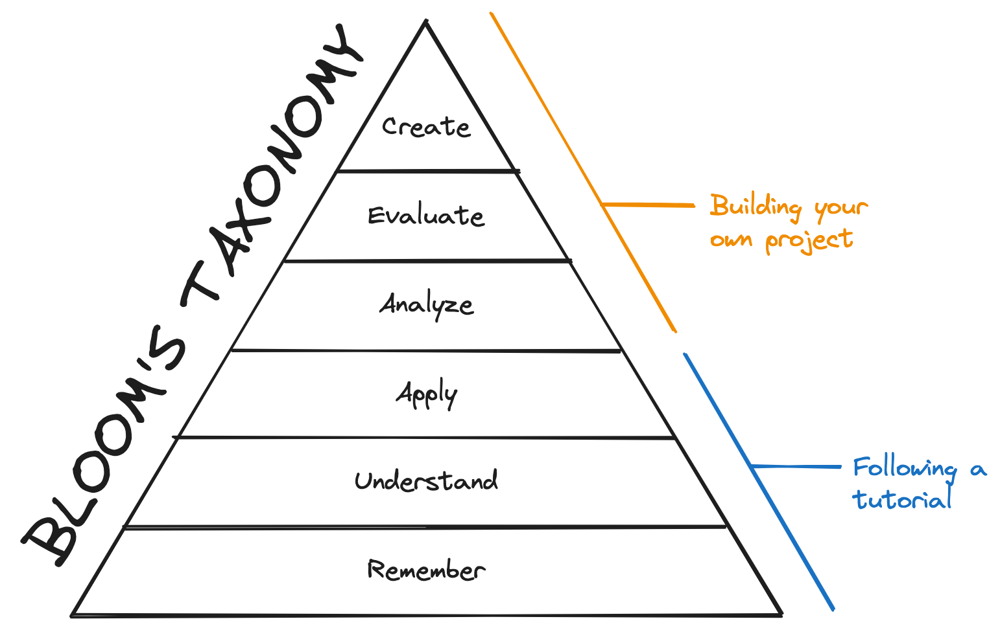

## Introduction

Last week I built my first hackathon app! The hackathon was for the [Learn with Jason Web Dev Challenge](https://www.learnwithjason.dev/blog/web-dev-challenge-hackathon-monsters), and the theme was to create an app to help out in a world where monsters are real. I built a *super* basic MVP for a monster-human exchange program. (You can watch my [livestream of the process](https://youtube.com/playlist?list=PLkJWtzSqMOjYn8GQ8qrnJf6ZrcBH8G-6u&si=ZPoGCzhbgFpMWxUh)!)

But this post isn't about what I built. It's about what I learned through participating in the hackathon! I wanted to take some time to write down my thoughts and reflect on my big takeaways. So here goes!

## 1) Building things is fun!

I thoroughly enjoyed making something for this hackathon! It's been a while since I've done any substantial web development, and it felt nice to flex those muscles again.

## 2) Following a tutorial is not the same as building your own project

This might seem obvious. In a tutorial, the project you're building has been clearly scoped for you. There's a progression of ideas, an outlined set of instructions to follow, a solution code snippet if you get stuck.

But when you're building your own project, you don't have any of that. You have to decide for yourself what features to add and what order to create them in. There are no guard rails.

To prepare for my project, I went through the tutorials for [Convex](https://www.convex.dev/) and [Clerk](https://clerk.com), two of the tools for hackathon. I felt like I had a decent understanding of how to do things. But once I actually started building, I quickly found out where there were still gaps in my understanding. It was harder than the tutorial. But I also found it more rewarding.

<CalloutBox>

**Note:** (Excuse me while I put on my developer educator hat for a moment here.)

This isn't to say that tutorials are bad. They're not! Tutorials are a great introduction to the main concepts. They're your training wheels as you figure out how to use a new tool or framework for the first time. If you're going by [Bloom's Taxonomy](https://en.wikipedia.org/wiki/Bloom's_taxonomy), tutorials help you build the foundation of your learning: remembering, understanding, and applying concepts in a well-defined setting.

But when you create your own projects, you're operating at the higher levels of the pyramid. You have to analyze and evaluate the concepts you've learned and figure out how to use them to create something new.

Ideally, you should do a mix of tutorials and creating your own projects. The tutorial teaches you a new set of tools, and then your personal project forces you to practice choosing the right tool for the current situation.

</CalloutBox>

## 3) Limit yourself to one or two new tools per project

If possible, limit the number of new tools you're learning at once. I probably had too many.
Convex, Clerk, React Router, pnpm, TypeScript, Vite. I learned a ton along the way, but there were definitely times I could feel my brain slowing down under the weight of all the cognitive load. I probably could have gotten something working sooner if I was using a stack I was more familiar with. (But on the bright side, now I have a bunch of new tools in my developer toolkit!)

## 4) Time constraints force you to pick your battles

I tend to overthink things. But with this hackathon project, I only had four hours to put something together. The time limit imposed a sense of urgency, which forced me to overcome my usual analysis paralysis. With every new hurdle, I had to evaluate, "Is this worth spending my limited time figuring out? Is it critical to the MVP, or can I adjust the feature or cheat the data for now, to just get *something* working?" I felt a bit out of my comfort zone, but it was also kind of nice to let go and just try things to see what would happen.

## 5) Take a step back and regroup if you need to

On the flip side, sometimes YOLO-ing your way through development gets you into trouble. Partway through my app, I ran into some bugs I didn't fully understand, but I tried to just keep going and white-knuckle my way through the errors. I was livestreaming building my app, and I felt internal pressure to push forward through the issues so that the audience wouldn't be forced to watch me stare at my screen and think. So I kept going, digging myself into a deeper and deeper hole, until eventually I had to call it a night and end the stream without figuring out a fix.

It felt pretty discouraging to end the night on a low note. But taking a break gave me time to step back and reassess where I was at. I put together some notes on my issue, wrote up a question, and asked it in the Discord. And then the next day, some kind folks left suggestions of things to try, I added it to my code, and it worked!

There's a [William Zinsser](https://www.goodreads.com/quotes/8729115-clear-thinking-becomes-clear-writing-one-can-t-exist-without-the) quote: "Clear thinking becomes clear writing; one can't exist without the other." He was talking about writing prose, but I think the sentiment applies to writing code as well. When I feel like I'm just randomly guessing at how to fix things, that's my sign that I don't really understand what I'm trying to do. I need to take a step back, pull out Obsidian or Excalidraw, and think through the problem at hand. My mental model is likely missing some key piece of information; it's time to do some detective work to figure out what it is. I wrote a sticky note to put on my monitor as a reminder for next time:

> Stuck? Pause. Regroup.
> 
> - What do I know/not know?
> - What am I trying to do?
> - What is happening instead?
> - What is causing that disconnect?

## 6) Streaming feels like programming on hard mode

I livestreamed the process of designing and building my app. It was difficult, but ultimately I think it was worth it.

Streaming probably led to me working a little slower than I typically would have, since I was spending time talking through what I was doing. But it also forced me to stay (mostly) focused, since I was sharing my screen and couldn't get distracted with checking my email or LinkedIn.

Knowing that I was being observed added some anxiety about looking dumb in front of people. But I reminded myself that one of the reasons [why I wanted to start streaming](/blog/i-stream-now/) was to normalize that debugging is a normal part of programming. Plus, it was nice to have an audience of people who you can ask for help when you get stuck. (It's almost like pairing, and I love pairing!)

## Final thoughts

Overall, I had a really great time participating in this hackathon. I learned a ton, and it was inspiring to see all the creative ideas that other folks built out!

The next [Learn With Jason Web Dev Challenge hackathon prompt](https://www.learnwithjason.dev/blog/web-dev-challenge-s1e5-food-scene-hackathon) is out now! If you're interested in building something fun and learning with a bunch of cool and supportive developers, I'd recommend giving it a try. Submissions are due on September 30. Hope to see you there!

