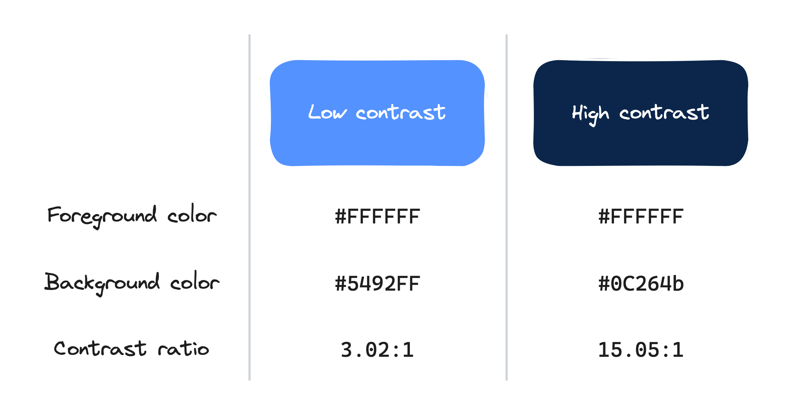
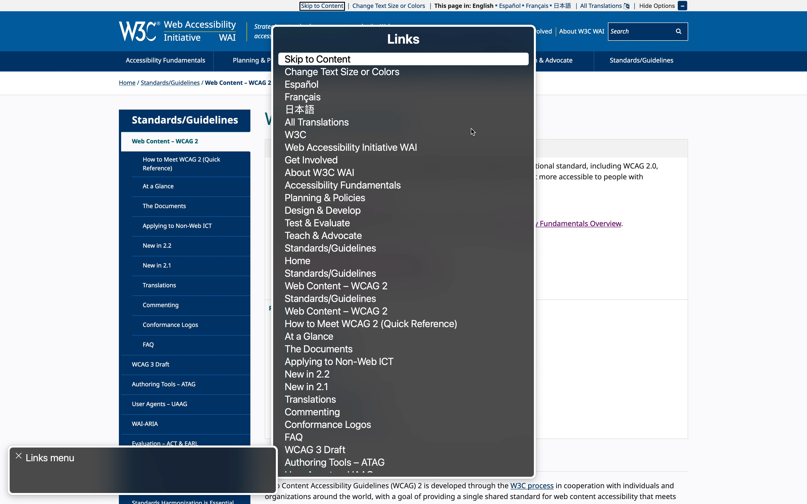

## Introduction

It's [Global Accessibility Awareness Day](https://accessibility.day/) (GAAD)! The goal of digital accessibility is to enable users with disabilities to independently engage with content and technology. Ultimately, it's about empowering disabled people to live with autonomy and dignity.

- The World Health Organization estimates that [16% of the world's population has some kind of significant disability](https://www.who.int/news-room/fact-sheets/detail/disability-and-health). As of 2024, that's **1.3 billion** people.
- In 2024, [The WebAIM Million](https://webaim.org/projects/million/)—an annual report on the accessibility of 1 million different websites—found that **95.9%** of home pages had accessibility issues.

Accessibility issues prevent disabled users from accessing digital services and participating in online communities. Some accessibility problems require a developer to fix, but others can be fixed by anyone who creates online content! Here are three quick ways that you can make your digital content more accessible.

<CalloutBox>

**Note:** This post references the [Web Content Accessibility Guidelines](https://www.w3.org/WAI/standards-guidelines/wcag/) (WCAG), which define standards for creating accessible web content.

The WCAG standard includes a detailed list of success criteria that a website must meet in order to be considered accessible. These success criteria are categorized into different levels: 
 
- Level A (the bare minimum)
- Level AA (the industry standard)
- Level AAA (above and beyond)
 
For your site to get level AA conformance, it must meet all the level AA success criteria *and* all the level A success criteria. Similarly, to get level AAA conformance, your site must meet all the success criteria for levels AAA, AA, and A.
 
The WCAG documents can be overwhelming at first! But they're also the industry's go-to resource for in-depth accessibility standards, so it's worth exploring them. For a more general introduction to accessibility, check out the W3C WAI [Accessibility Fundamentals Overview](https://www.w3.org/WAI/fundamentals/).

</CalloutBox>

## Tip #1: Use Sufficient Color Contrast

The most prevalent issue reported in the 2024 WebAIM Million was insufficient color contrast. 

For online content, color contrast refers to the difference between the color of your text and the color of the background behind it. With some [fancy calculations](https://www.accessibility-developer-guide.com/knowledge/colours-and-contrast/how-to-calculate/), you can calculate the **contrast ratio**, which tells you how different your foreground and background colors are from each other.

<Collapsible summary="Expand for accessible image description">

|                  | Low contrast | High contrast |
| ---------------- | ------------ | ------------- |
| Foreground color | \#FFFFFF     | \#FFFFFF      |
| Background color | \#5492FF     | \#FFFFFF      |
| Contrast ratio   | 3.02:1       | 15.05:1       |

</Collapsible>

Use a higher contrast ratio to make your site's text legible to users with visual impairments (e.g., cataracts or color blindness). The Web Content Accessibility Guidelines include the following requirements color contrast ratios:

- [Success Criterion 1.4.3 Contrast (Minimum)](https://www.w3.org/TR/WCAG22/#contrast-minimum) (level AA)
	- **4.5:1** for text (and images of text)
	- **3:1** for large text (18pt regular weight, or 14pt bold weight)
- [Success Criterion 1.4.6 Contrast (Enhanced)](https://www.w3.org/TR/WCAG22/#contrast-enhanced) (level AAA)
	- **7:1** for text (and images of text)
	- **4.5:1** for large text
- [Success Criterion 1.4.11 Non-text Contrast](https://www.w3.org/TR/WCAG22/#non-text-contrast) (level AA)
	- **3:1** for user interface components (e.g., buttons, form elements, or other page controls) or graphical objects (e.g., icons, charts) that are required to understand the content

Based on these criteria, the low color contrast example from the previous image passes 1.4.3 for large text, but fails it for small text. The high contrast example passes 1.4.3 and 1.4.6 for both large and small text. Both color combinations pass 1.4.11 for non-text elements.

There are a wide variety of online calculators you can use to determine the contrast ratio between two colors. Some examples:
- [WhoCanUse](https://www.whocanuse.com/): Simulate what color combinations look like to users with different kinds of visual impairments.
- [WebAIM Contrast Calculator](https://webaim.org/resources/contrastchecker/): Use an eyedropper color picker to select a color from anywhere on your screen. (This is helpful if you don't have access to the hex codes for the colors you want to test.)
- [Polypane Color Contrast Checker](https://polypane.app/color-contrast/): If the color combination you tested fails one of the WCAG success criteria, it will suggest an alternative color to use instead.

<CalloutBox>
**Learn more about color contrast:** [WebAIM: Contrast and Color Accessibility](https://webaim.org/articles/contrast/)
</CalloutBox>

## Tip #2: Add Alternative Text to Images

Images are great for creating engaging websites. They can also be helpful tools for helping readers understand your content. But what happens for non-sighted users who can't see images?

Many users with visual or learning disabilities use an assistive tool called a **screen reader** to navigate their computers. A screen reader is a program that translates the text and elements on the screen into audio, so users can hear the page instead of (or potentially in addition to) see it.

<CalloutBox>
**Want to see how it works?** Check out this video by the Chrome Accessibility team: [Screen Reader Basics: NVDA -- A11ycasts #9](https://www.youtube.com/watch?v=Jao3s_CwdRU)

[NVDA](https://www.nvaccess.org/download/) is only available on Windows computers. Apple computers come with their own built-in screen reader called [VoiceOver](https://www.apple.com/voiceover/info/guide/_1121.html).
</CalloutBox>

You can provide descriptions for screen reader users by adding alternative text (also called alt text) to your images. When a screen reader user moves their focus onto an image, the software announces the image by reading out the alt text.

How do you add alt text to an image?
- If you have access to the underlying HTML for your page, you can add alt text to your image tag like this:
  ``
- If you're writing your content in a word processor or content management system, do a quick search on Google or YouTube to see how to add image alt text in your particular tool.
	- [Add alt text in Google Docs, Sheets, and Slides](https://support.google.com/docs/answer/6199477?hl=en)
	- [Add alt text in Microsoft Word](https://support.microsoft.com/en-us/office/video-improve-accessibility-with-alt-text-9c57ee44-bb48-40e3-aad4-7647fc1dba51)
	- [Add accessibility descriptions to media in Apple Pages, Keynote, or Numbers](https://support.apple.com/en-us/102031)

<CalloutBox>
**Note:** There are certain scenarios where you don't need to provide alt text for an image. Check [WCAG Success Criterion 1.1.1 Non-text Content](https://www.w3.org/TR/WCAG22/#non-text-content) for more information.
</CalloutBox>

What should you write in your image description? As it turns out, writing great alt text is as much of an art form as it is a science. Essentially, you want to provide a text equivalent to whatever a sighted user gets out of the image. A lot of that depends on the context in which the image appears in the content.

One trick to help you get started is to imagine you're describing the image out loud to a friend.
- What is the most important part of the image? Describe that first.
	- For example: "Three dogs running on a grassy lawn."
- What details would you draw their attention to so that they can recreate the image in their mind? Add those next. The details you choose may depend on the context provided by the text surrounding the image.
	- Using the previous dog example: If the surrounding text is about how dog trainers should handle introducing a new dog to a play group, you might add, "The dogs have relaxed body posture. One dog is doing a play bow in front of the others."

A few other tips to get you started:
- If there's text in the image, include that in the alt text. (Otherwise, non-sighted users won't have access to that information at all!)
- For complex images like diagrams or charts, consider adding a text equivalent in the surrounding text. Then your alt text can be something like "A diagram"
- Try to keep your descriptions short. Technically there's no character limit, but when screen readers are reading alt text, users don't have a way to pause or rewind the descriptions. If you have a long paragraph of description and a user misses something, they'll have to restart the alt text all the way from the beginning.

<CalloutBox>
**Learn more about how to write alt text:** [Web Accessibility Initiative: Alt Text Tips and Tricks](https://www.w3.org/WAI/tutorials/images/tips/)
</CalloutBox>

## Tip #3: Use Descriptive Link Text

Frequently, when content writers add hyperlinks to their content, they'll write a sentence like "For more information, click here," and then add a [hyperlink](https://developer.mozilla.org/en-US/docs/Web/HTML/Element/a) to the word "here." But this isn't accessible! According to [WCAG Success Criterion 2.4.4 Link Purpose (In Context)](https://www.w3.org/TR/WCAG22/#link-purpose-in-context), linked text needs to have a descriptive name that indicates where the link will take the user.

Why is this important? Screen readers have a feature that lets users see a list of all the links on the current page. This list lets users quickly navigate to a particular link.

<BrowserWindow>

</BrowserWindow>

The links in the list are labeled by their link text. So if all the links in your content just say "here", then the screen reader links menu becomes essentially useless.

What can you do instead? Try using the title of the page you're linking to. (Want an example? Check out the links sprinkled throughout this post!)

<CalloutBox>
**Learn more about descriptive link text:** [Understanding Success Criterion 2.4.4 Link Purpose (In Context)](https://www.w3.org/WAI/WCAG22/Understanding/link-purpose-in-context)
</CalloutBox>

## What Next?

Accessibility is important every day, but GAAD provides an opportunity to learn and discuss how we can create inclusive applications for *all* users.

Ready to learn more? Here are some resources to check out next:

- [Accessibility Fundamentals Overview](https://www.w3.org/WAI/fundamentals/):  Beginner-friendly resources about how disabled people use technology and general accessibility principles.
- [WCAG 2 Overview](https://www.w3.org/WAI/standards-guidelines/wcag/): An introduction to the WCAG documents and how to use them.
- [The WebAIM Strategic Accessibility Framework](https://webaim.org/articles/strategicframework/): A set of indicators and benchmarks for how organizations and leadership can intentionally prioritize accessibility.

For developers:

- [MDN Web Docs on Accessibility](https://developer.mozilla.org/en-US/docs/Learn/Accessibility): A technical introduction to accessible best practices for HTML, CSS, and JavaScript.
- [A11y Coffee](https://a11y.coffee/): A collection of tips on accessibility quick wins and testing for developers.
- [A11ySupport.io](https://a11ysupport.io/): The [caniuse](https://caniuse.com/) of accessibility. Lists compatibility of various browser accessibility features for different screen reader and browser combinations.