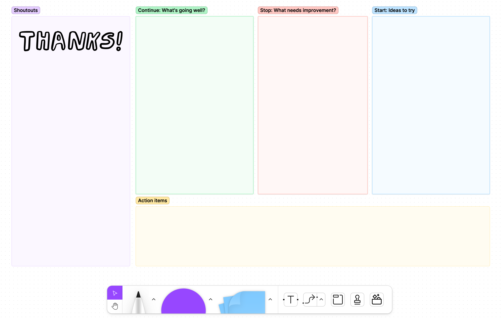
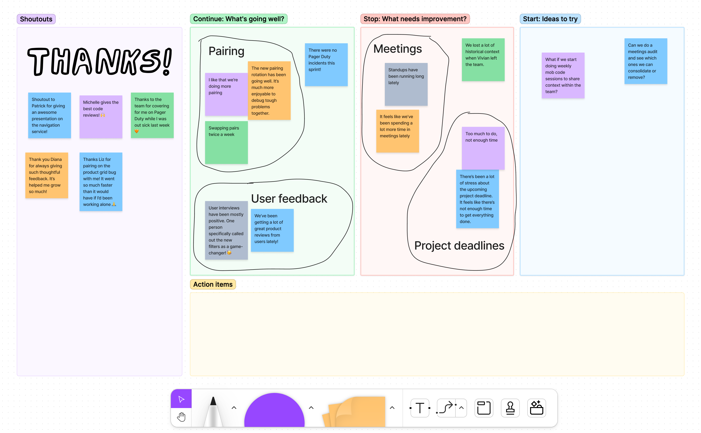
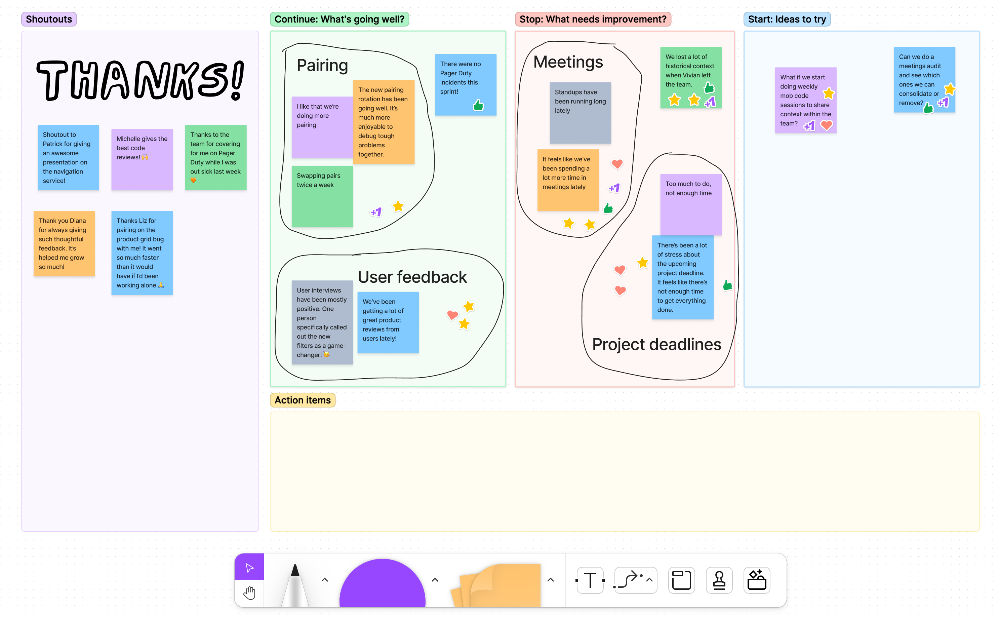
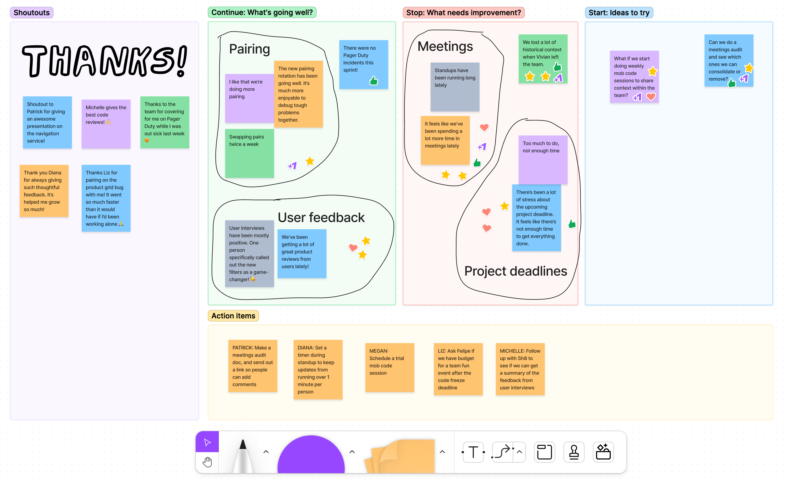

## Introduction

Businesses want teams to work together effectively so that they can produce value quickly. But it's not enough to just "always be shipping". Sometimes you need to take a beat, step back as a team, and reflect on your processes. ["Go slow to go fast."](https://www.huffpost.com/entry/why-going-slow-will-make-you-go-faster_b_7062064) That's where retrospectives come in.

A retrospective (or retro, for short) is a type of meeting where teammates reflect back on how they worked together over a period of time. Typically, retros are run at the end of an Agile sprint, usually every 2-4 weeks. In a retro, the team looks back on their accomplishments and brainstorms ways to make work more efficient and enjoyable in future sprints.

<CalloutBox>
  **Sprint Retrospective at a glance:**

  - **Goal:** To make process improvements by discussing what went well this sprint and what can be improved.
  - **Duration:** 1 hour
  - **Frequency:** Once per sprint (ideally every 2-3 weeks)
  - **Participants:** All individual contributors (ICs) & manager(s) on the team
</CalloutBox>

### Why do we need retros?

When you work on a team for a while, sometimes there's friction. Building software is hard, both from the technology side and the people side. There's a lot to balance—clashing personalities, different working preferences, team norms and expectations. But it's not always easy to bring up those issues when you're in the middle of the day-to-day grind. Sprint retrospectives provide a consistent safe space where teammates can bring up the challenges they're facing and find ways to work through them together.

### Do we *really* need a retro at the end of every sprint?

Retros work best when you have them on a regular basis. That way, challenges can be addressed quickly, while there's still time for the team to pivot and make adjustments.

Think of it like navigation assistance when you're driving. You *could* wait until you're hopelessly lost before looking up directions to your final destination. But by that point, it's going to take a lot more effort to get you back on track. On the other hand, if you're using Google Maps from the get-go, you'll get notified as soon as you start heading in the wrong direction, and it'll be much easier to course correct.

![A doodle diagram showing two line charts, where the X axis is "time" and the Y axis is "effort required to get back on track". The top diagram is labeled, "One End-of-Project Retrospective", and it shows an orange line that gradually gets higher and higher on the Y axis, before it suddenly drops back down to intersect with the X axis (at an X value labeled "Retro"). The bottom diagram is labeled, "Periodic Sprint Retrospectives", and it shows a similar line that gradually increases up the Y axis. But the bottom diagram has four "Retro" labels equally spaced along the X axis, which each cause the line to drop back to Y=0. As a result, the Y value of the bottom graph never reaches the same magnitude as the top graph.](./diagram-postmortem-vs-retros.png)

In this post, I'll walk you through everything you need to know to facilitate your first sprint retrospective.

## Before the meeting

To make sure everything runs smoothly on the day of your retro, it's important to prepare all the necessary pieces ahead of time.

### Choose a retro framework to use

The retro framework you choose directly impacts the kinds of topics the team will discuss during the meeting.

Some popular options are:
- **Start, Stop, Continue:** What should we to start, stop, and continue doing as a team?
- **Liked, Learned, Lacked:** What did you like or learn this sprint? What was missing?
- **Anchors and Engines:** What slows us down as a team? What helps us gain momentum?

<CalloutBox>
  Check out [Fun Retrospectives](https://www.funretrospectives.com/category/retrospective/) for more example reflection frameworks.
</CalloutBox>

How do you decide which framework to pick? If you get the sense that there's something the team wants or needs to talk about, you can find (or create!) categories that lead naturally to that kind of conversation. Otherwise, pick whichever framework strikes your fancy. (You can always mix it up and choose a different one for the next retro.)

<CalloutBox>
  **Tip:** If your team tends to feel nervous sharing constructive feedback, try renaming those categories to something like "Wished for" or "What could be improved?" (which sound a bit gentler than "Stop" or "Disliked").
</CalloutBox>

### Set up the retro board

Now that you know what retro framework you'll be using, it's time to set up a retro board to guide the conversation.

Personally, I prefer to use a virtual retro board instead of a physical whiteboard, even when I'm facilitating a retro in person. There's less cleanup, and the team gets to keep a digital record of the board that they can refer back to after the meeting. (But if analog is more your thing, that works too! Just make sure to gather enough sticky notes and pens for everyone participating.)

<CalloutBox>
  **Platform options for building a virtual retro board:**

  (Ordered from least to most structured.)
  - [FigJam](https://www.figma.com/figjam/): Super flexible, and feels the most like a whiteboard.
  - [Trello](https://trello.com/): Kanban boards with columns, with optional add-ons for features like card voting.
  - [EasyRetro](https://easyretro.io): Kanban-style boards specifically for retros, with some built-in features like voting and sorting cards.
  - [Parabol](https://www.parabol.co/): Does much of the heavy lifting of facilitating for you. Applies a pre-defined structure to your retro agenda.
</CalloutBox>

To set up your retro board:

1. Add a column for each of the categories from your retro framework.
2. Add additional columns for "Shoutouts" (where teammates can thank and celebrate each other) and "Action Items" (where you'll track next steps that come out of the retro conversation).
3. Include a link to the board in the calendar invite for your meeting.

<BrowserWindow>
  
</BrowserWindow>

### Assign a notetaker for the retro

The last piece of prep is to assign someone to take notes during the retro. Ideally, this would be someone different from the facilitator (who will be focused on managing the conversation).

The notetaker's job is to make sure that all action items brought up in the meeting are added to the Action Items column on the board. They may also choose to write down additional context that comes up through the conversation.

To keep things fair and equally distribute the burden, I like to have a notetaker rotation. In the meeting invite, or at the top of each retro board, I'll write all the retro participants' names in alphabetical order. Then at the start of each retro, we check the list and see whose turn it is to take notes. (If you want to take things to the next level, you can also have a similar rotation for deciding who will *facilitate* the retro.)

## During the meeting

It's game time! There are many ways to run a retro. Here's my preferred agenda:

### Step 1: Set expectations (5 minutes)

As the facilitator, it's your job to set the tone for the meeting and create a space where folks feel comfortable sharing with the group.

I like to open retros by doing the following:

- **Remind everyone of the [Agile Prime Directive](https://www.retrium.com/blog/an-agile-prime-directive):** "Regardless of what we discover, we understand and truly believe that everyone did the best job they could, given what they knew at the time, their skills and abilities, the resources available, and the situation at hand."
    - Why? Retros are not about placing blame for things that did or didn't happen this sprint. Instead, they're about looking for opportunities to learn and improve in the future.

- **Take a quick pulse check.** In the chat, each participant writes a number from 1-5, rating how they're feeling going into this conversation. (Where 5 means "I'm open to talking about anything," and 1 means "I'm more comfortable listening/observing".)
    - Why? We're all human. Sometimes, there are other things going on in our lives, and we're not in the mood to have a potentially squishy conversation about teamwork. As a facilitator, it's good to know what energy the group is starting with. If many folks are feeling more reserved, it might be a good idea to reschedule the retro for a time when folks are more open to sharing and discussing.

- **Review the action items from the previous retro.** Follow up on what's been done and what still needs to be carried over. (The notetaker copies over any remaining action items to the Action Items section of the new retro board.)
    - Why? Knowing that action items will actually be followed up on helps keep folks accountable for what the said they'd get done. Or it helps to remind folks of tasks they might have forgotten about in the shuffle of day-to-day work.

### Step 2: Brain dump (10 minutes)

Now that everyone is in the right headspace, it's time for folks to add all their ideas to the retro board!

1. Set a timer for 7 minutes. Silently, each teammate simultaneously adds their thoughts to each topic on the retro board. Teammates write each thought on a separate card or sticky note. They can write as many cards as it takes to cover everything that's on their mind.

<BrowserWindow>
  
</BrowserWindow>

2. When the timer goes off (or when everyone's done writing), take another 2-3 minutes as a group to read over the cards silently, and group them into related topics. Draw boundaries around the related cards, and add a concise label to summarize the topic (like "too many meetings" or "unclear team priorities").

<BrowserWindow>
  
</BrowserWindow>

<CalloutBox>
  **Note:** Retrospectives are about process, not progress. When identifying areas for improvement, focus more on *how* you're working together, as opposed to *what* work still needs to be done. (There are other types of meetings for those tactical progress conversations, like sprint planning and standups.)

  For example, let's say the team didn't finish all the tickets assigned for the sprint. Instead of writing a card like, "We still need to do tickets X, Y, and Z," encourage teammates to dig deeper and think about what may have gotten in the way of completing that work. For example, "We added new tickets to the sprint halfway through the week, which meant our workload estimations were off."
</CalloutBox>

### Step 3: Vote (1 minute)

Once all participants have had a chance to read the cards to themselves, it's time to vote on which topics to discuss as a group. This gives everyone a chance to show support for their teammates' perspectives, which helps folks feel validated while also identifying broader patterns in team sentiments.

1. Each teammate gets a total of 5 votes, which they distribute among the different topics. (You're allowed to vote for the same topic multiple times.) 
2. Once all the votes have been tallied, you'll have a prioritized list of topics to discuss in the next step.

<BrowserWindow>
  
</BrowserWindow>

<CalloutBox>
  **Note:** The goal of the voting exercise is to rank which topics the team wants to talk about as a group. This means that some cards or topics (with the least votes) won't be verbally addressed during the meeting. But that's okay, because everyone had a chance to read them all in the previous step.
</CalloutBox>

### Step 4: Discuss (30 minutes)

You've got a list of ranked topics. Now it's time to dig into the discussion! (This is the meat and potatoes of your retro.)

As a group, discuss each topic on the board. Start with the one with the most votes, and work your way down from there. For each topic:

1. To kick off the conversation, **restate the topic** (or read the card aloud) and then ask the group, "Does anyone want to share some more context on that?" Often, the person who wrote the card may speak up to add some more detail, or another teammate may be inspired to share their experience.
2. Guide the conversation by **asking follow-up questions** like, "What do you mean by [something they said]?" or "Can you share an example?" or even just "Will you say more about that?" If the discussion starts to drift to another topic, refocus the group by saying something like, "Before we get to that, was there anything else anyone wanted to add about [the previous topic]?"
3. Once the group has a shared understanding of the current topic, shift the discussion to **action items**. You can say something like, "What action items could we take that would help address [the topic]?" The notetaker tracks action items as they're identified and adds them to the Action Items section of the board.

<BrowserWindow>
  
</BrowserWindow>

Typically, you'll have more topics than you can cover in the allotted amount of time, but that's okay. If those undiscussed topics are still important, odds are they'll show up again in a future retro.

<CalloutBox>
  **Facilitation tips:**

  Leading group discussions is hard! Here are some suggestions for how to handle common pitfalls:

  - **Ask, don't tell.** Avoid the temptation to read out the cards and then add your own perspective on what it's referring to. You may be missing context or misinterpreting the author's original intention. Instead, ask follow-up questions and let teammates share what they mean in their own words.
  - **Sit with the silence.** Often, new facilitators will ask a question, and if no one instantly responds they'll move on to the next topic. But it takes participants time to hear the question, think of a response, decide how to word their response, find the unmute button, etc. Seasoned educators typically recommend leaving 5 seconds of [wait time](https://www.teachervision.com/teaching-strategies/your-secret-weapon-wait-time) after asking a question, to give learners an opportunity to answer. (It may feel awkward at first, but I promise the silence feels longer to you than it does to everyone else!)
  - **Use timers!** Does your group tend to spend too long on a single topic? Set a 3-minute timer when you start discussing a new topic. When the timer goes off, have a quick show of hands to see who wants to continue discussing this topic and who wants to move on. (Again, it may feel awkward interrupting the conversation at first, but after a few rounds folks will get used to the rhythm.)
</CalloutBox>

### Step 5: Close out the meeting (5 minutes)

By this point, you've discussed the topics that were most important to the team, and the group has identified a list of action items to follow up on after the meeting.

Now it's time to wrap things up:

1. Review the tasks in the Action Items column, and make sure each one is assigned to an individual owner.
    - The assigned owner doesn't necessarily have to be the one who will actually complete the task. But they're the one responsible for following up on it and making sure the team doesn't forget about it.

<BrowserWindow>
  
</BrowserWindow>

2. If you have a facilitator rotation, assign the facilitator (and notetaker) for the next retro, so that they know to start preparing.

3. (Optional) I like to end things on a high note by sharing "[warm fuzzies](https://en.wikipedia.org/wiki/Claude_Steiner#A_Warm_Fuzzy_Tale)". Each teammate takes a moment to share a shoutout with someone else on the team. If everyone is comfortable with it, share these shoutouts in a public team channel so that others have visibility into their awesome work! Or if they'd prefer private praise, send it to them in a direct message.

## After the meeting

Shortly after the retro, **send a Slack or email summary** of the action items and their assigned owners, so that teammates can keep them top-of-mind.

And that's all there is to it! Congratulations on facilitating your first sprint retrospective!

## Wrap it up

Sprint retrospectives are my favorite kind of meeting. They're a chance to reflect back on your work as a team and celebrate your accomplishments. A chance to talk about challenging experiences and find ways to ease that friction in the future. A chance to connect with teammates and say, "This was how I felt over the last few weeks. Did you feel that too?"

Sometimes they can lead to tough conversations. But if you can create a safe space where your team feels comfortable opening up and being vulnerable, it can lead to transformational changes.

## Resources

- [Example retro board in FigJam](https://www.figma.com/file/Rfl6J3uHjWYJ5cmnGp6q9R/Example-Retro-Board?node-id=0%3A1&t=xr9QPT4Q45tzEhuO-0): Take a closer look at the sample retro board from this post. (In your own retros, you won't need multiple copies of your board in the same file.)
- [Fun Retrospectives](https://www.funretrospectives.com/): List of several different retro frameworks you can use to structure your retro board. Includes different formats for different kinds of reflections. Choose whatever one fits the kind of conversation you think your team needs to have.
- [Agile Retrospective Resource Wiki](https://retrospectivewiki.org/): A collection of sample agendas and tips for running retros. 
- [How to run a great retrospective](https://leaddev.com/communication-relationships/how-run-great-retrospective): LeadDev Blog post by Nickolas Means.
- [Team Meetings That Don't Suck - Avoid Retrospectives Antipatterns](https://www.youtube.com/watch?v=ApAkqxHZq6o): GOTO Conference talk by Aino Vonge Corry, author of [Retrospectives Antipatterns](https://metadeveloper.com/retrospective-antipatterns/).
