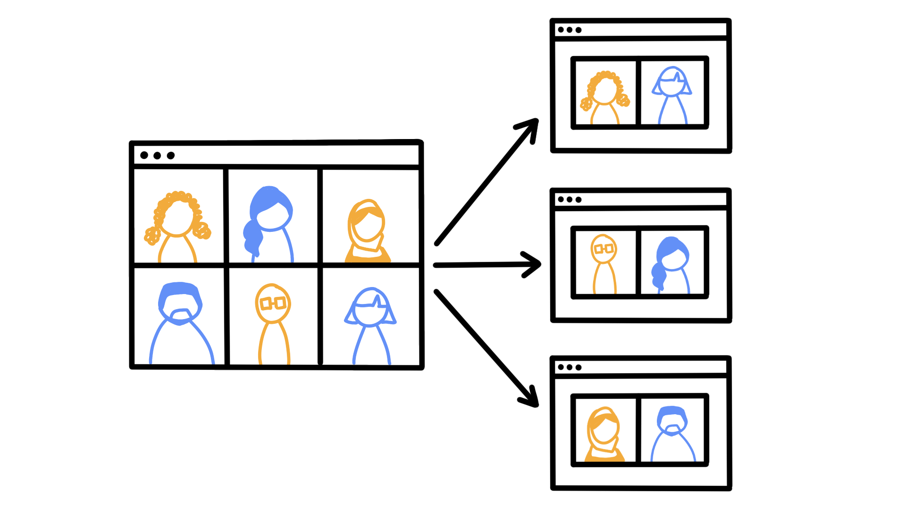
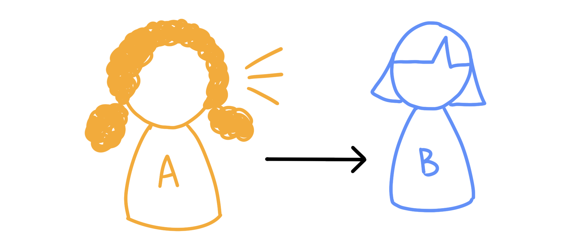
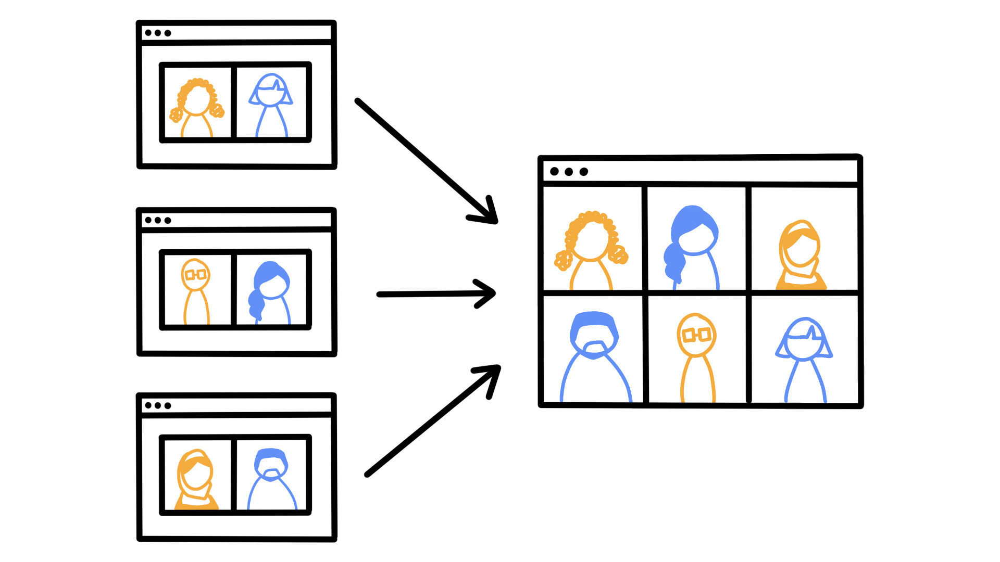
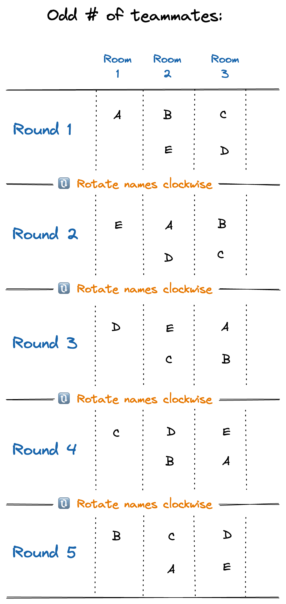
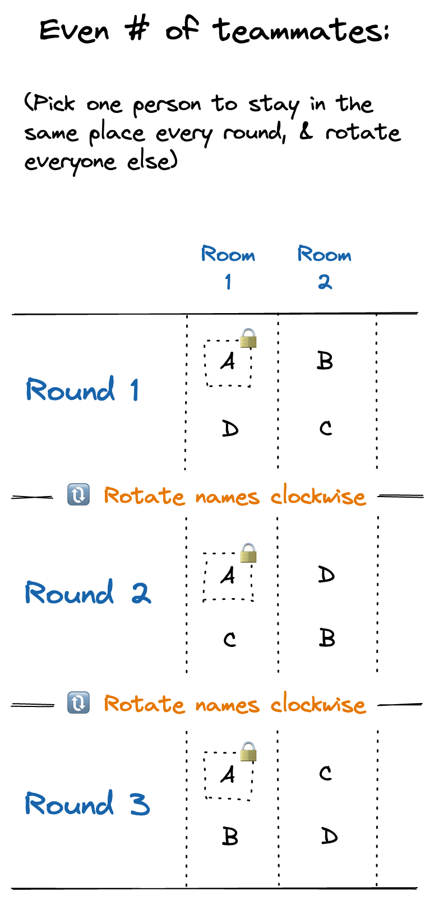

## Introduction

We all need feedback to help us grow. As Sarah Drasner says in her book, [*Engineering Management for the Rest of Us*](https://www.barnesandnoble.com/w/engineering-management-for-the-rest-of-us-sarah-drasner/1142398485), "We can steer our own ship to some extent, but at some point we can't always see our own work clearly, and we need input from others to improve."

A **360˚ speedback** is a type of meeting used for quickly sharing 1:1 feedback with teammates. (It's kind of like speed dating, but for exchanging feedback!) By the end of the speedback, everyone on the team will have shared feedback with everyone else.

In this post, you'll learn how to prepare for and facilitate your first speedback.

## Before the meeting

1. Teammates share their individual **goals** for what they want feedback on.

	- This can be anything that the individual finds helpful: a behavior they're trying to improve, leadership skills they're developing, content areas they're trying to build expertise in, etc.
  
	- Store these goals in a shared document or spreadsheet. Using a spreadsheet is a handy way to track how goals change over time. Label each row with a teammate's name, and label each column with the date of the speedback session. In each cell, teammates can put the goals they're looking for feedback on for that speedback session. (Check out the example below.)

| Teammate | November 17, 2022 | October 6, 2022 |
| :---: | --- | :---: |
| Megan | **Meeting facilitation.** Do our meetings feel efficient? What could I improve about the way I facilitate? | ... |
| Tahia | **Code reviews.** Am I leaving a good balance of positive and constructive comments? | ... |
| Angelo | **Communication.** Are my standup updates clear and easy to understand? What kind of information is most helpful in these updates? | ... |

<CalloutBox>

**Tip:** Prepare this list of goals as far in advance as possible. That way, teammates have time to keep an eye out for concrete examples of specific behaviors, which they can reference to give more meaningful feedback.

</CalloutBox>

2. The speedback facilitator creates the list of **pair rotations** for each round. (See the appendix below on [creating pair rotations](#appendix-creating-pair-rotations).)

3. The speedback facilitator creates the **meeting invite**.
    - The total meeting duration should be 7 minutes times the number of pair rotations. (So if your team has 5 rounds of pair rotations, the meeting should be 35 minutes long.)

## During the meeting

Complete as many rounds as it takes to get through all the pair rotations.

<CalloutBox>

**Note:** Speedbacks can be run remotely or in person! This post assumes you're running a remote speedback.

If you're facilitating an in-person speedback, the process looks mostly the same. But instead of using Zoom breakout rooms, you'll need to designate separate quiet areas where each pair can speak in private.

</CalloutBox>

For each round:

1. **(1 minute)** The facilitator sets up separate Zoom breakout rooms for each pair, and everyone joins their assigned breakout room. (If you're doing an in-person speedback, this time can be used for physically moving to the location for your next pairing.)

	- Each breakout room contains a single pair of teammates, Person A and Person B.

	- Have an odd number of participants? One person will be alone each round. I like to have this person look up a quick joke or fun fact to share when the group comes back together at the end of the round, while the facilitator assigns the next set of breakout rooms.

  

2. **(3 minutes)** In each breakout room, one person sets a timer for 3 minutes. Then Person A gives Person B feedback. Person B listens and takes notes. Person B can ask follow-up questions if needed, but Person A should be doing most of the talking.

	- This feedback can be related to what Person B put in their goals, or it can be something else Person A thinks would be helpful to hear. (Praise, areas for growth, progress on feedback topics from the previous speedback, etc.)

  

3. **(3 minutes)** When the first timer goes off, each pair switches roles and sets another timer for 3 minutes. Now Person B gives Person A feedback. Similarly, Person B should be doing most of the talking, while Person A listens.
  
  

4. When the second timer goes off, all the pairs rejoin the main Zoom room and wait for the next round.

  

<CalloutBox>

**Not sure what to say?**

Here are some resources with tips on how to give and receive feedback gracefully:

- [How to get feedback without falling apart](https://www.linkedin.com/pulse/how-get-feedback-without-falling-apart-elisabeth-fosslien), by Liz Fosslien. Tips on receiving feedback.
- [How to give feedback that doesn't pack a painful punch](https://www.linkedin.com/pulse/how-give-feedback-doesnt-pack-painful-punch-elisabeth-fosslien), by Liz Fosslien. Tips on giving constructive feedback.

</CalloutBox>

Once the group makes it through all the pair rotations, you're done! 🥳

## After the meeting

1. The facilitator schedules the next speedback! (I've found that having one speedback every 4-6 weeks is a good cadence. It's frequent enough to check in regularly, and spaced out enough to leave time to make meaningful progress.)

2. Teammates update their individual goals in the shared doc. They can choose to keep working on the same goal, or they can switch it up and pick a different thing they'd like feedback on.

## Wrap it up

Speedbacks are a great time to celebrate your teammates and the hard work you all do. They also help us recognize where we still have room to grow and improve.

Giving and receiving feedback might feel scary at first. But the more you practice having these conversations, the easier they'll get. Hang in there!

<CalloutBox>

**A closing caveat**

This one goes out to all you people-pleasers out there.

It's important to remember that feedback is a gift. But ultimately, you get to decide whether or not to act on a specific piece of feedback.

If something feels off about a suggestion, you don't *have* to address it. It's okay to note it as a single data point, and move on. That said, if you hear the same suggestion from multiple teammates, it may be a sign that there's something worth reevaluating.

</CalloutBox>

## Appendix: Creating pair rotations

These instructions will help the facilitator create the list of pair rotations for the speedback.

### If you have an **odd** number of participants:

1. For the first round, write everyone's names in two rows. Each column represents a pair who will be matched up for that round. There should be one empty space left in one of the rooms.

2. For the next round, rotate each person's name one position clockwise around the circle. Make sure to skip over the empty space, so that the empty space stays in the same position from the first round.

3. Continue rotating everyone around the circle for each round, until everyone makes it back to the position where they started.

Here's an example for a group of 5 participants (named A, B, C, D, and E):

<Collapsible summary={<em>Expand for detailed image description</em>}>

There are five rows, one for each round of the speedback. There are also three columns, one for each breakout room.

In round 1:
- Room 1 has only Person A.
- Room 2 has Person B and Person E.
- Room 3 has person C and Person D.

Then all the names rotate one position clockwise. In round 2:
- Room 1 has only Person E.
- Room 2 has Person A and Person D.
- Room 3 has Person B and Person C.

Again, all the names rotate one position clockwise. In round 3:
- Room 1 has only Person D.
- Room 2 has Person E and Person C.
- Room 3 has Person A and Person B.

Again, all the names rotate one position clockwise. In round 4:
- Room 1 has only Person C.
- Room 2 has Person D and Person B.
- Room 3 has Person E and Person A.

Once more, all the names rotate one position clockwise. In round 5:
- Room 1 has only Person B.
- Room 2 has Person C and Person A.
- Room 3 has Person D and Person E.

</Collapsible>

### If you have an **even** number of participants:

The process for assigning pairs is similar, with one difference: After step 1, choose one person to stay in the same position for every round. Then rotate everyone else using the same process as before.

Here's an example with 4 participants (named A, B, C, and D):

<Collapsible summary={<em>Expand for detailed image description</em>}>

With an even number of teammates, pick one person to stay in the same place every round, and rotate everyone else. (In this example, Person A stays in the same position every round.)

There are three rows, one for each round of the speedback. There are also two columns, one for each breakout room.

In round 1:
- Room 1 has Person A and Person D.
- Room 2 has Person B and Person C.

Then all the names (except Person A) rotate one position clockwise. In round 2:
- Room 1 has Person A and Person C.
- Room 2 has Person D and Person B.

Once more, all the names (except Person A) rotate one position clockwise. In round 3:
- Room 1 has Person A and Person B.
- Room 2 has Person C and Person D.

</Collapsible>
