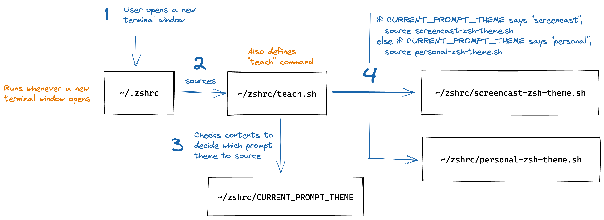

## Introduction

When you're recording a screencast for your latest piece of educational content, it's a good idea to simplify your dev setup. Removing distracting tooling customizations reduces cognitive load, so that learners can focus on the key ideas you want them to understand.

But as a developer, you probably also have your own preferences for tooling when you're working on your own programming projects outside of teaching.

There's a great post by [Joe Previte](https://twitter.com/jsjoeio) on [How to Create Code Profiles in VSCode](https://dev.to/jsjoeio/how-to-create-code-profiles-in-vscode-3ofo), which shows you how to create a shell command that switches between two different sets of VS Code settings. 
  
In this post, we'll expand that shell command to also switch between command prompt themes, to keep your terminal simple and distraction-free.

## Prerequisites

This post assumes that:

- You're using [zsh](https://en.wikipedia.org/wiki/Z_shell).
    - Not sure which shell you're using? On a Mac, open the Terminal app, and run `echo $SHELL`. It should output `/bin/zsh`.
    - **Note:** If you're using bash, you can still use the same principles from this post. But anywhere it says `zshrc`, you'll use `bashrc` instead.
- You have [Oh My Zsh](https://ohmyz.sh/) installed. This is what we'll use for customizing zsh themes.
- You've [set up VS Code to allow launching from the command line](https://code.visualstudio.com/docs/setup/mac#_launching-from-the-command-line).
- You've followed Joe's post on [How to Create Code Profiles in VSCode](https://dev.to/jsjoeio/how-to-create-code-profiles-in-vscode-3ofo).
	  - TL;DR: Create a new file at `~/code_profiles/teaching/data/User/settings.json`. Paste your VS Code settings for screencasts in there.

<Collapsible summary="Not sure what settings to use for screencasts?">

Here are the settings we use at Apollo for recording screencasts for the [Odyssey learning platform](https://www.apollographql.com/tutorials/).

```json
{  
  "zenMode.hideLineNumbers": false,  
  "workbench.colorTheme": "Apollo Midnight",  
  "editor.quickSuggestions": {  
    "other": false,  
    "comments": false,  
    "strings": false  
  },  
  "editor.wordBasedSuggestions": false,  
  "editor.suggestOnTriggerCharacters": false,  
  "workbench.statusBar.visible": false,  
  "editor.renderLineHighlight": "none",  
  "javascript.updateImportsOnFileMove.enabled": "always",  
  "editor.minimap.enabled": false,  
  "git.enableSmartCommit": false,  
  "window.zoomLevel": 3,  
  "zenMode.centerLayout": false,  
  "zenMode.fullScreen": false,  
  "editor.suggest.snippetsPreventQuickSuggestions": false,  
  "html.suggest.html5": false,  
  "editor.parameterHints.enabled": false,  
  "workbench.tips.enabled": false,  
  "editor.lightbulb.enabled": false,  
  "editor.hover.sticky": false,  
  "npm.fetchOnlinePackageInfo": false,  
  "editor.hover.enabled": false,  
  "editor.formatOnSave": true,  
  "editor.fontSize": 19,  
  "git.enabled": false, // prevents color-coding file names in the Explorer sidebar based on Git status
  "prettier.printWidth": 80,  
  "editor.glyphMargin": false,  
  "editor.cursorBlinking": "solid",  
  "editor.defaultFormatter": "esbenp.prettier-vscode",  
  "[javascript]": {  
    "editor.defaultFormatter": "esbenp.prettier-vscode"  
  },  
  "prettier.enable": true,  
  "eslint.format.enable": false,  
  "workbench.fontAliasing": "default",  
  "workbench.activityBar.visible": false  
}
```

</Collapsible>

## What you will build

Joe's post sets up a `teach` [alias](https://en.wikipedia.org/wiki/Alias_%28command%29), which you can run from the command line. This command opens a folder in a new VS Code window, with your screencasting settings loaded.

In this post, we'll expand the `teach` command to understand a few different options. Here's the API we'll build:

- `teach screencast <folder>`
    1. Opens the specified folder in VS Code using your screencasting settings.
    2. Switches shell preference to your screencasting zsh theme.

- `teach reset`
    1. Sets shell preference back to your personal zsh theme.
    2. The next time you run `code <file>` from the command line, it will load VS code with your original personal settings.


## The architecture

To build the `teach` command, we'll be configuring our `~/.zshrc` file. The `~/.zshrc` file gets run automatically whenever a new terminal window is open. (The "rc" stands for "run commands".)

Here's a high-level overview of the architecture we'll build to load the correct shell theme: 



1. Whenever a new terminal window is opened, the `~/.zshrc` file runs.
2. We'll set up our `~/.zshrc` file to source another file called `~/zshrc/teach.sh`.
3. The `~/zshrc/teach.sh` script will check the contents of a text file called `~/zshrc/CURRENT_PROMPT_THEME`.
4. Use the contents of `CURRENT_PROMPT_THEME` to load the correct zsh theme.
    - If the file's contents are the string "screencast", then `~/zshrc/teach.sh` will source the zsh theme from the `~/zshrc/screencast-zsh-theme.sh` file.
    - Otherwise, if the file's contents are the string "personal", then `~/zshrc/teach.sh` will source the zsh theme from `~/zshrc/personal-zsh-theme.sh`.

<CalloutBox>

**Note:** You could (in the way that all things are possible) just put all this logic directly into your `~/.zshrc` file. But we're going to break it up into multiple files, to keep things modular and tidy.

</CalloutBox>

## Instructions

Let's get to it!

1. Create a new file called `~/zshrc/personal-zsh-theme.sh`. You can do this from the command line by running the following:
    ```
    mkdir ~/zshrc
    touch ~/zshrc/personal-zsh-theme.sh
    ```
1. Move your existing personal zsh theme settings out of `~/.zshrc` and into the `~/zshrc/personal-prompt.sh` file. Here's what mine looks like:
    ```shell title="~/zshrc/personal-zsh-theme.sh"
    # Path to your oh-my-zsh installation.
    export ZSH="/Users/megansullivan/.oh-my-zsh"

    # Set name of the theme to load --- if set to "random", it will
    # load a random theme each time oh-my-zsh is loaded, in which case,
    # to know which specific one was loaded, run: echo $RANDOM_THEME
    # See https://github.com/ohmyzsh/ohmyzsh/wiki/Themes
    ZSH_THEME="robbyrussell"

    # Which plugins would you like to load?
    # Standard plugins can be found in $ZSH/plugins/
    # Custom plugins may be added to $ZSH_CUSTOM/plugins/
    # Example format: plugins=(rails git textmate ruby lighthouse)
    # Add wisely, as too many plugins slow down shell startup.
    plugins=(git)

    source $ZSH/oh-my-zsh.sh
    ```
1. Create a new file, `~/zshrc/screencast-zsh-theme.sh`. You can do this from the command line by running the following command:
    ```
    touch ~/zshrc/screencast-zsh-theme.sh
    ```
1. Put your zsh theme settings for screencasting in the new `~/zshrc/screencast-zsh-theme.sh` file. At Apollo we use the [powerlevel10k](https://github.com/romkatv/powerlevel10k) theme for screencasts, so here's what my teach theme looks like:
    ```shell title="~/zshrc/screencast-zsh-theme.sh"
    # Enable Powerlevel10k instant prompt. Should stay close to the top of ~/.zshrc.
    # Initialization code that may require console input (password prompts, [y/n]
    # confirmations, etc.) must go above this block; everything else may go below.
    if [[ -r "${XDG_CACHE_HOME:-$HOME/.cache}/p10k-instant-prompt-${(%):-%n}.zsh" ]]; then
      source "${XDG_CACHE_HOME:-$HOME/.cache}/p10k-instant-prompt-${(%):-%n}.zsh"
    fi

    # Path to your oh-my-zsh installation.
    export ZSH="/Users/megansullivan/.oh-my-zsh"

    # Set name of the theme to load --- if set to "random", it will
    # load a random theme each time oh-my-zsh is loaded, in which case,
    # to know which specific one was loaded, run: echo $RANDOM_THEME
    # See https://github.com/ohmyzsh/ohmyzsh/wiki/Themes
    ZSH_THEME="powerlevel10k/powerlevel10k"

    # Which plugins would you like to load?
    # Standard plugins can be found in $ZSH/plugins/
    # Custom plugins may be added to $ZSH_CUSTOM/plugins/
    # Example format: plugins=(rails git textmate ruby lighthouse)
    # Add wisely, as too many plugins slow down shell startup.
    plugins=(git)

    source $ZSH/oh-my-zsh.sh

    # To customize prompt, run `p10k configure` or edit ~/.p10k.zsh.
    [[ ! -f ~/.p10k.zsh ]] || source ~/.p10k.zsh
    ```
    - **Note:** Using powerlevel10k requires some extra installation steps, which you'll need to do first. For more details, refer to the [powerlevel10k installation instructions for Oh My Zsh](https://github.com/romkatv/powerlevel10k#oh-my-zsh).
1. Set the initial value of the `~/zshrc/CURRENT_PROMPT_THEME` file to "personal" by running the following from the command line:
    ```
    echo "personal" > ~/zshrc/CURRENT_PROMPT_THEME
    ```
1. Create a new file, `~/zshrc/teach.sh`. You can do this from the command line by running the following:
    ```
    touch ~/zshrc/teach.sh
    ```
1. Add the following to `~/zshrc/teach.sh`:
    ```shell title="~/zshrc/teach.sh"
    # read the CURRENT_PROMPT_THEME file, and load the corresponding shell theme
    cat ~/zshrc/CURRENT_PROMPT_THEME | while read line; do
      if [[ $line = "personal" ]]
      then
        source ~/zshrc/personal-zsh-theme.sh;
      elif [[ $line = "screencast" ]]
      then
        source ~/zshrc/screencast-zsh-theme.sh;
      fi
    done

    # defines a "teach" command that can be run from the command line
    teach() {
      # usage: teach reset
      # - sets shell preference back to personal theme
      if [[ $1 = "reset" ]]
      then 
        source ~/zshrc/personal-zsh-theme.sh;
        echo "personal" > ~/zshrc/CURRENT_PROMPT_THEME;

      # usage: teach screencast <folder>
      # - switches shell preference to screencast theme
      # - opens the specified folder in VS Code using screencast settings
      elif [[ $1 = "screencast" ]]
      then
        source ~/zshrc/screencast-zsh-theme.sh;
        echo "screencast" > ~/zshrc/CURRENT_PROMPT_THEME
        code --user-data-dir ~/code_profiles/teaching/data $2;

      # default message
      else
        echo "  Command not recognized. Options:";
        echo "  - teach reset: restore personal preferences for command prompt";
        echo "  - teach screencast <folder>: switch command prompt and open with VS code settings for screencasting";
      fi
    }
    ```
1. Add the following line somewhere in your `~/.zshrc` file (the exact position doesn't matter):
    ```shell title="~/.zshrc"
    source ~/zshrc/teach.sh
    ```
1. Manually reload your `~/.zshrc` file by running the following from the command line:
    ```
    source ~/.zshrc
    ```

Now you should be able to use the `teach` command! Let's test it out in the next section.

## Testing it out

Time to see our shell script in action! Let's test out the `teach` command and make sure it behaves correctly.

### Switching to screencasting settings

First, let's check that our screencasting settings load correctly. Run the following from the command line:

```
teach screencast ~
```

This should open your home directory in a new VS Code window, using your screencast VS Code settings.

Open the VS Code integrated terminal. It should be using your screencasting zsh theme.

### Switching to personal settings

Now, let's check that we can reset to our personal settings correctly. Run the following from the command line:

```
teach reset
```

Now when you open a new shell window (in Terminal or in VS Code), it should be using your personal zsh theme.

<CalloutBox>

🚨 **Known issue:** On my machine, after running `teach reset`, the shell theme in my existing terminal window doesn't update. But if I open a new window/tab, it will load the correct zsh theme.

This happens because the p10k theme I use for my teaching zsh theme sets a bunch of environment variables that don't get unset in the current shell when `teach reset` gets run. So some combination of those p10k environment variables gets in the way of zsh using my personal theme. Opening a new shell window works because then the `~/.zshrc` file starts fresh and only loads the environment variables for my personal theme.

This isn't a huge deal for me, since I won't be switching themes in the middle of a screencast, and it's a minor chore to open up a new terminal window. But if you can think of an easy way to fix it, let me know!

</CalloutBox>

## Wrap it up

You did it! Now you can use the `teach` command to switch between shell themes.

I hope this post was helpful. If you enjoyed it, reach out on [Twitter](https://twitter.com/meganesulli) or support my work via [Ko-fi](https://ko-fi.com/meganesulli). I can't wait to see the cool things you create!
