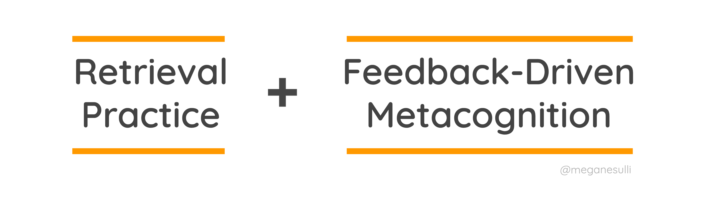
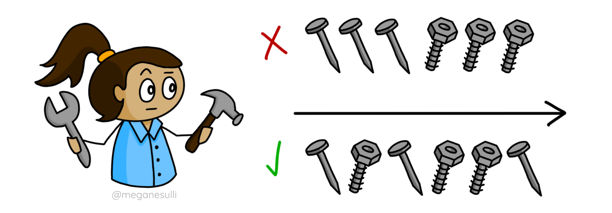

import Collapsible from '../../src/components/collapsible'
import CalloutBox from '../../src/components/callout-box'

## Introduction

Before I joined the tech industry, I worked as a tutor, a teaching assistant, a curriculum writer. And if I’ve learned anything from all my years of teaching, it’s that **learning new things is hard.**

Especially in the tech industry! As developers, we have a constant stream of new things to be learning, and every technology has its own quirks. Jargon! Syntax! Tools! It’s easy to feel overwhelmed, especially if you’re just getting started.

In this post, I’m going to talk about a few strategies you can use to learn more efficiently.

## How We Learn

But first, I want to take a step back and talk about learning in general. The doodle below shows the progression of how we learn.

1. First, you start out in the **developing** stage. You’re still acquiring knowledge - maybe you’ve done a few tutorials. But you don’t have a lot of practice under your belt yet, and so you still need a lot of support to do anything substantial.

2. Once you’ve practiced some more, you move on to the **competence** stage. This is when you start to “get” it. You can do the thing, but it still requires conscious effort, or extra supports like checklists or cheat sheets.

3. If you practice even more, eventually you reach the **mastery** stage. This is when you’ve developed deep expertise in a subject. At this point, you understand how nearly all the pieces of the puzzle fit together, and you can do the thing without consciously thinking about it. In other words, you’ve developed automaticity (meaning you can do it automatically).

### **Tangent:** Why Competence Isn't Enough

It can be tempting to stop practicing once you reach the competence stage, because you feel like you get it enough to get the job done.

But the great thing about achieving mastery is that, once you can handle the basics on autopilot, your brain is freed up to spend more time doing the hard work of creative problem solving.

I have a quick analogy to help illustrate what I mean. When I was first learning how to drive, I felt really overwhelmed by all the different things I had to keep track of. Was that dog on the sidewalk going to run into the street? Was that green light about to turn yellow? Was I too close to the car in front of me? There’s a lot to think about all at once!

But now that I’m a more experienced driver, my brain is able to process things like that dog and that light and the car in front of me without me even consciously thinking about it.

It’s not that I don’t see the same stimuli as when I was a beginner. But now, I’ve practiced driving enough so that I can react to all those things automatically. And that frees up my brain to wander and contemplate life’s real hard questions.

## Tips to Maximize Learning

So we know that - with lots of practice - we can achieve mastery. But *how* should we practice, to make sure we’re spending our time efficiently?

The main strategies I’m going to talk about in this post are a combination of retrieval practice and feedback-driven metacognition. Basically, trying to remember things that you’ve learned, and then checking your answers to see if you were right.

### 1) Retrieval Practice

> “The limiting factor for long-term memory is not retention (what is stored) but recall (what can be accessed).”
>
> Greg Wilson, [Teaching Tech Together](https://teachtogether.tech/)

If you think about some typical study patterns (like cramming for a test, re-reading notes or textbooks, or binge-watching online courses) many of them focus on retention - trying to shove information into your brain. And even though that can *feel* productive, it doesn’t help much when you actually need to use that information.

Retrieval practice, on the other hand, is all about trying to get information out of your brain. Which is ultimately the skill you want to practice, since that’s what you’ll have to do when you’re trying to use what you’ve learned for your actual job or side project.

Let’s take a quick look at how memories work. Your brain has two different kinds of memory: working memory (also called short-term memory) and long-term memory.

You can think of your working memory as a backpack, where you hold onto the memory books you’re currently working with. It’s quick to access, but it’s not very big, so it can only hold a few things at a time. Your long-term memory is like a bookshelf. You can store a lot more information there, but it’s a bit slower to access, because it takes some time to find the book you’re looking for.

**Retrieval practice** is the act of deliberately pulling information out of your long-term memory and back into your working memory.

When you practice remembering a particular piece of information, your brain thinks, “Oh, we keep trying to access this memory, so it must be important,” and strengthens those neural pathways, which makes it easier for you to remember that thing again next time.

Studies have shown that using retrieval practice leads to better long-term retention of information than cramming or rereading. That’s not to say that retrieval practice is easy! It’s hard, and it can feel frustrating, like constantly having a word on the tip of your tongue that you can’t quite remember. But studies have also shown that the more challenging something is to learn, the better it is for long-term learning.

### 2) Feedback-Driven Metacognition

The second piece of this technique is called **feedback-driven metacognition**, which essentially means using feedback to reflect on your own thinking.

Put simply, this means checking your answer after retrieving it. So when you’re practicing, you should be constantly alternating between trying to remember some piece of knowledge, and then checking yourself to see if you were correct.

This feedback loop helps cement the things you already know, and it also helps you identify gaps in your current knowledge.

If we go back to the backpack analogy, when you use feedback-driven metacognition to check your retrieval, you give your brain a chance to update that memory. It’s like adding notes to the margin of your memory book, to correct a misconception or add some extra details. That way, the next time you retrieve that memory, there’s a bit more information.

### Putting It Into Practice

Now that we’ve talked about what retrieval practice and feedback-driven metacognition are, let’s look at some examples of how you can put these strategies into practice.

1. **"Read-cover-retrieve."** Immediately after reading a section (or watching a video), cover up what you just read with your hand, and try to restate what you learned in your own words.
    * For best results, try actually speaking aloud, so that your brain really has to go through the process of distilling and communicating the information. Remember, the more challenging you make it for yourself, the better it will be for your long-term learning.
2. Make **flashcards** to test yourself on key vocabulary or concepts. (Personally, I have a set of Git flashcards that I made for myself, with a command on one side and a diagram showing what it does on the other side.)
    * Again, when you’re testing yourself, try to actually say your answer out loud first, as opposed to looking at the card, thinking, “Oh yeah I know this one,” and flipping it over to read the answer (which is really just rereading and not actual retrieval practice).
3. Do a **brain dump**. Get a blank piece of paper and write down everything you know about a topic. (This is also called the Feynman Technique.) You can make a concept map of key ideas, or you can write it out in words. The important thing is forcing your brain to articulate the concepts in your own words.

## Take It to the Next Level

Congratulations! You now know the basics of retrieval practice and feedback-driven metacognition.

Now that we’ve covered the fundamentals, it’s time to turn things up a notch. Next, we’ll look at a few ways you can make your retrieval practice more challenging, which will help you remember things even better.

### **Pro Tip #1:** Spaced Repetition

The first pro tip is to use **spaced repetition**, which means spreading out your practice over a several practice sessions. For example, instead of practicing a new skill for two hours all in one afternoon, it's better to practice for half an hour over the course of four days.

But why is that?

The graph below shows how the strength of a memory decays over time. It comes from a study by a German psychologist named Hermann Ebbinghaus. He memorized a bunch of random gibberish words, and then charted how well he was able to remember them at various time intervals.

Ebbinghaus found that the strength of a memory is strongest when you first learn it, then decays exponentially. It decreases the fastest in the first 20 minutes, then continues to drop for the first hour, and then eventually levels out after a day or so.

In other words, the more time that passes, the less you remember. Not terribly groundbreaking on its own. But what’s interesting is when you look at how this curve is affected by spaced repetition.

Ebbinghaus did another experiment, where he tracked the forgetting curve for his list of nonsense words, and then once he couldn’t remember any of the words anymore, he reviewed the list and started tracking a new forgetting curve. He repeated that process a bunch of times - learning, forgetting, relearning, forgetting again.

And he found that the rate of decay in each subsequent forgetting curve was actually slower than the previous ones. In other words, **the act of remembering something slows the rate at which you forget it**.

The key takeaway here is that, by giving yourself some time to forget between retrieval practice sessions, you’re actually strengthening those memories and making them easier to recall in the future.

### **Pro Tip #2:** Interleaved Practice

The second pro tip is to use **interleaved practice**. In other words, mix up the order in which you practice different skills.

For example, imagine you're learning how to use a hammer and how to use a wrench. With interleaved practice, instead of doing all the nails first and all the bolts second, you’d switch randomly back and forth between the two.

You might be thinking that this seems inefficient. Wouldn’t it be faster to do all the hammering first and then do all the wrenching? You’re right, but remember that the more challenging you make your retrieval practice, the better your long-term learning gains will be. With interleaved practice, the focus isn’t on getting the job done as quickly and easily as possible. It’s about practicing **how to choose the right tool for the problem at hand**.

## Try It Now!

Before you go, I want to give you one chance to try out retrieval practice for yourself.

Grab a piece of paper and do a quick brain dump of all the key ideas you can remember from this post. Ready? Go!

<Collapsible
  summary="When you're done, click here for some feedback-driven metacognition."
>

The diagram below recaps the main concepts from this post.

How many did you remember? Which ones did you forget or misremember?

For a bonus challenge, try explaining each of these concepts in your own words.

</Collapsible>

Otherwise, I’ll leave you with one final thought:

Learning new things is hard. **And you can do hard things.**

## Resources

- [Retrieval Practice](https://www.retrievalpractice.org/) 🌐
- [How to Remember Anything Forever-ish](https://ncase.me/remember/) 🌐
- [Learning How to Learn](https://www.coursera.org/learn/learning-how-to-learn) 👩‍🏫
- [Practice Perfect](https://teachlikeachampion.com/books/practice-perfect/) 📚
- [Make It Stick](https://www.hup.harvard.edu/catalog.php?isbn=9780674729018) 📚
- [Teaching Tech Together](https://teachtogether.tech/) 📚
- [Cult of Pedagogy](https://www.cultofpedagogy.com/) 🌐