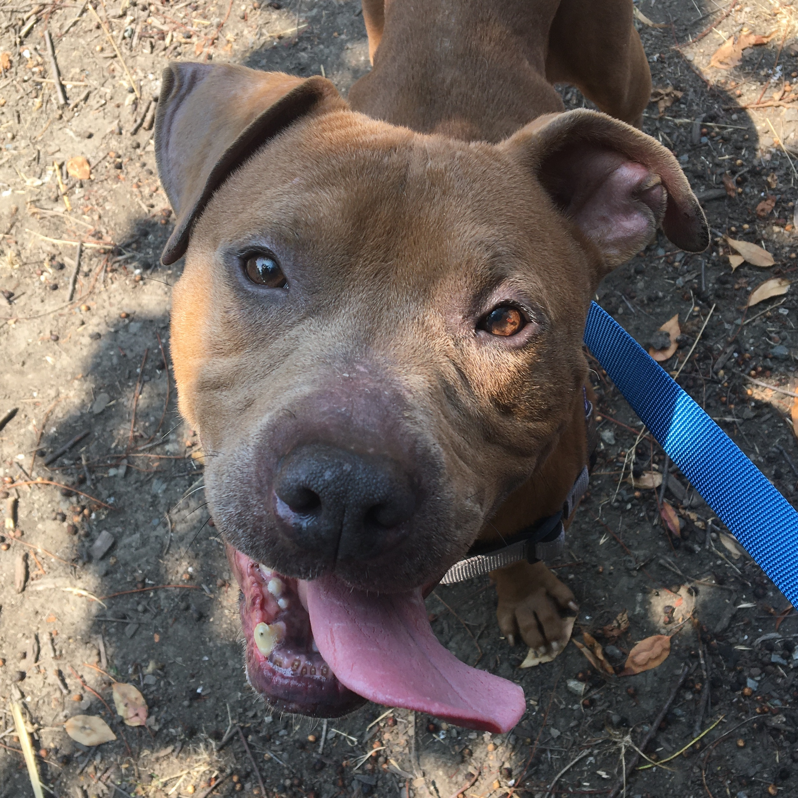

import CalloutBox from '../../src/components/callout-box'

## Introduction

Frankly, I don't know how to write an introduction to this hot mess of a year, so I'm just going to jump right into the reflection.

I love retrospectives. Taking a step back to reflect on progress and set new goals helps me feel like I have some control over my life. Here's a peek into what I've been thinking about as 2020 comes to a close.

## Looking Back 👀

### 2020 Goals

First, here's a recap of the goals I set for myself at the end of last year:

* 🏠 **Start working 100% remote.** I was working in San Francisco, which meant commuting 3 hours a day on a bus. It was brutal, especially in the winter, when I left for work in the dark and got home in the dark.
* 🐶 **Get a dog!** The precursor to this was buying a house (because I was tired of landlords with breed restrictions). Last December, my boyfriend and I moved in with my grandparents when our apartment lease was up, so that I could save money on rent.
* 💻 **Make a tech project.** Start this blog. Build more of an online presence.
* 🛠 **Build something with my hands.** Maybe a computer? Maybe something related to woodworking? Basically, I wanted to build something that wasn't on a screen.
* 🎉 **Get promoted to senior developer.** Last year, I'd started taking on more responsibilities at work. I presented about our team's microservice at the client's frontend chapter meeting. I helped plan working sessions for a team inception at the start of a new project. I became the team point of contact for working with the client's third-party accessibility consultants. I felt like I was finally able to keep up with the other senior developers on my team, and I wanted my job title to reflect that.
* 📊 **Learn some data science things!** The company where I worked provided free DataCamp subscriptions for employees, and I wanted to use it.

### 2020 Accomplishments

#### Game Boy Opcode Table

I finished my first side project! It's an [interactive Game Boy opcode table](/generate-gb-opcodes/). I started it last July and worked on it sporadically through March. I wrote a blog post with more details: [Meet the Game Boy Instruction Set](/blog/game-boy-opcodes).

#### Building an Online Presence

I started this blog! I've also been cross-posting everything on [DEV](https://dev.to/meganesulli), since I don't have a very big following of my own yet. I wrote 7 posts this year (not including this one), and I've got a backlog with many more ideas.

So far, I'm mostly writing for myself, to capture things I'm learning or want to remember. I'm still trying to figure out a balance between writing for myself versus writing for others.

<CalloutBox>

**By The Numbers**

Here's a breakdown of my current stats from my DEV dashboard:

| Post | Views | Reactions | Comments |
| --- | --- | --- | --- |
| Meet the Game Boy Instruction Set | 676 | 12 | 0 |
| 3 Teaching Techniques to Make You a Better Consultant | 125 | 10 | 2 |
| A Deep Dive on Managing Focus with React, Jest, and Enzyme | 49 | 7 | 0 |
| Improve Your Documentation by Playing Paper Mario | 197 | 13 | 0 |
| [Sketchnote] Web Storage APIs: How Browsers Store Data | 225 | 18 | 4 |
| Ways to Use Up Your Professional Development Budget | 497 | 11 | 5 |
| [Sketchnote] Why Use GraphQL? | 212 | 12 | 5 |

</CalloutBox>

I've also been more active on Twitter this past year (as opposed to my default state: lurking). There are lots of cool people making cool things, and I'm trying to push my introverted self to be more outgoing and make new friends. Participating in Twitter chats like #CodersTeach and #DevDiscuss has been a helpful place to start!

Right now, I have 234 Twitter followers, which is way more than I had at the beginning of the year! (I used to be below 100.) And I have 73 DEV followers.

#### Home Life

I bought a house in May! It's a cute little house with a farmhouse cottage vibe, and I love it.

I want to acknowledge the many privileges I have that made this possible: a job that paid well enough for me to save up money for the last few years, grandparents who let me live with them rent-free so I could save even more, parents and extended family who helped me make up the difference to afford a down payment. I worked hard for this, but I'm also extremely lucky, and I'm grateful to the people who helped me get here.

Now that we have a yard, my boyfriend and I made own backyard garden to grow our own food. I've always wanted to live on a farm, and at the start of quarantine I started obsessively watching homesteading channels on YouTube. By the time we moved into the house, I already had dozens of plant starts ready to put in the ground. Tomatoes, peppers, ground cherries, sweet potatoes, eggplants. We had moderate success, considering how late we got things into the ground. But we've learned a lot, so hopefully next year will be even better!

Most importantly, being a homeowner meant I could finally get a dog! And no landlord could tell me what breeds I could or couldn't have! I've been a dog volunteer at [Oakland Animal Services](https://www.oaklandanimalservices.org/) since last June, and I knew I wanted to adopt a dog from there. But unfortunately, when COVID hit, most volunteers weren't allowed at the shelter anymore, so I didn't know any of the dogs available for adoption. Luckily, I reached out to the volunteer coordinator to tell her roughly what kind of dog I was looking for, and she said she'd keep an eye out for me.

In September, she introduced us to Clifford! He's been an absolute dream. He needed some training when we first brought him home, as is to be expected with any new dog. But he's been adjusting well. He wags his tail much more now (he didn't wag it at all at first), and he loves to cuddle on the couch.

#### New Job

I started a new job at Gatsby in September. I'm a senior software engineer, specifically focused on our documentation. I love that I get to use both my teaching and technical skills. Plus I got to work with some great engineers that I've looked up to on Twitter for a while. (Shoutouts to [Aisha Blake](https://twitter.com/AishaBlake) and [Laurie Barth](https://twitter.com/laurieontech)!)

My first big project just went live! [We reorganized all the existing documentation.](https://www.gatsbyjs.com/blog/announcing-new-gatsby-docs-site/) It was a huge effort that got done surprisingly quickly, thanks to loads of help from [Sam Bhagwat](https://twitter.com/calcsam) and [Flo Kissling](https://twitter.com/fk). I've got lots of ideas for future improvements, so there will be lots to do once I head back to work next week.

#### Physical Health

_TW: body image_

This year I started taking my physical health more seriously. I used to exercise pretty regularly. I danced for 12 years growing up, I went to the gym in college, I walked everywhere when I lived in New York. But when I moved back to the Bay Area, I stopped moving quite so much. And then the pandemic hit, and whatever small amount of muscle I had left slowly withered away.

A while back, I remember seeing someone on social media share an [infographic about the average age people peak at different skills](https://www.businessinsider.com/science-what-peak-age-is-2016-7). The average age for peak muscle strength is 25, which was younger than I was at the time. I remember anxiously thinking, "Oh god, is this really as strong as I'm ever going to get?"

When I started working at Gatsby, I got enough of a bump in my salary that I could justify hiring a personal trainer. It's been about a month so far, and it's been going really well! We meet twice a week for a Zoom workout session, and I have a set of daily stretches and exercises I do on my own. She's already been able to help me strengthen my core to help alleviate my lower back pain. Plus it's nice to actually be able to see some muscle definition when I flex!

### Expectations vs. Reality

So, how did my year measure up to the goals I set for myself?

| Goal | Progress |
| --- | --- |
| 🏠 Start working 100% remote. | ✅ Done! Gatsby is 100% distributed. No commute for me!|
| 🐶 Get a dog! | ✅ Done! Welcome to the family, Clifford! |
| 💻 Make a tech project. | ✅ Done! I finished my Game Boy opcode table, and I made this blog. |
| 🛠 Build something with my hands. | ✅ Done! My boyfriend and I built raised garden beds for my grandmother. |
| 🎉 Get promoted to senior developer. | ✅ Done! I'm a big kid now 🎶🦒 |
| 📊 Learn some data science things! | 🚫 Not done. I ended up not making any progress on this. Oh well! |

### 2020 Lists

This section covers some of the other things I worked on this year.

<CalloutBox>

**Key**
* 📚 - finished
* 📖 - still in progress

</CalloutBox>

#### Books I Read

Non-Fiction:

* Mismatch: How Inclusion Shapes Design, by Kat Holmes 📚
* The Developer's Guide to Content Creation, by Stephanie Morillo 📚
* Just F*cking Ship, by Amy Hoy 📚
* Animal, Vegetable, Miracle: A Year of Food Life, by Barbara Kingsolver 📖
* Practice Perfect: 42 Rules for Getting Better at Getting Better, by Doug Lemov, Erica Woolway, and Katie Yezzi 📖
* How to Make Sense of Any Mess, by Abby Covert 📖
* Adaptive Web Design: Crafting Rich Experiences with Progressive Enhancement, by Aaron Gustafson 📖
* Inclusive Components, by Heydon Pickering 📖

Fiction:

* A Dog's Way Home, by Bruce Cameron 📚
* The Hate U Give, by Angie Thomas 📚
* Call Me By Your Name, by André Aciman 📖
* Sense and Sensibility, by Jane Austen 📖

#### Courses I Took

* Being Antiracist, by Kim Crayton 📚
* Accessibility in JavaScript Applications, by Marcy Sutton (Frontend Masters) 📚
* Introduction to Gatsby, by Jason Lengstorf (Frontend Masters) 📚
* Intermediate Gatsby with Gatsby Themes, by Jason Lengstorf (Frontend Masters) 📖
* SVG Essentials & Animation, v2, by Sarah Drasner (Frontend Masters) 📖
* Design for Developers, by Sarah Drasner (Frontend Masters) 📖
* Learning How to Learn, by Barbara Oakley and Terry Sejnowski (Coursera) 📖

### 2020 Challenges

#### 1) Surviving a global pandemic.

It goes without saying that COVID threw a huge wrench into everyone's plans for the year. It was a hot mess. It's still a hot mess here in the United States. Please wear a mask.

#### 2) Adjusting to the fast pace of startups.

When I was at ThoughtWorks, I was staffed at a large retail company. There was lots of process and bureaucracy, and things moved at a relatively slow pace. We had week-long inceptions at the start of each project, so the team could focus entirely on scoping out the work and crafting stories and acceptance criteria.

Now that I'm at Gatsby, I'm finding that things move much faster. I'm still trying to find a happy medium between thinking things through ahead of time and shipping things quickly.

#### 3) Staying focused.

I have a tendency to want to do all the things all at once. This year, I wanted to learn more about accessibility, testing, design, information architecture, content creation, data science, and probably other things I'm forgetting. On top of that, I had a list of nontechnical things I wanted to get better at: education, growing food, piano, ukulele, drawing, dog training.

Because I kept bouncing from thing to thing, I feel like I didn't make as much progress as I could have. The times when I felt like I accomplished the most were when I would pick one goal (like "release my Game Boy opcodes project"), make a little dependency map of all the tasks needed to accomplish that goal, and then focus on getting those tasks done. I found that groove a few times over the past year. I'd like to get better at recreating it on a more regular basis. Which leads me to my next challenge...

#### 4) Maintaining consistency.

This past year, I had bursts of productivity. For a week or two, I would fixate on learning or writing about a new concept, spending all my after-work hours diving deep into the subject. But after a while, I would burn out and end up spending weeks playing video games or binge-watching bad TV on Netflix.

I'm trying to be kind to myself because of the pandemic, but I also know that this isn't a new pattern for me. I'd love to find a more sustainable way to be productive so that I can maintain that initial curiosity over a longer period of time. 

## Looking Forward 🔮

### 2021 Goals: The Year of Good Habits

In her Coursera course, *Learning How to Learn*, Dr. Barbara Oakley explains that one good way to combat procrastination is to focus on the *process* instead of on the *product*. With that in mind, my goals for 2021 revolve around establishing healthy habits:

* 💪 Continue improving my physical health by working out twice a week, stretching every day, and tracking calories.
* ✏️ Create content more consistently by writing for 10 minutes a day. This could be journaling, taking notes on something I learned, outlining a blog post. Anything that takes a thought out of my head and gets it down on paper.
* 🎨 Improve my sketching skills by drawing for 10 minutes a day. I used to doodle a lot in college, and I miss exercising that part of my brain. 
* 🧠 Continue developing my technical skills by spending 30 minutes a day on professional development. (Workdays only.) I've accumulated a long list of learning resources, and I need to actually start working through them!
* 🎶 Learn to play one new song a month. I play a little guitar and a little ukulele, but I haven't played at all this past year.
* 📚 Read at least one page a day. 

I hope that having several smaller goals will help me make steady progress toward my larger (more overwhelming) goals. I'm planning on using a timer and some kind of digital habit tracker to help me visualize my progress. If you have any favorites, please share them!

Some other things I hope to do this year:

* 👀 Learn in public. I really love [Steph Smith's Open page](https://stephsmith.io/open), and I'd like to create something similar to capture a bird's-eye view of my progress.
* 🎥 Try streaming!
* 🐶 Work on Clifford's stranger danger and reactivity to other dogs.

## Wrap It Up

If you're interested in keeping tabs on my writing, I recently added an [RSS feed for my blog](/rss.xml). Or you can [follow me on Twitter](https://twitter.com/meganesulli) to hear my one-off thoughts on tech, education, and other random topics. (Plus you'll get more photos of Clifford!)

Looking forward to learning and growing with y'all in 2021!
