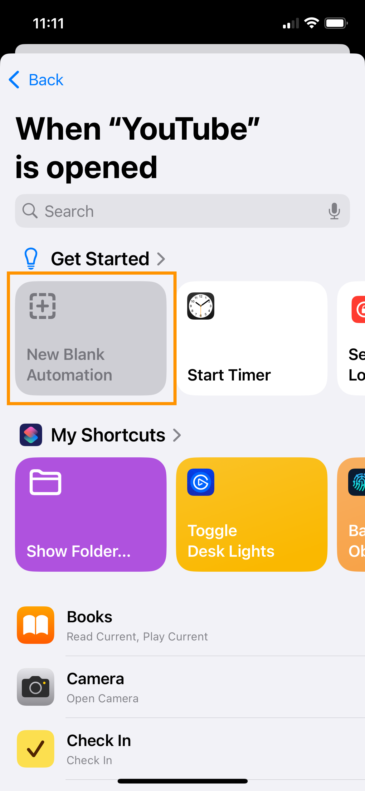

<CalloutBox>
**Note:** This post was inspired by my recent [BlueSky thread](https://bsky.app/profile/meganesulli.bsky.social/post/3legf5qma3s2e).
</CalloutBox>

## Introduction

Last year, I spent way too much time binge-watching YouTube videos. I tell myself I was learning new things, but most of the time I was just bored and wanted to have something on in the background.

But it's a new year, which means I'm reflecting and setting new goals! This year, I want to be more intentional about how I spend my time.

To kick things off, I created an iOS Shortcut on my phone to help stop me from mindlessly scrolling. In this post, I'll show you how to set it up on your own phone.

<CalloutBox>
**Note:** I set this Shortcut up to run when I open the YouTube app, but you could easily change it to run when you open a different app.
</CalloutBox>

## Prerequisites

Before you begin this tutorial, you should have an iPhone or iPad with the following:

- ✅ [Shortcuts](https://apps.apple.com/us/app/shortcuts/id915249334): an Apple app for creating automations on your device
	- As of iOS/iPadOS 13+, the Shortcuts app comes pre-installed as a default app on your device.
- ✅ YouTube (or another app that is equally as time-consuming)
- ✅ A [Reminders list](https://support.apple.com/en-us/119953) of activities you want to do instead of using YouTube
	- My list includes things like "Call a friend" or "Learn something new".

<CalloutBox>
  **Version notes:** At the time of writing, my iPhone is using iOS 18.1.1.
</CalloutBox>

## The Big Picture

Here's a quick overview of what the Shortcut will do:

When the YouTube app opens, our Shortcut will open a menu that asks the user why they're here.

The user chooses from a list of options:
* I'm bored. I should find something else to do.
* I want to watch something specific.
* I'm relaxing. I should set a timer so I don't lose track of time.

If the user selects "I'm bored", the Shortcut redirects them to a list of other activities they can do instead. (I set this list up in the Reminders app, but you could tweak the Shortcut to use a Note or some other list.)

If the user selects "I want to watch something specific", the menu closes and the user can use the YouTube app the same as they normally would.

If the user selects "I'm relaxing", the Shortcut asks the user how long they want to spend watching YouTube. Then it sets a timer in the background and let the user proceed into the YouTube app.

## 1) Create the Automation

Now that we know where we're headed, let's get started!

1. Open the **Shortcuts** app.
    

2. Navigate to the **Automation** tab.

    <IPhoneScreen>
      
    </IPhoneScreen>

3. Select the **+** icon to create a new automation.

    <IPhoneScreen>
      
    </IPhoneScreen>

4. In the Personal Automation menu, you choose the trigger for your Shortcut. Use the search box to find and select **App**.

    <IPhoneScreen>
      
    </IPhoneScreen>

5. In the When menu, select the following settings:
	- App: **YouTube**
	- **Is Opened**
	- **Run Immediately**

    <IPhoneScreen>
	    
    </IPhoneScreen>

6. Select **Next**. This takes you to a screen with some options for what you can do when you open the YouTube app.

    <IPhoneScreen>
      
    </IPhoneScreen>

7. Under the Get Started heading, select **New Blank Automation**.

    <IPhoneScreen>
      
    </IPhoneScreen>
    
8. Now you can build the Shortcut that runs when you open the YouTube app.

    <IPhoneScreen>
      
    </IPhoneScreen>

## 2) Set Up the Shortcut

Let's build out the Shortcut behavior we described earlier.

1. Use the search bar to find and select **Choose from Menu**.

    <IPhoneScreen>
      
    </IPhoneScreen>
    
2. The menu adds some new sections to your Shortcut body. In the first section, you can update the menu prompt and options. The additional sections let you define what happens if the user selects a particular menu option.

    <IPhoneScreen>
      
    </IPhoneScreen>
    
3. In the Prompt field, enter: *🛑 Why are you here?*

    <IPhoneScreen>
      
    </IPhoneScreen>
    
4. In that same first section, replace the existing menu options with the following choices:
	- I'm bored. I should find something else to do.
	- I want to watch something specific.
	- I'm relaxing. I should set a timer so I don't lose track of time.

    <IPhoneScreen>
	    
    </IPhoneScreen>

5. Notice that when you update the menu options, the headings of the subsequent sections update to match the option text.

    <IPhoneScreen>
      
    </IPhoneScreen>

With the basic structure of our Shortcut in place, we're ready to work on the individual menu options.

## 3) "I'm bored": Open Reminders List

Let's start with the "I'm bored" option. When the user selects this option, we want the Shortcut to redirect them to the Reminders list (from our prerequisites) so they can find something better to do with their time.

1. Use the search bar to find the **Open List** block.

    <IPhoneScreen>
      
    </IPhoneScreen>
    
2. Select the Reminders list with your activity ideas.

    <IPhoneScreen>
      
    </IPhoneScreen>
    
3. Drag the Open List block to be under the section heading for the "I'm bored" menu option.
	- Notice that the Open App block indents when you release it, to show that it's nested inside the menu option.

    <IPhoneScreen>
	    
    </IPhoneScreen>

## 4) "I want to watch something specific": Do Nothing!

When the user selects this option, we want to let them continue on to use the YouTube app as normal. We don't need to do anything else for this menu option! Nice!

## 5) "I'm relaxing": Set a Timer

Finally, let's finish the "I'm relaxing" option. In this case, we want to set a timer so that the user doesn't get completely sucked into videos and lose track of time. To provide additional flexibility, we'll show another menu to ask the user how long a timer they want.

1. Use the search bar to find and select **Choose from Menu**.

    <IPhoneScreen>
      
    </IPhoneScreen>
    
2. Drag the new Choose from Menu block to be nested inside the "I'm relaxing" menu option. Notice that the menu's option sections also get moved.

    <IPhoneScreen>
      
    </IPhoneScreen>
    
3. For the menu Prompt field, enter: *How long do you want to spend watching YouTube?*

    <IPhoneScreen>
      
    </IPhoneScreen>
    
4. Update the menu options to list the following choices:
	- *15 minutes*
	- *30 minutes*
	- *60 minutes*

    <IPhoneScreen>
	    
    </IPhoneScreen>
    
5. Use the search bar to find and select **Start Timer**.

    <IPhoneScreen>
      
    </IPhoneScreen>
    
6. Drag the Start Timer block to be nested inside the section heading for the "15 minutes" menu option.

    <IPhoneScreen>
      
    </IPhoneScreen>
    
7. Set the Duration field to *15*.

    <IPhoneScreen>
      
    </IPhoneScreen>
    
8. Repeat the process to add Start Timer blocks for the "30 minutes" and "60 minutes" menu options. (Set the timer durations to *30* and *60*, respectively.)

    <IPhoneScreen>
      
    </IPhoneScreen>

## 6) Save and Test

Now with all our menu options taken care of, we're ready to rock and roll!

1. Select **Done** to save your Shortcut and Automation.

    <IPhoneScreen>
      
    </IPhoneScreen>

2. Open the YouTube app. Your Automation should run, and you should see the "Why are you here?" menu.

    <IPhoneScreen>
      
    </IPhoneScreen>
    
3. Test each of the different menu options and make sure everything works as expected.

Congratulations, you're done!

## Wrap It Up

It's only been about a week since I set up this Shortcut, but the process seems to be working so far. The new menu popping up helps interrupt my muscle memory of just opening the app and immediately starting to mindlessly scroll. Sure, technically, I could always click the "I want to watch something specific" option and then continue scrolling. But having that one extra step helps remind me that I'm trying to be more intentional.

I'd like to spend my limited time on this Earth doing things that are important to me. Hopefully this Shortcut will help you do the same!

## What Next?

I'm on [BlueSky](https://bsky.app/profile/meganesulli.bsky.social) these days. If you follow this tutorial, I'd love to hear how it goes for you! What activities do you want to spend your time on?

If you're interested in other ways I use Shortcuts, here's a post I wrote on [how I sync my Obsidian vault across Apple devices](https://meganesulli.com/blog/sync-obsidian-vault-iphone-ipad/).
