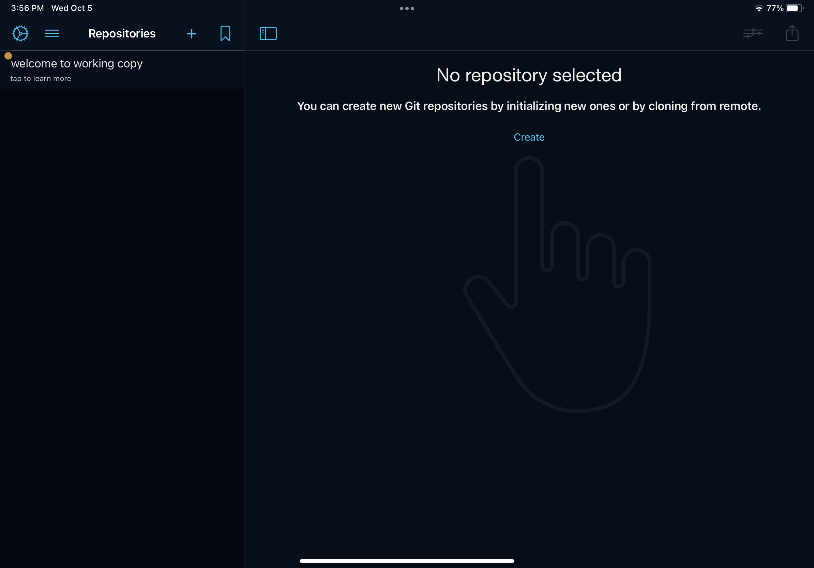
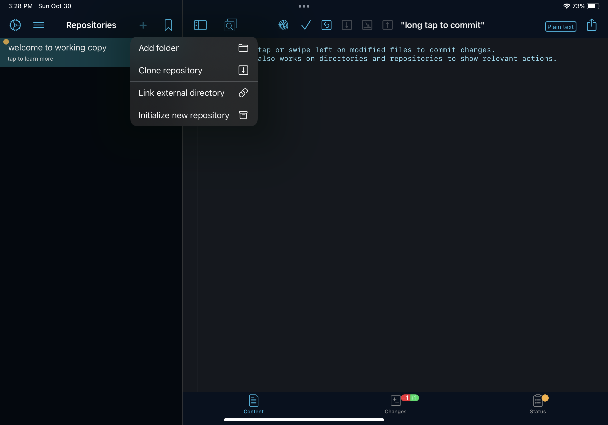

## Introduction

[Obsidian](https://obsidian.md/) is my favorite note-taking app. Since I started using it in 2021, I've been stuffing my vault full of notes, ideas, and reminders.

At first, I was only using Obsidian on my MacBook. But I quickly realized that I needed a way to capture my thoughts while I was on the go, without waiting to get back to my computer. Luckily, there's an Obsidian app that works on both iOS and iPad. But how do you connect the Obsidian app to an existing vault?

The Obsidian team offers a product called [Obsidian Sync](https://obsidian.md/sync), which is a monthly or annual subscription that you can use to sync your vaults across devices. If you're not comfortable with [Git](https://git-scm.com/), Obsidian Sync is a great way to get the same functionality while also supporting the Obsidian creators!

But for developers (or folks who would rather avoid paying for another monthly subscription), you can achieve a similar result using a GitHub repo, an app called Working Copy, and the built-in Shortcuts app on your Apple device.

In this post, I'll show you how to synchronize your Obsidian vault across Apple devices so that you can easily take notes wherever you are.

<CalloutBox>
  **Note:** This tutorial is not completely free. It requires a one-time purchase of the pro version of [Working Copy](https://workingcopyapp.com/) (which costs $19.99 USD, as of February 2023).  (But personally, I'd rather pay a one-time fee than a monthly subscription.)
</CalloutBox>

## Prerequisites

Before you begin this tutorial, you should have the following materials:

- An Apple device (iPhone or iPad)
- The following applications downloaded onto your Apple device:
  - [Obsidian](https://apps.apple.com/us/app/obsidian-connected-notes/id1557175442)
  - [Working Copy](https://apps.apple.com/us/app/working-copy-git-client/id896694807)
  - [Shortcuts](https://apps.apple.com/us/app/shortcuts/id915249334) (as of iOS/iPadOS 13+, this comes pre-installed as a default app on your device)
- An existing Obsidian vault, backed up to a [GitHub](https://github.com/) repository
	- On my MacBook, I use the [obsidian-git](https://github.com/denolehov/obsidian-git) plugin, which I've configured to back up my vault every 30 minutes.

<CalloutBox>
  **Version notes:**
  Here are the versions I used when I was setting this up on my own personal devices:
  
  On my iPhone 12 Pro:
  - iOS 14.8
  - Obsidian 1.0.4
  - Working Copy 4.9.1

  On my iPad Pro (11-inch):
  - iPadOS 15.6.1
  - Obsidian 1.4.1
  - Working Copy 5.3.3
</CalloutBox>

## The Big Picture

First things first, let's take a step back and look at the big picture of the setup you'll be building:

Your GitHub repo will be the source of truth for your vault. You'll want to make sure any changes you make to your local Obsidian vault get pushed to GitHub so that they can be accessed from your other devices.

Now let's zoom in a bit and take a closer look at the tools we'll use to enable this setup:

<Collapsible summary={<em>Expand for detailed image description</em>}>
	GitHub:
	- Has a repo called "my-vault"

	Desktop:
	- Stores files in a local copy of the "my-vault" repo
	- Uses the Obsidian application, with the Obsidian Git plugin

	iPhone/iPad:
	- Stores files in a local copy of the "my-vault" repo
	- Uses the Obsidian, Working Copy, and Shortcuts applications
</Collapsible>

<CalloutBox>
	**Note:** This tutorial assumes that you already have the GitHub and Desktop pieces set up.
	
	Need help getting started? Check out this post by Obsidian Rocks: [Backing up Your Obsidian Vault on Github (for free!)](https://obsidian.rocks/backing-up-your-obsidian-vault-on-github-for-free/)
</CalloutBox>

For the rest of this post, we'll focus on how to set up the iPhone/iPad applications.

## Requirements

In order to keep your Obsidian vault synchronized with your iPhone or iPad, you'll need to handle the two following scenarios:

1. **Pull** changes from the remote vault repo on GitHub into the local vault on your device.
	- This syncs any changes you've made to your notes from another device.
2. **Push** changes from the local vault on your device into the remote vault repo on GitHub.
	- This makes changes from your iPhone/iPad available on other devices.

Let's get started!

## 1) Connect your local Obsidian vault to the GitHub repo

First things first, you'll need to create a new empty Obsidian vault on your iPhone/iPad.

1. Open the **Obsidian** app on your device. Select "Create new vault".

	<IPadScreen>
		
	</IPadScreen>

2. Give your vault a name. (I call mine "Second Brain".) Leave the "Store in iCloud" setting turned off. Then click "Create".

	<IPadScreen>
		
	</IPadScreen>

3. A new empty vault will be created on your device.

	<IPadScreen>
		
	</IPadScreen>

Next, use Working Copy to connect your new vault to your existing vault repo on GitHub.

1. Open the **Working Copy** app on your device. The first time you load Working Copy, it should look something like this:

	<IPadScreen>
		
	</IPadScreen>

2. Click the "+" icon in the sidebar, then select "Clone repository".

	<IPadScreen>
		
	</IPadScreen>

3. Open the "GitHub" tab, then click "Sign In".

	<IPadScreen>
		
	</IPadScreen>

4. Enter your GitHub credentials to give Working Copy access to your repositories.

	<IPadScreen>
		
	</IPadScreen>

5. Now, Working Copy should display a list of your GitHub repositories. Locate and click on the one for your existing Obsidian vault.

	<IPadScreen>
		
	</IPadScreen>

6. If needed, configure the settings for cloning the repo. (I kept the default settings.) Then click "Clone". This will download a copy of your existing vault repo from GitHub to your device.

	<IPadScreen>
		
	</IPadScreen>

7. When you're done, you should see the contents of your vault repo in Working Copy.

	<IPadScreen>
		
	</IPadScreen>

8. Click the share button (the up arrow coming out of a box) on the right, then select "Link Repository to Folder".

	<IPadScreen>
		
	</IPadScreen>

<CalloutBox>
	**Note:** Finding this setting on the iPhone version of Working Copy looks a little different:
	
	1. Open the Repository "Status and Configuration" settings.
	2. Click on the dropdown next to the name of the repo.
	3. Select the "Link Repository to Directory" setting.
</CalloutBox>

9. Under the "On My iPad" folder, open the "Obsidian" directory, and then select the folder for the new vault you created earlier. Then click "Done". This tells Working Copy to use your Obsidian vault folder for the local copy of your repo.

	<IPadScreen>
		
	</IPadScreen>

10. Back in Obsidian, validate that the files from your existing remote vault now appear in your new vault.

	<IPadScreen>
		
	</IPadScreen>

## 2) Pull changes from GitHub into your local vault

1. Open the Shortcuts app. Click the "+" icon to create a new Shortcut.

	

2. Name your new Shortcut "Pull Changes From Remote Obsidian Vault". 

	

3. Use the search bar to find the Working Copy action to "Pull Repository".

	

4. Click to add the action to your Shortcut.

	

5. Tap on the "Repository" variable to fill in a value. Choose your vault repo from the list of Working Copy repos.

	

6. Your final Shortcut should look like the one below. Click "Done" to save your changes.

	

7. Now you have a Shortcut that you can trigger by clicking on it in the Shortcuts menu.

	

Now that you can pull updates from GitHub into your local vault, it's time to set up an automation to run that Shortcut automatically! To avoid merge conflicts, you'll want to pull changes every time you open the Obsidian app on your device. Let's set that up:

1. In the **Shortcuts** app, open the Automation page, and create a new personal automation.

	

2. In the "New Automation" menu, you'll select the event that you want to trigger your automation. Scroll down and select "App".

	

3. Choose "Obsidian" for the App, and make sure "Is Opened" is checked. Then click "Next".

	

4. You should see a prompt to add the action you want to trigger when Obsidian is opened.

	

5. Click the "Add Action" button, then search for the "Run Shortcut" action. Click it to add it to your automation.

	

6. Click the "Shortcut" variable to fill in a value. Select the "Pull Changes From Remote Obsidian Vault" Shortcut you created earlier. Then click "Next".

	

7. Review your automation settings. Turn off the "Ask Before Running" setting, so that you won't need to confirm the automation every time it runs.

	

8. Turning off the "Ask Before Running" setting will require a second confirmation that you really don't want to ask before running the automation. Confirm by selecting "Don't Ask".

	

9. Now you should see an additional setting, "Notify When Run". Turn that setting on, so that you'll get a notification whenever your automation is run. (This will help you confirm that the automation is actually working as expected. You can always turn this off later if you prefer.)

	

10. Click "Done" to save your changes. Your new automation should appear under "Personal" on the Automation page.

	

Test out your automation by opening the Obsidian app. You should see a notification telling you that your "Opened Obsidian" was run.

## 3) Push changes from your local vault to GitHub

automation

## Wrap It Up

## Resources

Observations / edge cases:
- After syncing your existing vault to a new device, you may still need to update your settings for:
	- Turning on your theme (under the Appearance settings)
	- Merging duplicate settings files in the .obsidian directory (look in Working Copy to see if there are multiple files, e.g. app.json and app.json-2) ![[CD695723-8A7C-494C-B78D-D4BEE2AE1FD2.png]]

---

Here's a quick sneak peak of the requirements for what you'll build in this tutorial:

GIVEN there are updates on the remote GitHub repo that aren't in my local Obsidian vault,
WHEN I open the Obsidian app on my Apple device,
THEN the changes from the remote repo are pulled into my local vault.

GIVEN there are local changes to my Obsidian vault that aren't on the remote GitHub repo,
WHEN I close the Obsidian app on my Apple device,
THEN the local changes are committed and pushed to GitHub.

## Process

Part 1: Connect local Obsidian vault to existing remote repo

INSERT ARCHITECTURE DIAGRAM OF THIS STAGE. MAKING A LOCAL IPHONE COPY OF YOUR VAULT FROM GITHUB, AND CONNECTING IT TO OBSIDIAN.

- Download apps from App Store:
	- Obsidian
	- Working Copy
- Open Working Copy & upgrade to Pro version (at time of writing, this costs $20). The Pro version unlocks the ability to push to a remote repo.
- In Obsidian, create a new empty vault
- In Working Copy:
	- Sign into your GitHub account, and clone your existing Obsidian vault repo from GitHub.
	- Turn on Sync to File (check what this setting is called in the new version), and select the Obsidian vault folder you just created.
		- Check in the Obsidian app that your existing files from the remote repo have been pulled into the vault on your new device.
	- Optional: If you want to keep different Obsidian settings between devices, create a duplicate of the .obsidian directory and rename it .obsidian.mobile. Then in the Obsidian app, go to Settings -> About. Scroll down to Advanced, and set "Override config folder" to .obsidian.mobile. This will prevent your mobile and desktop settings from clashing. (But it also means that if you want to make changes to your settings on all devices, you'll have to change them on each one separately.)

Part 2: Automatically sync local repo with remote repo (automatic updates)

INSERT ARCHITECTURE DIAGRAM OF THIS STAGE. PART 1: WHEN MAKING UPDATES ON MOBILE DEVICE, PUSH THEM TO THE VAULT WHEN CLOSING THE APP. PART 2: WHEN MAKING CHANGES ON DESKTOP, PULL THEM INTO MOBILE VAULT WHEN OPENING THE APP.

- Next step is to set up automations that will keep your vault in sync with the remote repo. In Shortcuts:
	- Create a new Shortcut that uses Working Copy to pull changes from the remote repo.
	- Create another new Shortcut that uses Working Copy to commit changes to your local vault and then push them to the remote repo.
		- Create a new variable with device details (Device Type)
		- Commit changes, passing device variable into commit message
			- Make sure you adjust the "What to Commit" setting to be "modified" instead of "staging".
		- Push changes to remote repo
	- You can check that your Shortcuts are working by tapping on them in the "My Shortcuts" grid. (To make changes to your Shortcut, click on the three dots in the grid item.)
	- Create a new automation that runs whenever the Obsidian app is opened. In that automation, run the "Pull vault updates" shortcut you created.
		- Turn off the setting to ask for permission (check for exact wording)
	- Create a new automation that runs whenever the Obsidian app is closed. In that automation, run the "Push vault updates" shortcut you created.
		- Turn off the setting to ask for permission
- In Obsidian:
	- It should be working! When you open the Obsidian app, you should see a badge notification telling you that an automation is running (check for exact wording)
	- The first time your automation runs, you may need to confirm that you give permission for Working Copy to make changes. (Check for exact wording.)
*

