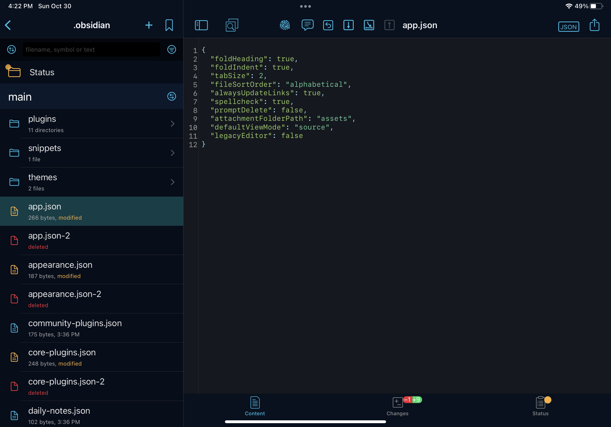

## Introduction

[Obsidian](https://obsidian.md/) is my favorite note-taking app. Since I started using it in 2021, I've been stuffing my vault full of notes, ideas, and reminders.

At first, I was only using Obsidian on my MacBook. But I quickly realized that I needed a way to capture my thoughts while I was on the go, without waiting to get back to my computer. Luckily, there's an Obsidian app that works on both iOS and iPad. But how do you connect the Obsidian app to an existing vault?

The Obsidian team offers a product called [Obsidian Sync](https://obsidian.md/sync), which is a monthly or annual subscription that you can use to sync your vaults across devices. If you're not comfortable with [Git](https://git-scm.com/), Obsidian Sync is a great way to get the same functionality while also supporting the Obsidian creators!

But for developers (or folks who would rather avoid paying for another monthly subscription), you can achieve a similar result using a GitHub repo, an app called Working Copy, and the built-in Shortcuts app on your Apple device.

In this post, I'll show you how to synchronize your Obsidian vault across Apple devices so that you can easily take notes wherever you are.

<CalloutBox>
  **Note:** This tutorial is not completely free. It requires a one-time purchase of the pro version of [Working Copy](https://workingcopyapp.com/) (which costs $19.99 USD, as of February 2023).  (But personally, I'd rather pay a one-time fee than a monthly subscription.)
</CalloutBox>

## Prerequisites

Before you begin this tutorial, you should have the following materials:

- An Apple device (iPhone or iPad)
- The following applications downloaded onto your Apple device:
  - [Obsidian](https://apps.apple.com/us/app/obsidian-connected-notes/id1557175442)
  - [Working Copy](https://apps.apple.com/us/app/working-copy-git-client/id896694807): a Git client for working with repositories from a mobile device
  - [Shortcuts](https://apps.apple.com/us/app/shortcuts/id915249334): an Apple app for creating automations on your device
	  - (As of iOS/iPadOS 13+, the Shortcuts app comes pre-installed as a default app on your device.)
- An existing Obsidian vault, backed up to a [GitHub](https://github.com/) repository
	- On my MacBook, I use the [obsidian-git](https://github.com/denolehov/obsidian-git) plugin, which I've configured to back up my vault every 30 minutes.

<CalloutBox>
  **Version notes:**
  Here are the versions I used when I was setting this up on my own personal devices:
  
  On my iPhone 12 Pro:
  - iOS 14.8
  - Obsidian 1.0.4
  - Working Copy 4.9.1

  On my iPad Pro (11-inch):
  - iPadOS 15.6.1
  - Obsidian 1.4.1
  - Working Copy 5.3.3
</CalloutBox>

## The Big Picture

First things first, let's take a step back and look at the big picture of the setup you'll be building:

Your GitHub repo will be the source of truth for your vault. You'll want to make sure any changes you make to your local Obsidian vault get pushed to GitHub so that they can be accessed from your other devices.

Now let's zoom in a bit and take a closer look at the tools we'll use to enable this setup:

<Collapsible summary={<em>Expand for detailed image description</em>}>
	GitHub:
	- Has a repo called "my-vault"

	Desktop:
	- Stores files in a local copy of the "my-vault" repo
	- Uses the Obsidian application, with the Obsidian Git plugin

	iPhone/iPad:
	- Stores files in a local copy of the "my-vault" repo
	- Uses the Obsidian, Working Copy, and Shortcuts applications
</Collapsible>

<CalloutBox>
	**Note:** This tutorial assumes that you already have the GitHub and Desktop pieces set up.
	
	Need help getting started? Check out this post by Obsidian Rocks: [Backing up Your Obsidian Vault on Github (for free!)](https://obsidian.rocks/backing-up-your-obsidian-vault-on-github-for-free/)
</CalloutBox>

For the rest of this post, we'll focus on how to set up the iPhone/iPad applications.

## Requirements

In order to keep your Obsidian vault synchronized with your iPhone or iPad, you'll need to handle the two following scenarios:

1. **Pull** changes from the remote vault repo on GitHub into the local vault on your device.
	- This syncs any changes you've made to your notes from another device.
2. **Push** changes from the local vault on your device into the remote vault repo on GitHub.
	- This makes changes from your iPhone/iPad available on other devices.

Let's get started!

## 1) Connect your local Obsidian vault to the GitHub repo

First things first, you'll need to create a new empty Obsidian vault on your iPhone/iPad.

1. Open the **Obsidian** app on your device. Select "Create new vault".

	<IPadScreen>
		
	</IPadScreen>

2. Give your vault a name. (I call mine "Second Brain".) Leave the "Store in iCloud" setting turned off. Then click "Create".

	<IPadScreen>
		
	</IPadScreen>

3. A new empty vault will be created on your device.

	<IPadScreen>
		
	</IPadScreen>

Next, use Working Copy to connect your new vault to your existing vault repo on GitHub.

1. Open the **Working Copy** app on your device. The first time you load Working Copy, it should look something like this:

	<IPadScreen>
		
	</IPadScreen>

<CalloutBox>
	**Note:** If you haven't yet, you'll need to upgrade to the Pro version of Working Copy. If you've already purchased the Pro version on another device (using the same Apple ID), you can restore your purchases and unlock the Pro version on your new device.
</CalloutBox>

2. Click the "+" icon in the sidebar, then select "Clone repository".

	<IPadScreen>
		
	</IPadScreen>

3. Open the "GitHub" tab, then click "Sign In".

	<IPadScreen>
		
	</IPadScreen>

4. Enter your GitHub credentials to give Working Copy access to your repositories.

	<IPadScreen>
		
	</IPadScreen>

5. Now, Working Copy should display a list of your GitHub repositories. Locate and click on the one for your existing Obsidian vault. (TODO: block out the other private repos)

	<IPadScreen>
		
	</IPadScreen>

6. If you want, you can configure the settings for cloning the repo, but I kept the default settings. Then click "Clone". This will download a copy of your existing vault repo from GitHub to your device.

	<IPadScreen>
		
	</IPadScreen>

7. When you're done, you should see the contents of your vault repo in Working Copy.

	<IPadScreen>
		
	</IPadScreen>

8. Click the share button (the up arrow coming out of a box) on the right, then select "Link Repository to Folder".

	<IPadScreen>
		
	</IPadScreen>

<CalloutBox>
	**Note:** Finding this setting on the iPhone version of Working Copy looks a little different:
	
	1. Open the Repository "Status and Configuration" settings.
	2. Click on the dropdown next to the name of the repo.
	3. Select the "Link Repository to Directory" setting.
</CalloutBox>

9. Under the "On My iPad" folder, open the "Obsidian" directory, and then select the folder for the new vault you created earlier. Then click "Done". This tells Working Copy to store the local copy of your repo in your Obsidian vault folder.

	<IPadScreen>
		
	</IPadScreen>

10. Back in Obsidian, validate that the files from your existing remote vault now appear in your new vault.

	<IPadScreen>
		
	</IPadScreen>

<CalloutBox>
	**Troubleshooting Tip:** After syncing your existing vault to a new device, you may still need to update your settings for:

	- Turning on your theme (under the "Settings" -> "Appearance").

	- Merging duplicate settings files in the .obsidian directory. (In Working Copy, check to see if there are duplicate files, e.g. `app.json` and `app.json-2`. Consolidate by removing one of the duplicates.)

		<IPadScreen>
			
		</IPadScreen>
</CalloutBox>

## 2) Pull changes from GitHub into your local vault

Now that you've got your local vault set up, it's time to handle the first scenario from earlier: pulling changes from the remote vault repo into your local vault.

You'll do this work in two stages:
- Creating a shortcut to pull changes
- Automating the shortcut to run when the Obsidian app opens

### Creating a shortcut to pull changes

1. Open the Shortcuts app. Click the "+" icon to create a new shortcut.

	<IPadScreen>
		
	</IPadScreen>

2. Name your new shortcut "Pull Changes From Remote Obsidian Vault". 

	<IPadScreen>
		
	</IPadScreen>

3. Use the search bar to find the Working Copy action to "Pull Repository".

	<IPadScreen>
		
	</IPadScreen>

4. Select the action from the sidebar to add it to your shortcut.

	<IPadScreen>
		
	</IPadScreen>

5. Tap on the "Repository" variable to fill in a value. Choose your vault repo from the list of Working Copy repos.

	<IPadScreen>
		
	</IPadScreen>

6. Your final shortcut should look like the one below. Click "Done" to save your changes.

	<IPadScreen>
		
	</IPadScreen>

7. Now you have a shortcut that you can trigger by tapping it in the Shortcuts menu. (To make changes to your shortcut, click on the three dots in the grid item.)

	<IPadScreen>
		
	</IPadScreen>

### Automating the shortcut to run when the Obsidian app opens

Now that you can pull updates from GitHub into your local vault, it's time to set up an automation to run that shortcut automatically! To avoid merge conflicts, you'll pull changes from the remote repo every time you open the Obsidian app on your device. Let's set that up:

1. In the **Shortcuts** app, open the Automation page, and create a new personal automation.

	<IPadScreen>
		
	</IPadScreen>

2. In the "New Automation" menu, you'll select the event that you want to trigger your automation. Scroll down and select "App".

	<IPadScreen>
		
	</IPadScreen>

3. Choose "Obsidian" for the App, and make sure "Is Opened" is checked. Then click "Next".

	<IPadScreen>
		
	</IPadScreen>

4. You should see a prompt to add the action you want to trigger when Obsidian is opened.

	<IPadScreen>
		
	</IPadScreen>

5. Click the "Add Action" button, then search for the "Run Shortcut" action. Click it to add it to your automation.

	<IPadScreen>
		
	</IPadScreen>

6. Click the "Shortcut" variable to fill in a value. Select the "Pull Changes From Remote Obsidian Vault" shortcut you created earlier. Then click "Next".

	<IPadScreen>
		
	</IPadScreen>

7. Review your automation settings. Turn off the "Ask Before Running" setting, so that you won't need to confirm the automation every time it runs.

	<IPadScreen>
		
	</IPadScreen>

8. Turning off the "Ask Before Running" setting will require a second confirmation that you really don't want to ask before running the automation. Confirm by selecting "Don't Ask".

	<IPadScreen>
		
	</IPadScreen>

9. Now you should see an additional setting, "Notify When Run". Turn that setting on, so that you'll get a notification whenever your automation is run. (This will help you confirm that the automation is actually working as expected. You can turn this setting off later if you'd prefer not to see a notification.)

	<IPadScreen>
		
	</IPadScreen>

10. Click "Done" to save your changes. Your new automation should appear under "Personal" on the Automation page.

	<IPadScreen>
		
	</IPadScreen>

And that should do it! Test out your automation by opening the Obsidian app. You should see a notification telling you that your "Opened Obsidian" shortcut was run.

<IPadScreen>
  
</IPadScreen>

<CalloutBox>
	**Troubleshooting Tip:**

	The first time your automation runs, you may see a notification that says "Allow 'Update Obsidian Vault through Working Copy' to access 'Working Copy'?"

	<IPadScreen>
		
	</IPadScreen>

	To confirm that you give permission for Working Copy to make changes to your Obsidian vault, tap the notification and select "Allow".

	<IPadScreen>
		
	</IPadScreen>
</CalloutBox>

## 3) Push changes from your local vault to GitHub

Now you're ready to tackle the second scenario: pushing changes from your local vault into the remote repo on GitHub.

Like before, you'll do this work in two stages:
- Creating a shortcut to push local changes
- Automating the shortcut to run when the Obsidian app closes

### Creating a shortcut to push local changes

1. In the **Shortcuts** app, navigate back to the "All Shortcuts" page. Click the "+" icon to create a new shortcut.

	<IPadScreen>
		
	</IPadScreen>

2. Name your shortcut "Back Up Obsidian Vault".

	<IPadScreen>
		
	</IPadScreen>

3. If you plan on running these shortcuts across multiple devices, it helps to specify in your commit message which device you're making changes from. (For example, I use the free iCloud tier to sync my Shortcuts across Apple devices, so this shortcut could run from either my iPad or my iPhone. Knowing which device a commit came from helps me troubleshoot if something goes wrong or I start getting merge conflicts.)

	To set that up, use the search bar to find the Scripting action called "Set Variable".

	<IPadScreen>
		
	</IPadScreen>

4. Choose the "Set Variable" action from the sidebar to add it to your shortcut.

	<IPadScreen>
		
	</IPadScreen>

5. Give your variable a name by tapping on "Variable Name". You can call this whatever you want; I called mine "Device".

	<IPadScreen>
		
	</IPadScreen>

6. Now set the value of your variable by tapping "Input" and choosing "Device Details".

	<IPadScreen>
		
	</IPadScreen>

7. Checkpoint: This is what your action should look like so far:

	<IPadScreen>
		
	</IPadScreen>

8. Tap on "Device Details", and scroll down to select "Device Type". When your shortcut runs, this value will be something like "iPhone" or "iPad", depending on what kind of device you're using.

	<IPadScreen>
		
	</IPadScreen>

9. Use the search bar to find the Working Copy action called "Commit Repository".

	<IPadScreen>
		
	</IPadScreen>

10. Select the "Commit Repository" action to add it to your shortcut.

	<IPadScreen>
		
	</IPadScreen>

11. Click "Repository" to fill in a value for which Working Copy repo you want to commit to. Choose your vault repo from the menu.

	<IPadScreen>
		
	</IPadScreen>

12. Next, click "Message" to fill in what you want your commit message to be.

	<IPadScreen>
		
	</IPadScreen>

13. You can use the menu at the bottom of the screen to add the Device variable to your commit message. I set my commit message to: "Vault autocommit on \<Device\>".

	<IPadScreen>
		
	</IPadScreen>

14. Click the arrow icon in the commit action to expand the advanced options menu.
	- Set the "What to Commit" option to "modified".
	- Turn off the "Fail when nothing to Commit" toggle.

	TODO: Change toggle state to false

	<IPadScreen>
		
	</IPadScreen>

15. Use the search bar to find the Working Copy action called "Push Repository".

	TODO: Change toggle state to false

	<IPadScreen>
		
	</IPadScreen>

16. Tap the "Push Repository" action to add it to your shortcut.

	TODO: Change toggle state to false

	<IPadScreen>
		
	</IPadScreen>

17. Tap "Repository" to fill in a value for which Working Copy repo to push to its remote. Select your vault repo from the menu.

	TODO: Change toggle state to false

	<IPadScreen>
		
	</IPadScreen>

18. Your final "Back Up Obsidian Vault" shortcut should look like this:

	TODO: Change toggle state to false

	<IPadScreen>
		
	</IPadScreen>

19. Click "Done" to save your new shortcut. You should now see it appear on the "All Shortcuts" page. Tap the shortcut to run it. (To make changes to the shortcut, click on the three dots in the corner of the shortcut.)

	<IPadScreen>
		
	</IPadScreen>

### Automating the shortcut to run when the Obsidian app closes

Now that your shortcut is set up, it's time to automate it! To make sure your latest changes are always pushed up to the remote repo, run your shortcut every time you close the Obsidian app. Let's set that up next:

1. In the **Shortcuts** app, navigate to the "Automation" page. Click the "+" icon to create a new automation.

	<IPadScreen>
		
	</IPadScreen>

2. Choose "Create Personal Automation".

	<IPadScreen>
		
	</IPadScreen>

3. Next, choose what event you want to trigger your automation. Scroll down and select "App".

	<IPadScreen>
		
	</IPadScreen>

4. For "App", choose Obsidian. Uncheck the "Is Opened" toggle, and check "Is Closed" instead. Then click "Next".

	<IPadScreen>
		
	</IPadScreen>

5. Now it's time to specify what actions you want to run when your automation is triggered. Click the "Add Action" button.

	<IPadScreen>
		
	</IPadScreen>

6. Use the search bar to find the "Run Shortcut" action. Tap the action to add it to your automation.

	<IPadScreen>
		
	</IPadScreen>

7.  Tap the "Shortcut" variable to add in a value.

	<IPadScreen>
		
	</IPadScreen>

8. Select your "Back Up Obsidian Vault" shortcut from the menu.

	<IPadScreen>
		
	</IPadScreen>

9. Checkpoint: Your actions should look like this. Click "Next" to continue.

	<IPadScreen>
		
	</IPadScreen>

10. Review your automation settings. Turn off the "Ask Before Running" setting, so that you won't need to confirm the automation every time it runs.

	<IPadScreen>
		
	</IPadScreen>

11. Turning off the "Ask Before Running" setting will require a second confirmation that you really don't want to ask before running the automation. Confirm by selecting "Don't Ask".

	<IPadScreen>
		
	</IPadScreen>

12. Now you should see an additional setting, "Notify When Run". Turn that setting on, so that you'll get a notification whenever your automation is run. (This will help you confirm that the automation is actually working as expected. You can turn this setting off later if you'd prefer not to see a notification.)

	<IPadScreen>
		
	</IPadScreen>

13. Click "Done" to save your changes. Your new automation should appear under "Personal" on the Automation page.

	<IPadScreen>
		
	</IPadScreen>

And you're done!

Test out your new automation by opening the Obsidian app (which triggers a notification that your "Opened Obsidian" automation is running), making some changes, and then closing the Obsidian app (by going back to your home screen). You should see a notification that your "Closed Obsidian" automation ran.

<IPadScreen>
	
</IPadScreen>

## Wrap It Up

Obsidian has become a huge part of my day-to-day workflow. By syncing my vault across all my devices, I have the flexibility to capture notes on whichever device I have on hand.

Want to learn how to make the most of your new note-taking freedom? I've learned a ton about Obsidian by watching Ben Hong's YouTube channel, [BenCodeZen](https://www.youtube.com/@BenCodeZen). You can also check out the [official Obsidian Community page](https://obsidian.md/community), which has links to a dedicated Discord server and online forum.

## Resources

- [Obsidian on the App Store](https://apps.apple.com/us/app/obsidian-connected-notes/id1557175442)
- [Working Copy on the App Store](https://apps.apple.com/us/app/working-copy-git-client/id896694807)
	- [Working Copy website](https://workingcopyapp.com/)
	- [Working Copy User Guide](https://workingcopyapp.com/manual.html)
- [Shortcuts on the App Store](https://apps.apple.com/us/app/shortcuts/id915249334)
	- Apple Support: [Shortcuts User Guide](https://support.apple.com/guide/shortcuts/welcome/ios)
	- Apple Support: [Setting triggers in Shortcuts on iPhone or iPad](https://support.apple.com/guide/shortcuts/setting-triggers-apde31e9638b/5.0/ios/15.0)

This tutorial was inspired by the following resources:
- [Obsidian forum post by Richard Steele](https://forum.obsidian.md/t/mobile-setting-up-ios-git-based-syncing-with-mobile-app-using-working-copy/16499)
- [GitHub comment by Julian Gonggrijp](https://github.com/denolehov/obsidian-git/issues/57#issuecomment-952297086)

---

TODO:

- [ ] Alt text
- [ ] Better image names
- [ ] Redact private info from screenshots
- [ ] Add highlights to images
