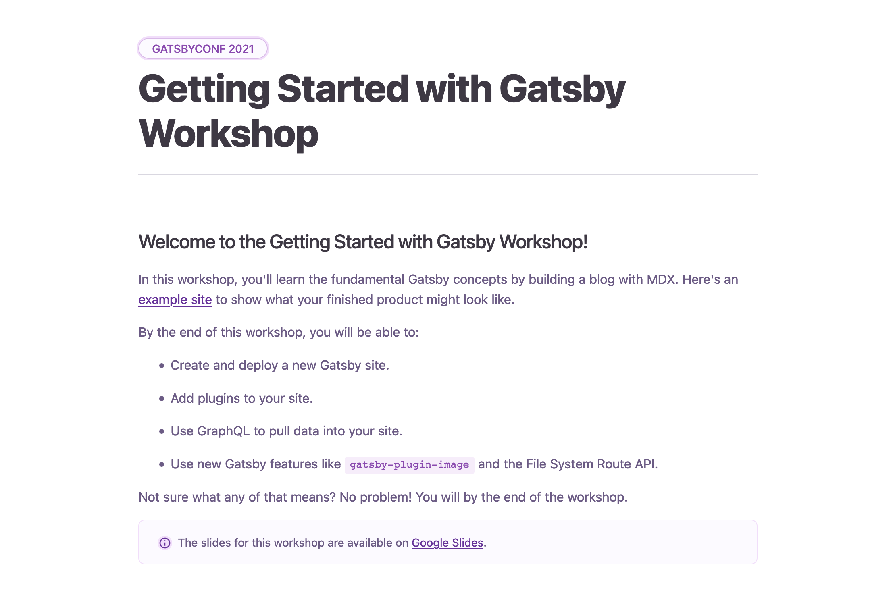

import CalloutBox from '../../src/components/callout-box'

## Introduction

Last month, I co-facilitated a four-hour workshop at GatsbyConf. Although I've led many workshops in the past, this was my first time teaching remotely. We had over 1000 unique visitors, with around 250 participants at any given time for the full four hours. There were a few technical hiccups, but in general it went pretty well!

<CalloutBox>

**Want to watch the workshop recording?** Check it out on YouTube: [Getting Started with Gatsby](https://www.youtube.com/watch?v=231bkZnebvo).

Fair warning: There are some technical difficulties at the beginning. (And lots of vocal sound effects from me throughout. 😅)

</CalloutBox>

In this post, I'll share some strategies we used to design an engaging virtual experience for students. I'll also highlight some things I'd do differently next time.

- Before the workshop...
    - [Create a curriculum companion site.](#create-a-curriculum-companion-site)
    - [Use polls to gauge student engagement.](#use-polls-to-gauge-student-engagement)
    - [Test your _exact_ technical setup.](#test-your-exact-technical-setup)
- During the workshop...
    - [Recruit teammates to help moderate the chat.](#recruit-teammates-to-help-moderate-the-chat)
    - [Be flexible.](#be-flexible)
    - [Bring your enthusiasm!](#bring-your-enthusiasm)

## Before the Workshop: Preparation

### Create a curriculum companion site

We decided to create a [companion website](https://intro_workshop_gatsbyconf_2021.gtsb.io/) that students could use to follow along with the workshop curriculum. This was likely the highest impact choice we made. After all, just because a teacher says something once doesn't mean that every student will understand and retain it. By summarizing the key points in a curriculum site, students could look over the concepts or code snippets at their own pace, even if they missed it in our slides or demos.

Think of the site as a virtual replacement for a textbook or worksheets. You can add as much or as little information as you think students will find helpful. For our workshop, we broke up the curriculum site into different pages - one for each section in the workshop. Each page had two main sections: Background and Exercises.

The **Background** section included explanations of key concepts, diagrams, code snippets, and links to relevant documentation. The content mirrored what was in our slides, with just enough extra description to put the ideas into context. To avoid overloading students, we only explained concepts that they'd need to be able to complete the exercises for that section.

The **Exercises** section included the prompts for all the student exercises, like what you might find on a worksheet. The goal was to help students stay on track. By giving students easy access to the exercise instructions, we avoided repeatedly answering the dreaded question: "What are we supposed to be doing right now?" Each exercise had the following pieces:

- **Instructions** for the exercise.
  - This should include a clear goal. What are students trying to do in this exercise? How will they know when they're done?
- **Hints.**
  - Point students in the right direction, without giving them the exact answer. For example, you could list out the general steps students have to follow to finish the exercise, without telling them exactly what to type.
- **Solution.**
  - Reveal the full solution for the exercise. (In our case, we linked to a specific branch in the [GitHub repo for the example project](https://github.com/meganesu/gatsby-intro-workshop-example-site-with-v3).) If students finish early, they can check their work. Or, if they get stuck, they can use the solution to troubleshoot their own work.
- **Extra-credit challenges.** (Sometimes.)
  - Suggest ways to extend the original exercise. This piece isn't strictly necessary, but it's helpful for students who finish the main exercise early.

Want to see an example? The [curriculum page on plugins](https://intro_workshop_gatsbyconf_2021.gtsb.io/part-3) is a good place to see the general structure in context.

<CalloutBox>

**Tip:** You can use a [`
` element](https://developer.mozilla.org/en-US/docs/Web/HTML/Element/details) to hide the contents of the Hints and Solution sections behind a dropdown toggle. That way, students can tailor the difficulty level to their own needs. If they want to challenge themselves, they can attempt the exercise without looking at the "spoilers." And if they want the extra help, they can open the toggle to get some more support.

</CalloutBox>

If we'd had more time, I would have loved to add prerecorded videos to each section, where we'd explain key concepts and walk through exercises. That way, students could work through the content at their own pace, and our facilitation could focus more on answering questions and addressing misconceptions. (This style of instruction is called the [flipped classroom model](https://study.com/teach/flipped-classroom.html).)

### Use polls to gauge student engagement

When you're teaching in person, you can read students' facial expressions in real time. You can sense whether the crowd feels engaged, confused, or bored, and you can adjust your instruction to accommodate their needs. But when you're teaching remotely and can't see anyone, you have to be more intentional about checking in with your audience.

**Polls are a great virtual replacement for "reading the room."** With a short multiple-choice question, you can quickly assess whether students are following you or not.

When you're planning your workshop, add in multiple-choice polls at key moments, like how you'd plan out exercises or examples. You can adjust your poll questions based on what you're hoping to learn about your students. For example, you might want to:

- **Gauge prior knowledge** of a topic. Check how comfortable students already are with a topic before you start teaching.
    - Example Question: "How much prior experience do you have with React?"
        - "This is my first time using it."
        - "I've tried it out but haven't used it extensively."
        - "I'm comfortable using it."
- **Check student progress.** Use these after students have been working on an exercise to see how far they got.
    - Example Question: "How far did you get?"
        - "I created a new site."
        - "I deployed my site."
        - "I got stuck."
- **Check for understanding.** Ask students to self-assess how comfortable they currently feel with the material. Ask this after students have had some hands-on time with the concepts, like after an exercise or question-and-answer session.
    - Example Question: "How comfortable are you feeling with writing GraphQL queries?"
        - "I get it!"
        - "I sort of get it."
        - "I don't get it at all."

<CalloutBox>

**Wondering how to gather student responses?** Some conference hosting platforms have built-in audience polling features. But you can also use a tool like Google Forms or [Slido](https://www.sli.do/) to set up your questions ahead of time.

</CalloutBox>

**The way students answer a poll question should directly influence your next action as the instructor.** For example, if most students say they didn't complete an exercise, you might decide to give them a few more minutes to work on it. Or, if many students said they weren't very comfortable with the material, you should probably find out what concept confused them and reexplain it with some different examples.

### Test your **exact** technical setup

I present this cautionary tale, so you can learn from my mistakes:

A few weeks before our GatsbyConf workshop, we had a dress rehearsal to try out the conference-hosting platform with a fake test event. I practiced sharing my screen, audio, and video from my laptop, and everything worked as expected. Then, the night before the conference, I thought, "You know, I should add in an external monitor. That way, I can have the chat and my notes open while I share my laptop screen." I'd still be sharing from my laptop, so everything would be fine, right?

Narrator voice: "Everything was _not_ fine."

On the day of the workshop, something about the resolution of my external monitor caused problems with screen sharing. Whenever I changed slides or switched between desktops, a bunch of weird visual artifacts showed up on the screen. Even though my screen looked fine to me, audience members couldn't actually see what I was presenting. And because I didn't see this issue until the actual workshop, my co-facilitator and I had to improvise a workaround so that we could actually teach the material. It wasn't ideal, and it significantly slowed down the initial pace of the workshop. Luckily, during one of the breaks, another teammate in the chat was able to help us troubleshoot and get us back on track. (Huge shoutout to Laurie Barth!)

The moral of this story is to test out your *exact* technical setup ahead of time, so that you don't have to fight with your technology on the day of the event. This includes monitors, microphones, headphones, internet connection, keyboards, lighting - any of the moving pieces that you're planning to use in the actual workshop.

## During the Workshop: Instruction

### Recruit teammates to help moderate the chat

If possible, have a few extra teammates sit in the session to act as teaching assistants (TAs) and help moderate the chat. When specific issues come up (e.g., a student gets an unexpected error message), ask the TAs to help them troubleshoot in the chat while you continue teaching. That way, students can get the individualized attention they need without derailing the entire lesson.

I didn't always do a great job at this hand-off in our workshop. A few times, a question in chat caught my eye, and I stopped what I was saying to answer the question myself, instead of passing it on to my other teammates in the chat. And in those moments, the rest of the students were stuck waiting for me to finish explaining something that wasn't relevant to them.

That's not to say that as the instructor you should never respond to the chat. If you see multiple people asking about the same topic, that's a good indicator that you may need to back up and re-explain something. But in general, **consider the experience of the entire group before getting too far down a rabbit hole**. Ask yourself, "Is answering this question in public going to help unblock enough people that it's worth taking the entire group on this detour?" If the answer is no, ask a TA to help debug, or revisit the question once the rest of the group has started work time for the next exercise.

### Be flexible

I'm a big fan of effective time management. Before all of my workshops, I time how long it takes me to complete each exercise, and I use those times to estimate how long each section will take to teach. When I facilitate, I display [timers](https://www.bigtimer.net/) during work time and breaks, so that students can self-regulate based on how much time they have left.

But in the end, it's also important to know when to throw out the schedule and make adjustments on the fly. If students are confused, it's okay to take a few extra minutes to back up and help them understand the big ideas. Show them another example or explain a concept with a different analogy. If you fall a bit behind schedule, skip one of the later exercises. Personally, I'd rather not get through all the material and have high rates of student understanding than rush to finish everything and lose students along the way.

It can be stressful to think on your feet in the moment, especially if things aren't going as planned. But do your best to stay calm and upbeat. Be kind to yourself. **Remember, as the instructor, you're modeling the way students should behave when things go wrong.** Show them that it's okay to make mistakes. Every mistake is an opportunity to learn something new. (Keep a [growth mindset](https://www.youtube.com/watch?v=M1CHPnZfFmU)!)

### Bring your enthusiasm!

This last tip applies to both remote and in-person teachers (and, more generally, leaders of any kind). In my experience, **the instructor always sets the upper bound for the group's enthusiasm**. Students will rarely be more excited about what you're teaching than you are. And even if they start out more excited than you, they're likely to tone down their energy level to meet yours. So it's important to set that bar high from the beginning.

Being an engaging speaker is just as much about *how* you say things as it is about *what* you say. If you sound bored by what you're talking about, odds are your students are also going to be bored and start reaching for their phones. Instead, speak clearly and confidently, in your best "teacher voice." If you feel comfortable showing your personality or incorporating a little humor, do it! It might feel silly at first, but that's okay. Setting the right tone is especially important for virtual workshops, where it's easier for students to tune out without anyone noticing.

Showing enthusiasm doesn't have to mean being insincerely peppy. If that's not your style, think instead about ways you can highlight what's exciting or game-changing about your subject matter. Why is this topic important? How does it tie into what students already know, and how might it help them in the future?

<CalloutBox>

**Nervous about public speaking?** This is one way that virtual workshops are easier than in person: you don't have to see everyone! Try to do some calming exercises before the workshop starts, like taking deep breaths or stretching. I personally like doing a quick ["shake down"](https://www.youtube.com/watch?v=HP5qcA3ty1w) to loosen up and boost my energy.

</CalloutBox>

## Things I'd Do Differently Next Time

Overall, I'm reasonably happy with how our GatsbyConf workshop went. But I do want to touch on some changes I'd make the next time around:

- **Overcommunicate expectations about pre-work.**
  - Many of the issues that came up in the first part of the workshop were related to problems students encountered when installing the necessary tools. We'd included installation instructions in the workshop description and asked students to complete them ahead of time, but we could have been better about sending out reminders. Next time, I want to clearly communicate that we won't be spending time in the workshop helping people troubleshoot their setups. Instead, we could hold an office hours session a few days before the workshop, where folks can drop in and get individualized help with debugging.
- **Set up contingency plans** ahead of time, to unblock workshop attendees who have trouble setting up the tools or project on their own computers.
  - A few days before the workshop, I tried to test out the curriculum by teaching it to my boyfriend. He wasn't able to install Gatsby on his laptop, which blocked him from doing the rest of the workshop. I started setting up a CodeSandbox starter project, so that he and other participants could have a controlled environment where they could work on the project without fighting with installers. But I was new to CodeSandbox and couldn't figure it out in time for the workshop. Next time, I'd like to prepare the backup plan in advance.
- **Provide opportunities for students to share their work.**
  - I had originally planned on having students each drop a link to their project in a shared Google Doc. I wanted students to be able to celebrate each other's progress, to recreate the sense of community you'd normally get from face-to-face interactions during an in-person event. Unfortunately, because we had so many workshop participants, there were too many people trying to access the doc at once, and it crashed. (Oops. 😬) Next time, I'll have to find a different solution that can handle more viewers at once.

## Wrap It Up

Teaching a remote workshop can be a great opportunity to scale the number of people who see your work. But it also has its own set of unique challenges.

Here's a quick summary of the student engagement techniques outlined in this post:

- Before the workshop...
    - **Create a curriculum site** that students can use to follow along with the content.
    - **Use multiple-choice polls** to check in with your audience and see what they need.
    - **Test your _exact_ technical setup** to avoid technical difficulties.
- During the workshop...
    - **Recruit teammates to help moderate the chat**, to act as teaching assistants and help answer individual student questions.
    - **Be flexible** and make adjustments to timing and content as needed.
    - **Bring your enthusiasm**, to keep students interested.

Do you have experience teaching remotely? Or have you attended a remote workshop as a student? I'd love to hear what other teaching techniques you've found especially helpful.
