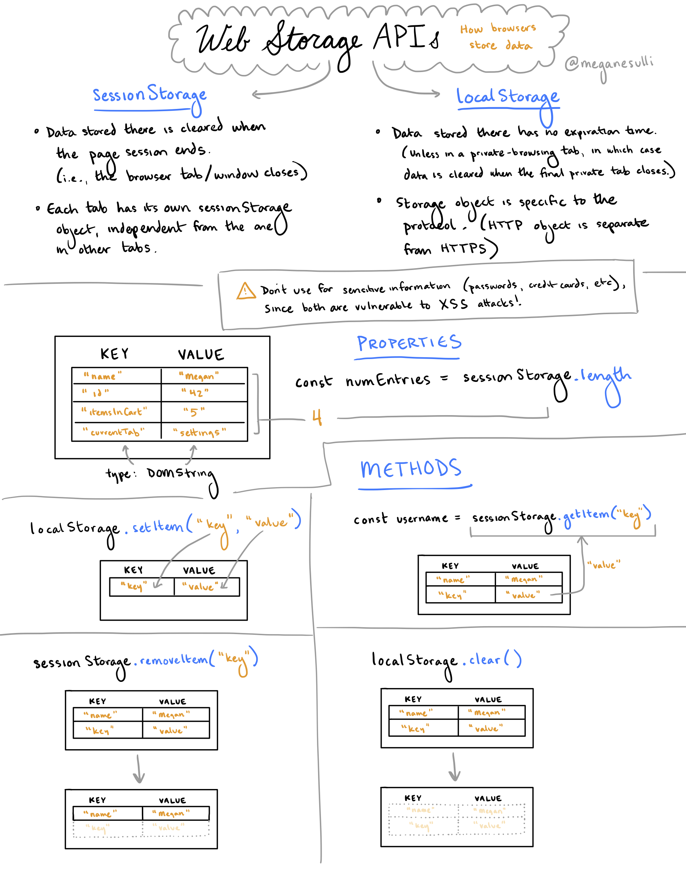

Browsers have two built-in ways to store data: `sessionStorage` and `localStorage`.

> ⚠️ Don't use either for sensitive information (passwords, credit cards, etc.), since both are vulerable to XSS attacks!

## `sessionStorage`

* Data stored there is cleared when the page session ends (i.e., the browser tab/window closes).
* Each tab has its own `sessionStorage` object, independent from the one in other tabs.

## `localStorage`

* Data stored there has no expiration time.
    * **Exception**: If you're in a private tab, then `localStorage` is cleared when the last private tab is closed.
* Storage object is specific to the protocol. (HTTP object is separate from HTTPS.)

## Common API

`sessionStorage` and `localStorage` both implement the [Storage interface](https://developer.mozilla.org/en-US/docs/Web/API/Storage).

Both objects contain a key-value store, which is where data is kept. The keys and values are both type [`DOMString`](https://developer.mozilla.org/en-US/docs/Web/API/DOMString).

### Properties

* `.length` - The number of entries in the Storage object's key-value store.
    ```javascript
    const numEntries = sessionStorage.length
    ```

### Methods

* `.setItem(key, value)` - Adds the key-value pair to the store.
    ```javascript
    localStorage.setItem("key", "value")
    ```
* `.getItem(key)` - Retrieves the value for the specified key. (Returns `null` if the key doesn't exist.)
    ```javascript
    const username = sessionStorage.getItem("key")
    ```
* `.removeItem(key)` - Removes the key-value pair for the specified key. (If the key doesn't exist, nothing happens.)
    ```javascript
    sessionStorage.removeItem("key")
    ```
* `.clear()` - Removes all key-value pairs from the store.
    ```javascript
    localStorage.clear()
    ```

## Additional Resources

* [`Window.sessionStorage`](https://developer.mozilla.org/en-US/docs/Web/API/Window/sessionStorage)
* [`Window.localStorage`](https://developer.mozilla.org/en-US/docs/Web/API/Window/localStorage)
