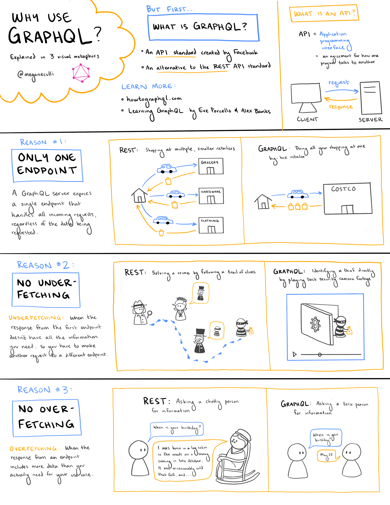

## Introduction

Since I started working at [Gatsby](https://gatsbyjs.com), I've been learning more about [GraphQL](https://graphql.org/). One resource that has been really helpful is [How To GraphQL](https://www.howtographql.com/).

I made a sketchnote based on my current understanding of their video: [GraphQL is the better REST](https://www.howtographql.com/basics/1-graphql-is-the-better-rest/). The rest of this post describes the content of the sketchnote.

## But First... What is GraphQL?

* An **API standard** created by Facebook.
* An alternative to the [REST](https://www.ibm.com/cloud/learn/rest-apis) API standard.

> ### What is an API?
>
> **API** stands for "application programming interface." It's an agreement for how one program talks to another.
>
> One program (the **client**) sends a **request** to another application (the **server**) to ask for information. The server sends a **response** with the requested data back to the client.

## Why Use GraphQL?

### Reason #1: Only One Endpoint

A GraphQL server exposes a single endpoint that handles all incoming requests, regardless of the data being requested.

An analogy:

* REST is like shopping at multiple, smaller retailers. You have to make multiple trips to different stores to buy all the things you need.
* GraphQL is like doing all your shopping at one big-box retailer (like Costco). You can make a single trip to buy everything you're looking for in one place.

### Reason #2: No Underfetching

**Underfetching:** When the response from the first endpoint doesn't have all the information you need, so you have to make another requst to a different endpoint.

An analogy:

* REST is like solving a crime by following a trail of clues. Each clue on its own isn't enough to solve the mystery: you have to put them all together to get the final answer you're looking for.
* GraphQL is like identifying a thief directly by playing back security camera footage. You can get the information you're looking for in one step.

### Reason #3: No Overfetching

**Overfetching:** When the response from an endpoint includes more data than you actually need for your use case.

An analogy:

* REST is like asking a chatty person for information. You ask them, "When is your birthday?" and they start telling you their entire life story.
* GraphQL is like asking a terse person for information. You ask them, "When is your birthday?" and they tell you a date. They give you only as much information as you ask for.

## Learn More

* [How To GraphQL](https://www.howtographql.com/)
* [Learning GraphQL](https://www.oreilly.com/library/view/learning-graphql/9781492030706/) by Eve Porcello and Alex Banks