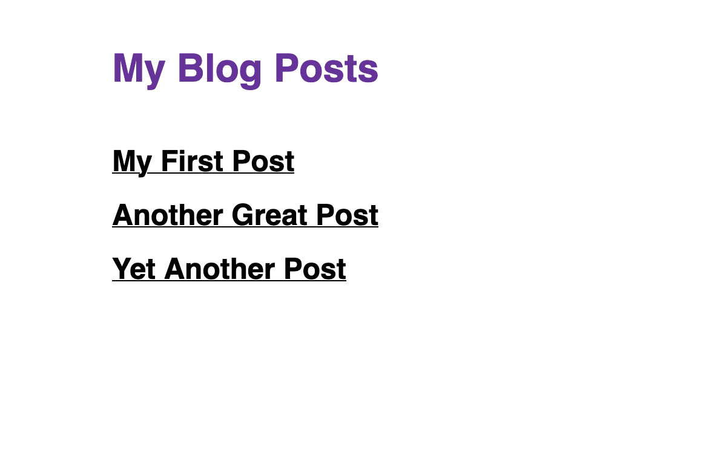

## Introduction

As a content creator, you want to make it easy for your readers to stay up to date with your latest content. By adding an RSS feed to your site, readers can get automatic updates whenever you post a new article, video, or photo of your dog.

In this post, I'll show you how to add an RSS feed to a Gatsby site.

## A Quick Crash Course on RSS Feeds

### What is an RSS feed?

An [RSS feed](https://www.rssboard.org/rss-specification) is a specific kind of XML file. (The structure looks similar to HTML, but it uses different kinds of elements.)

RSS feeds contain a few special elements:

* `<channel>` - Contains information about your overall site, like the URL where it's hosted. Also contains one or more `<item>` elements. Each RSS feed contains a single `<channel>` element.
* `<item>` - Contains information about a single unit of content on your site, like a specific blog post or video. You'll have multiple `<item>` elements - one for each piece of content on your site.

### How does an RSS feed work?

Here's a brief overview:

1. You add the RSS feed to your site. You also add a link to it somewhere on your site (maybe the header or footer) to make it easy for users to find.
1. A reader decides they love your content and want to get updates from your site. (Hooray!) They add the URL to your RSS feed to whatever **feed aggregator** software they use (like Feedly). The feed aggregator checks your RSS feed periodically to see if there's any new content.
1. Time goes by. When you post a new piece of content, your RSS feed gets updated to include a new `<item>` element with information about the new content.
1. The next time your reader's feed aggregator checks your site's RSS feed, it sees the new content and notifies the reader. The reader checks out your new content and thinks about how handy it is that your site has an RSS feed!

The best part is, once you set up your RSS feed, all the updates happen automatically! 🥳

## Prerequisites

In this post, you'll learn specifically how to add an RSS feed to an existing Gatsby site.

If you don't have a Gatsby site on your own, that's fine! I created some starter code that you can use to follow along. (I won't tell.) More on how to get started in the next section.

If you'd rather follow along with your own Gatsby site, you should have your own basic blog set up, with separate pages for each post. The starter code uses the `gatsby-transformer-remark` plugin to query for Markdown nodes, but if your blog posts use something besides Markdown you can make adjustments to the GraphQL queries specified in this post.

## The Starter Code

Introduce the starter project: https://github.com/meganesu/gatsby-blog-with-rss-feed-example

This is a simple Gatsby blog. Posts are written in Markdown and stored in the `src/blog` directory.

To get the site up and running locally:

1. Fork the [starter project repo](https://github.com/meganesu/gatsby-blog-with-rss-feed-example) on GitHub.
1. Clone your forked repo. (Don't forget to swap out `<your-github-username>` for your own GitHub username.)
   ```shell
   git clone https://github.com/<your-github-username>/gatsby-blog-with-rss-feed-example.git
   ```
1. In your terminal, change directories into the repo you just cloned.
   ```shell
   cd gatsby-blog-with-rss-feed-example
   ```
1. Build the site and start up a local server:
   ```shell
   npm run build && npm run serve
   ```
1. In a web browser, navigate to `localhost:9000`. You should see something like this:
   

**TODO:** Details/Summary explaining how the starter code works. (For people who are new to the Filesystem Route API and aren't familiar with the syntax of the filename or the `gatsbyPath` field.)

## Add an RSS Feed

The high-level process for adding an RSS feed to your Gatsby site looks like this:

* **Prerequisite:** Confirm that you have `siteMetadata` set up in your `gatsby-config.js` file.
* **Step 1:** Install `gatsby-plugin-feed`.
* **Step 2:** Configure `gatsby-plugin-feed` in your `gatsby-config.js` file.
* **Step 3:** Build and serve your site locally to test the RSS feed.
* **Step 4:** (Optional) Add a link to your RSS feed to your site.

> To skip ahead and see the finished product, check out the `solution` branch of the starter code repo.

### Prerequisite: Confirm that you have `siteMetadata`

If you haven't already, you'll need to add a `siteMetadata` object to your `gatsby-config.js` file.

You'll need the following properties:

- `title` - the name of your site
- `siteUrl` - the URL where your site will be hosted once it's deployed
- `description` - a short sentence describing the purpose of your site

This data will be added to the `<channel>` element in your RSS feed.

The starter code shows what this looks like in context:

```javascript
// gatsby-config.js
module.exports = {
  siteMetadata: {
    title: "My Personal Blog",
    siteUrl: "https://my-personal-blog.com",
    description:
      "An example Gatsby blog with an automatically generated RSS feed.",
  },
  // ...
}
```

### Step 1: Install `gatsby-plugin-feed`

In your command line, install `gatsby-plugin-feed`.

```shell
npm install gatsby-plugin-feed
```

This will add the plugin to your `package.json` file as a dependency and add it to your `node_modules` folder.


### Step 2: Configure the plugin in your `gatsby-config.js` file

To make your Gatsby site actually use the plugin, you need to add it to the `plugins` array in your `gatsby-config.js` file. (You can add it before or after the existing plugins; it doesn't matter.)

```javascript
// gatsby-config.js
module.exports = {
  siteMetadata: { /* ... */ },
  plugins: [
    {
      resolve: 'gatsby-plugin-feed',
      options: {
        // We'll get to this in a moment
      }
    }
    // The rest of the existing plugins
  ]
}
```

Next, configure the additional options that `gatsby-plugin-feed` needs to generate your RSS feed:

* `query` - the GraphQL query for pulling in data that should be shared across all the RSS feeds generated
    * By default, this will pull in the `siteMetadata`
* `feeds` - an array of feed objects

A feed object has the following properties:

* `title` - (string) the text to put in the `<title>` element of the generated RSS feed
* `output` - (string) the path where you want your generated RSS feed to be hosted
* `query` - (string) a GraphQL query for how to get the data that goes into the feed
* `serialize` - (function) a function specifying what properties to add to the `<item>` elements in the RSS feed

#### Configuring `options.query` and `feed.query`

You may have noticed that there are two different `query` attributes in the plugin configuration: one under `options` and one in an individual feed object. Why are there two?

Imagine if you wanted to generate multiple RSS feeds for your site. For example, maybe you want one RSS feed for your blog posts and a separate RSS feed for your videos. Some of the data for your RSS feed will be the same in both cases (like the metadata for your site), but other data will be different (like the content of each `<item>` element in your feed).

The `options.query` will be included in all of your RSS feeds, while the `query` field on a feed object will only be used for that specific feed.

Now let's put this into practice!

The query to pull in your shared site metadata will look like this:

```javascript
`
{
  site {
    siteMetadata {
      title
      description
      siteUrl
      site_url: siteUrl
    }
  }
}
`
```

And the query to pull in your blog data for your feed will look like this:

```javascript
`
{
  allMarkdownRemark(sort: {fields: frontmatter___date, order: ASC}) {
    nodes {
      frontmatter {
        title
      }
      html
      slug: gatsbyPath(filePath: "/{MarkdownRemark.frontmatter__title}")
    }
  }
}
`
```

Once you've added these two queries to your configuration, your `gatsby-config.js` file should look like this:

```javascript
// gatsby-config.js
// ...
{
  resolve: "gatsby-plugin-feed",
  options: {
    query
    // ...
  }
}
```

> If you're new to GraphQL, you can start up your site in develop mode and use the GraphiQL explorer at `localhost:8000/___graphql` to see what queries you have available to you.

#### Configuring `serialize`

### Step 3: Build and serve your site locally to test the RSS feed

The `gatsby-plugin-feed` plugin only generates an RSS feed for production-style builds. To test your RSS feed locally, you'll have to build and serve your site by running the following command:

```shell
npm run build && npm run serve
```

Once your site is up and running, you should be able to see it in a web browser at `localhost:9000`.

You can check your RSS feed by visiting `localhost:9000/rss.xml` (or whatever you set the `output` configuration to be).

The generated RSS feed should look something like this:

```xml
[INSERT HERE]
```

And you're done! Commit your changes.

### Step 4: (Optional) Add a link to your RSS feed to your site

Now that you've done all this work to generate and RSS feed for your site, it's time to make it discoverable by your readers! (This step is optional, although it's probably a good idea if you want people to actually use your RSS feed.)

Add a link to your RSS feed to the blog page. (Header or footer?)

Test your link by killing your local server and restarting it. (Production builds don't do hot reloading, so you need to restart the server to see your changes.)

You could test the link using the development server (npm run develop), but the RSS feed doesn't get generated for dev builds, so you'll get a 404 when you try to visit the URL.

Congratulations! Now, the next time you deploy your site, you should be able to visit `<your-domain>/rss.xml` (or whatever you configured `output` to be) and see your own RSS feed.

---

1. The error from the previous step occurs because the default GraphQL query used by `gatsby-plugin-feed` expects your MarkdownRemark nodes to have a fields.slug property. If you use graphiql to look at the properties available, you'll see that there is no `fields.slug` property available.

   At this point, you have two options:

   - You can add a `fields.slug` property using the `onCreateNode` API in a new `gatsby-node.js` file.
   - You can override the GraphQL query that `gatsby-plugin-feed` uses to create your RSS feed.

   In this particular case, since you're going to end up customizing the `gatsby-plugin-feed` options later on anyway, you might as well override the query as well.

1. Test it out again by doing another prod build.

   ```shell
   gatsby build && gatsby serve
   ```

   This time, it should build successfully.

1. Open the site in a web browser and check out your generated RSS feed. The default path for the feed will be `localhost:9000/rss.xml`.
1. Customize the feed! I wanted to get rid of THE weird "content:encoded" field. (Don't want the full post text in the RSS feed!)
   Use `serialize` feed option
1. Do another prod build and look at the final RSS feed.

> Don't forget to commit your changes once you're done!

## Troubleshooting Errors

To help troubleshoot, here are some of the errors I ran into as I was implementing this on my own site, as well as the solution for how I fixed the problem:

<details>
  <summary>
    Cannot query field "siteUrl" on type "SiteSiteMetadata".
  </summary>

**The Error Message:**

```shell
     ERROR #11321  PLUGIN

    "gatsby-plugin-feed" threw an error while running the onPostBuild
    lifecycle:

    Cannot query field "siteUrl" on type "SiteSiteMetadata".

    GraphQL request:7:11
    6 |           description
    7 |           siteUrl
      |           ^
    8 |           site_url: siteUrl, Cannot query field "siteUrl" on type
     "SiteSiteMetadata".

    GraphQL request:8:11
    7 |           siteUrl
    8 |           site_url: siteUrl
      |           ^
    9 |         }
```

**The Underlying Problem:** Your site doesn't have site metadata, which the default query in `gatsby-plugin-feed` expects there to be.

**The Solution:** Add site metadata to your `gatsby-config.js` file. See [Prerequisite: Confirm that you have `siteMetadata`](#prerequisite-confirm-that-you-have-sitemetadata).

</details>

<details>
  <summary>
    Cannot query field "fields" on type "MarkdownRemark".
  </summary>

**The Error Message:**

```
ERROR #11321  PLUGIN

"gatsby-plugin-feed" threw an error while running the onPostBuild
lifecycle:

Cannot query field "fields" on type "MarkdownRemark".

GraphQL request:16:15
15 |               }
16 |               fields {
   |               ^
17 |                 slug
```

**The Underlying Problem:** Your blog posts don't have a slug field. The default GraphQL query used by `gatsby-plugin-feed` expects your MarkdownRemark nodes to have a `fields.slug` property. (You can use the GraphiQL explorer to manually inspect the available fields on the MarkdownRemark query and confirm that `fields.slug` is not available.)

**The Solution:** In your configuration for `gatsby-plugin-feed` (in the `gatsby-config.js` file), use the `feed.query` field to write a new query.

</details>

## Wrap It Up

Now that you've added an RSS feed to this sample blog site, try adding one to your own Gatsby site. Let me know how it goes!

Want to be notified when I write new content? You can subscribe to the [RSS feed for my own blog](/rss.xml), or you can [follow me on Twitter](https://twitter.com/meganesulli). See you around!

## Additional Resources

- [Gatsby How-To Guide: Adding an RSS Feed](https://www.gatsbyjs.com/docs/how-to/adding-common-features/adding-an-rss-feed/)
- [`gatsby-plugin-feed` README](https://www.gatsbyjs.com/plugins/gatsby-plugin-feed/)
- [How do RSS Feeds Work](https://rss.com/blog/how-do-rss-feeds-work/)
- [What is RSS](https://rss.softwaregarden.com/aboutrss.html): Intro to RSS feeds and RSS aggregators
- [RSS Specification](https://www.rssboard.org/rss-specification)
