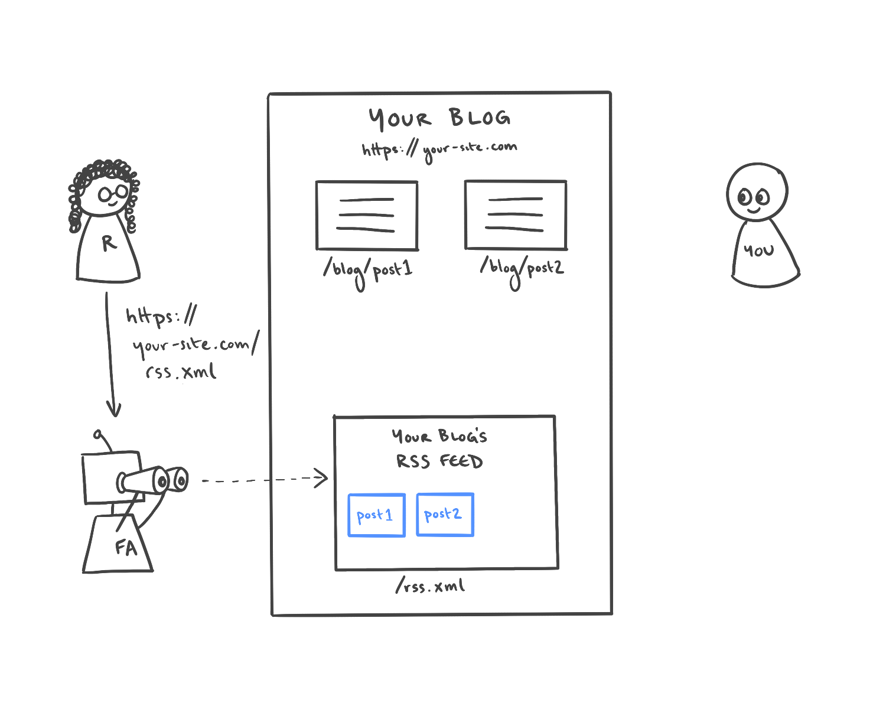
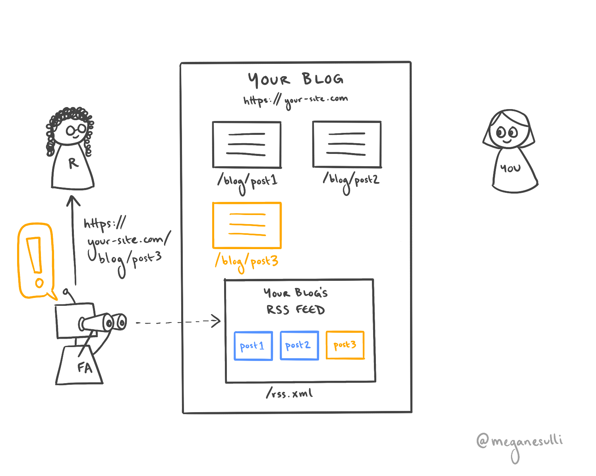

## Introduction

RSS feeds are a great low-lift way to keep your readers up to date with your latest content. But what actually is an RSS feed? And how do people use them?

In this post, I'll explain the basics of how RSS feeds work.
## What is an RSS feed?

RSS stands for "really simple syndication."

In publishing, syndication means sharing your content with other websites or platforms. Those publishers share your work with their readers, which helps grow your audience.

In web development, an RSS feed is a special file you add to your site that describes each piece of content on your site. Other programs can read your RSS feed and send automatic updates to your readers when you write a new post.

Under the hood, an RSS feed is a specific kind of [XML](https://developer.mozilla.org/en-US/docs/Web/XML/XML_introduction) file. The structure looks similar to HTML, but it uses different kinds of elements.

The two main RSS elements are:

* `<channel>` - Contains information about your overall site, like the URL where it's hosted. Each RSS feed has a single `<channel>` element, which contains one or more `<item>` child elements.
* `<item>` - Contains information about a single unit of content on your site, like a specific blog post or video. You'll have several `<item>` elements - one for each piece of content on your site.

> Looking for more details about the structure of an RSS feed? Here's the formal [RSS specification](https://www.rssboard.org/rss-specification).

## How do people use RSS feeds?

### Initial Scenario

You have a blog site that you run: `https://your-site.com`. Your blog has multiple posts, which live at paths like `/blog/post1` or `/blog/post2`.

Your site also has an RSS feed, which lives at `/rss.xml`. The RSS feed contains information about each of your posts, including the title, the publish date, and the URL where it lives.

### Step 1

A reader reads one of the posts on your site and enjoys it.

### Step 2

The reader decides they like your content so much that they want to get updated when you post new things. They find the URL to your RSS feed on your site, and they add it to their **feed aggregator** software of choice (e.g., [Feedly](https://feedly.com/)).

The feed aggregator periodically checks your RSS feed to see if there's any new content.

### Step 3

Time goes by. You write a new blog post, which gets added as a new page on your site. Your RSS feed gets updated to include another item with information about your new post.

### Step 4

The next time the reader's feed aggregator checks your RSS feed, it sees that there is new content. It sends a notification to the reader, including the data from the new post's item in your RSS feed (e.g., title, date, URL).

### Step 5

The reader clicks on the link in the feed aggregator's notification. They're taken to your new blog post, which they read happily.

Repeat steps 3-5 indefinitely.

## Wrap It Up

I hope this was a helpful introduction to RSS feeds. Looking for more specifics on how to generate an RSS feed for your site? I wrote a guide on [how to add an RSS feed to a Gatsby site](/blog/gatsby-rss-feed).

If you're interested in getting updates on my new content, you can subscribe to the [RSS feed for my personal site](/rss.xml). If you want cute photos of my dog, Clifford, you can [follow me on Twitter](https://twitter.com/meganesulli).