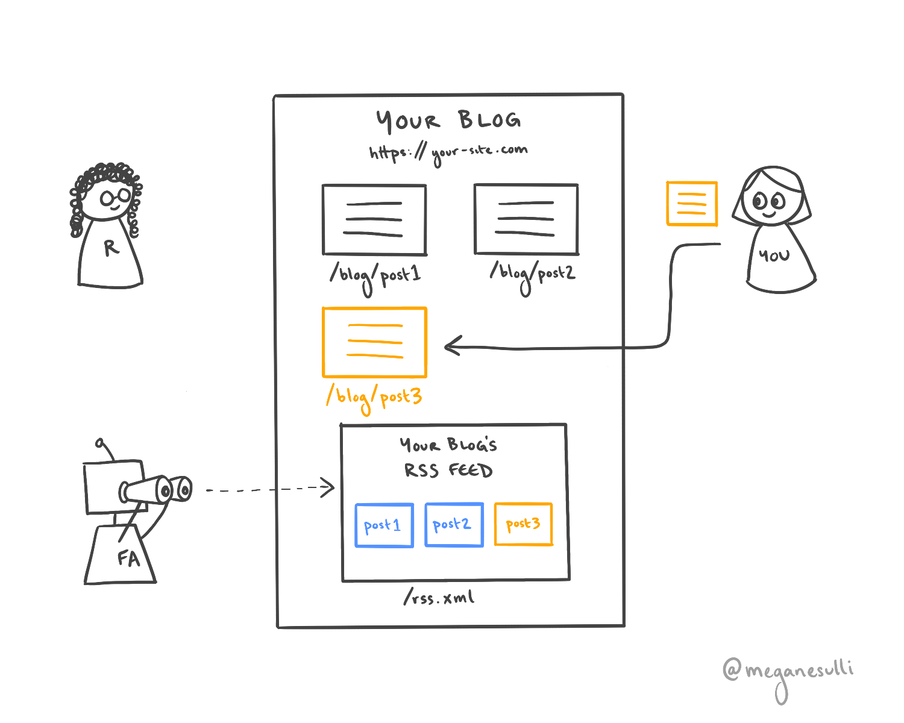
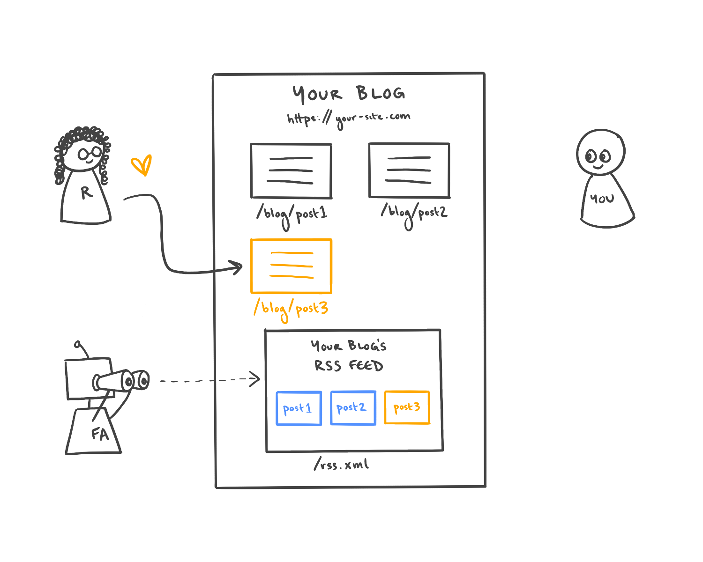

## Introduction

RSS feeds are a great low-lift way to keep your readers up to date with your latest content.

Not sure how they work? This post explains the basics. (With pictures!)

## What is an RSS feed?

## How do people use RSS feeds?

### Initial Scenario

You have a blog site that you run: `https://your-site.com`. Your blog has multiple posts, which live at paths like `/blog/post1` or `/blog/post2`.

Your site also has an RSS feed, which lives at `/rss.xml`. The RSS feed contains information about each of your posts, including the title, the date it was posted, and the URL where it lives.

### Step 1

A reader reads one of the posts on your site and enjoys it.

### Step 2

The reader decides they like your content so much that they want to get updated when you post new things. They find the URL to your RSS feed on your site, and they add it to their **feed aggregator** software of choice (e.g., [Feedly](https://feedly.com/)).

The feed aggregator periodically checks your RSS feed to see if there's any new content.

### Step 3

Time goes by. You write a new blog post, which gets added as a new page on your site. Your RSS feed gets updated to include another item with information about your new post.

### Step 4

The next time the reader's feed aggregator checks your RSS feed, it sees that there is new content and notifies the reader. The notification includes data from the new post's item in your RSS feed (e.g., title, date, URL).

### Step 5

The reader clicks on the link in the notification from the feed aggregator, and they happily read your new post.

Repeat steps 3-5 indefinitely.

## Wrap It Up

I hope this was a helpful introduction to RSS feeds. Looking for more specifics on how to generate an RSS feed for your site? I wrote a guide on [how to add an RSS feed to a Gatsby site](/blog/gatsby-rss-feed).

If you're interested in getting updates on my new content, you can subscribe to the [RSS feed for my personal site](/rss.xml), or you can [follow me on Twitter](https://twitter.com/meganesulli).