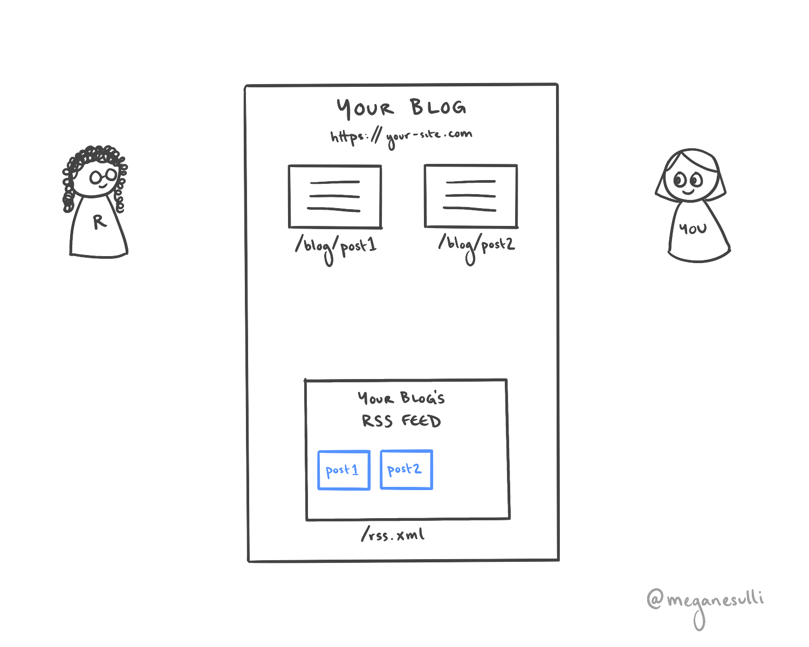
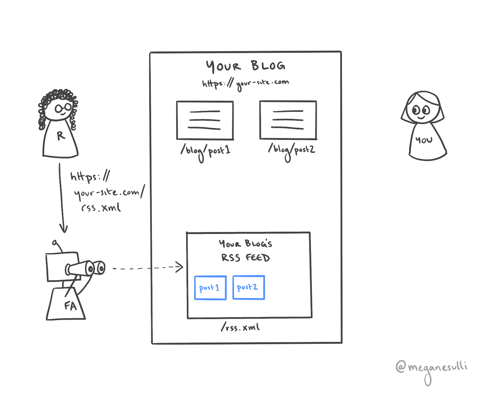

## Introduction

RSS feeds are a great low-lift way to keep your readers up to date with your latest content. But what actually is an RSS feed? And how do people use them?

In this post, I'll explain the basics of how RSS feeds work.
## What is an RSS feed?

RSS stands for "really simple syndication."

In publishing, syndication means sharing your content with other websites or platforms. Those publishers share your work with their readers, which helps grow your audience.

In web development, an RSS feed is a special file you add to your site that describes each piece of content on your site. Other programs can read your RSS feed and send automatic updates to your readers when you write a new post.

Under the hood, an RSS feed is a specific kind of [XML](https://developer.mozilla.org/en-US/docs/Web/XML/XML_introduction) file. The structure looks similar to HTML, but it uses different kinds of elements.

The two main RSS elements are:

* `<channel>` - Contains information about your overall site, like the URL where it's hosted. Each RSS feed has a single `<channel>` element, which contains one or more `<item>` child elements.
* `<item>` - Contains information about a single unit of content on your site, like a specific blog post or video. Your feed will have several `<item>` elements - one for each piece of content on your site.

> Looking for more details about the structure of an RSS feed? Here's the formal [RSS specification](https://www.rssboard.org/rss-specification).

You can give readers access to your RSS feed in a few different ways:

* You can add an `<a>` tag someplace where readers will easily find it, like in your site's header or footer.
* You can add a `<link>` element to the `<head>` of your site, which will make your feed autodiscoverable by some browsers.

> Interested in more implementation details? Check out the "Telling People About Your Feed" section of this [RSS Tutorial by Mark Nottingham](https://www.mnot.net/rss/tutorial/).

## How do people use RSS feeds?

### Initial Scenario

Imagine you have a blog site that you run: `https://your-site.com`. Your blog has multiple posts, which live at paths like `/blog/post1` or `/blog/post2`.

Your site also has a page for your RSS feed, which lives at `/rss.xml`. The RSS feed contains information about each of your posts, including the title, the publish date, and the URL where it lives.

### Step 1

A reader finds your blog. They read one of the posts and enjoy it.

### Step 2

The reader decides they like your content so much that they want to get updated when you post new things. They find the URL to your RSS feed, and they add it to their **feed aggregator** software of choice (e.g., [Feedly](https://feedly.com/)).

The feed aggregator then checks your RSS feed periodically to see if there's any new content.

### Step 3

Time goes by. You write a new blog post, which gets added as a new page on your site. Your RSS feed gets updated to include another item with information about your new post.

### Step 4

The next time the reader's feed aggregator checks your RSS feed, it sees that there is new content. It sends a notification to the reader, including the data from the `<item>` element for your new post (e.g., title, date, URL).

### Step 5

The reader clicks on the link in the feed aggregator's notification. They're taken to your new blog post, which they read happily.

Steps 3-5 repeat indefinitely.

## Why use an RSS feed?

Some readers want to stay on top of content from their favorite creators but don't want to sign up for a million email newsletters. With an RSS feed aggregator, they can keep track of all the updates from their favorite content creators in one place, without giving up their email address.

As a content creator, adding an RSS feed to your site is a low-lift way for you to let readers know as soon as you publish something new. Once you do the initial setup work, readers can get automatic updates without any extra effort on your end.

## Wrap It Up

I hope this was a helpful introduction to RSS feeds. Looking for more specifics on how to generate an RSS feed for your site? I wrote a guide on [how to add an RSS feed to a Gatsby site](/blog/gatsby-rss-feed).

If you're interested in getting updates on my new content, you can subscribe to the [RSS feed for my personal site](/rss.xml). If you want random musings and cute photos of my dog, Clifford, you can [follow me on Twitter](https://twitter.com/meganesulli).

## Additional Resources

* [RSS Specification](https://www.rssboard.org/rss-specification)
* [RSS Tutorial by Mark Nottingham](https://www.mnot.net/rss/tutorial/)
* [How Do RSS Feeds Work? (RSS.com)](https://rss.com/blog/how-do-rss-feeds-work/)
* [What is RSS? (Software Garden, Inc.)](https://rss.softwaregarden.com/aboutrss.html)