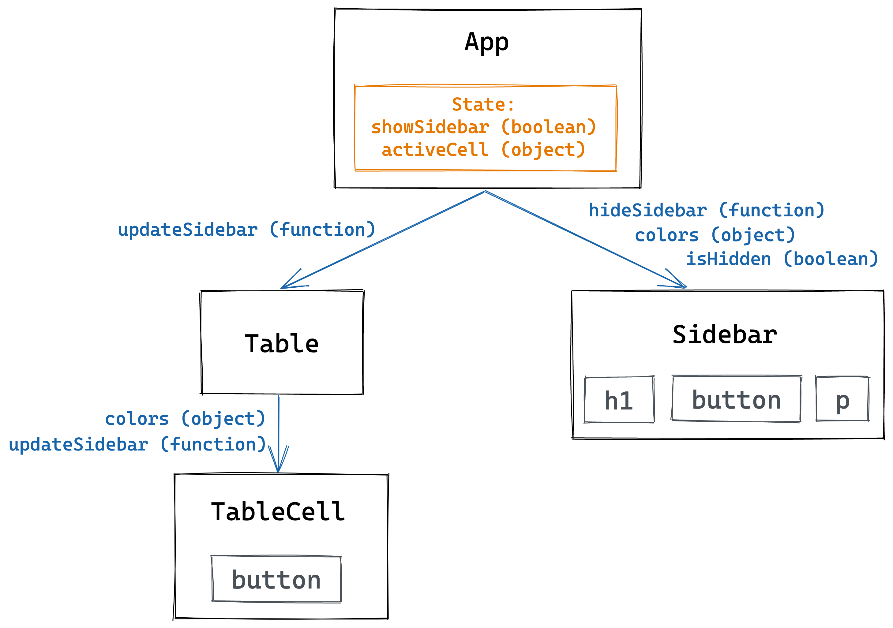

## What You Will Learn

By the end of this article, you will be able to:

* Explain what focus management is and why it's important.
* Use React `ref` to programmatically move focus.
* Write a Jest test to check focus management behavior.

## Prerequisites

In order to get the most out of this article, you should already know the basics of how React works. (If the words "component," "state," and "props" all sound familiar, you should be good.)

Here are some resources to help you get up to speed:

* Check out Ali Spittel's post, [A Complete Beginner's Guide to React](https://dev.to/aspittel/a-complete-beginners-guide-to-react-2cl6).
* New to the `useState` hook? Check out Christina Gorton's post, [React Hooks: useState](https://dev.to/coffeecraftcode/react-hooks-usestate-3hfo).

## The Problem

Not everyone who uses a computer can use a mouse. Some users rely on keyboards or assistive technologies like screen readers to navigate websites. As web developers, it's our responsibility to make sure our products are accessible to all users. That means we need to make sure that a user's keyboard focus moves around the page in a way that makes sense.

In this post, we're going to learn about how to programmatically manage a user's focus. To get some hands-on practice, we'll be improving the accessibility of a sample project that I've created. The starter code for the project is in the CodePen below. If you learn better by doing, you can fork the project and follow along as we go. 

The main content of the starter project is a table that shows what color you get when you mix two other colors. It's a simplified version of a project I built recently, a [table of all the Game Boy opcodes](/generate-gb-opcodes). (For more background on that project, check out this article I wrote: [Meet the Game Boy Instruction Set](/blog/game-boy-opcodes).) Each cell in the table has a button. Clicking a button 1) opens a sidebar and 2) updates the text in the sidebar based on which button was clicked.

Try using your keyboard to click some of the buttons inside the table, and see what happens to your focus. You can use the Tab key to move your focus between elements, and you can press the Space or Enter keys to click the currently focused element. (Note: you might need to click on the table first to get your focus inside the actual CodePen result window.)

<iframe style="width: 100%; border: none; min-height: 400px;" title="Managing Focus in React (no focus management)" src="https://codepen.io/meganesu/embed/preview/OJVXwer?height=265&theme-id=dark&default-tab=result" loading="lazy" allowfullscreen="true" >
  See the Pen <a href='https://codepen.io/meganesu/pen/OJVXwer'>Managing Focus in React (no focus management)</a> by Megan Sullivan
  (<a href='https://codepen.io/meganesu'>@meganesu</a>) on <a href='https://codepen.io'>CodePen</a>.
</iframe>

See how many times you have to press Tab after clicking a button before your focus moves into the sidebar? The current experience might be feasible for a sighted user who is using a mouse to navigate the page. But keyboard or screen reader users will have to move through a frustrating number of elements before they can actually get to the updated sidebar content. This isn't ideal, especially as the number of table cells grows.

## The Requirements

When a user clicks on one of the buttons in the table, their focus automatically moves into the sidebar. Additionally, when a user clicks on the "Close sidebar" button, their focus should automatically go back to the table cell they clicked on in the first place.

The [acceptance criteria](https://existek.com/blog/what-are-acceptance-criteria/) for these two requirements might look something like this:

1. **Given** the sidebar is closed\
**When** I click on a button in a table cell\
**Then** the keyboard focus moves to the header inside the sidebar.

1. **Given** the sidebar is open\
**When** I click on the "Close sidebar" button\
**Then** the keyboard focus moves back to the table cell button.

## A Deep Dive of the Starter Code

> "Cut to the chase, Megan. Where's the code?"
>
> If you want to jump right into implementing focus management, you can skip ahead to the next section: [How to Move Focus in React: `ref`](#react-ref)

Before we start implementing the focus management features, let's get familiar with the structure of the [starter code](https://codepen.io/meganesu/pen/OJVXwer):



Here's a breakdown of all the components fit together:

* **App**: The top-level component, which renders the Table and Sidebar components.
    * The App component keeps track of two state variables:
        * `showSidebar`: a boolean value that is `true` when the sidebar should be open and `false` when it should be closed. The inverse of this value is passed to the Sidebar component as the `isHidden` prop.
        * `activeCell`: an object corresponding to the colors for the TableCell currently displayed in the Sidebar. When the page first loads, this initializes as `null`. This object is passed to the Sidebar component as the `colors` prop.
    * The App component also defines two functions, which get passed down to rendered components as props:
        * `updateSidebar(colors)`: a function that sets App's `activeCell` state variable to the object passed in as `colors`. It also sets App's `showSidebar` state variable to `true`. It gets passed to the Table component as a prop.
        * `hideSidebar()`: a function that sets the value of `showSidebar` in the App state to `false`. It gets passed to the Sidebar component as a prop.
* **Table**: Renders the HTML `table` element and all of the TableCell components.
    * The Table component receives the `updateSidebar` function as a prop from App and passes it down to the TableCell components rendered.
    * The Table component also sets the `colors` objects for each TableCell. (Since this is a small example, the configuration is hard-coded for each TableCell.)
* **Sidebar**: Renders additional details about the currently selected TableCell.
    * This component renders an `h1` element for the title of the sidebar, a `button` element for closing the sidebar, and a `p` element for additional details about the TableCell that was clicked.
    * When the `isHidden` prop from App is `true`, the Sidebar renders with an additional class that "hides" the Sidebar by moving it offscreen. When `isHidden` is false, the class is removed, and the Sidebar becomes visible.
* **TableCell**: Renders the `td` element for an individual cell.
    * Inside the `td` element, there is a `button` element. When this button is clicked, the click event handler calls the `updateSidebar` function from props and passes it the `colors` prop for that cell.

### What Happens When the Sidebar Opens?

Here's a breakdown of how the data flows between components when the sidebar opens:

1. The user clicks on the button in a TableCell, which triggers the button's click event handler.
1. The event handler calls `updateSidebar` with the value of the `colors` prop for that TableCell.
1. The `updateSidebar` function - which is defined in the App component - updates the value of `activeCell` in the App state and sets `showSidebar` in the App state to `true`.
1. This state change causes a rerender of the App component, and the Sidebar component gets new prop values for `colors` and `isHidden`.
1. Since `isHidden` is now false (the opposite of `showSidebar`), the Sidebar component renders without the "hidden" class, and the Sidebar becomes visible to the user.

### What Happens When the Sidebar Closes?

Here's a breakdown of how the data flows between components when the sidebar closes.

1. The user clicks on the "Close sidebar" button in the Sidebar, which triggers the button's click event handler.
1. The event handler calls the `hideSidebar` function that was passed into the Sidebar as a prop.
1. The `hideSidebar` function - which is defined in the App component - sets `showSidebar` in the App state to `false`.
1. This state change causes a rerender of the App component, and the Sidebar component gets a new prop value for `isHidden`.
1. Since `isHidden` is now true (the opposite of `showSidebar`), the Sidebar component renders with the "hidden" class, and the Sidebar slides off the page and out of sight.

<h2 id="react-ref">How to Move Focus in React: <code class="language-text">ref</code></h2>

Now that we know how our starter code works and what we want it to do, we can start implementing our focus management requirements. But how do you move focus in a React app? Enter `ref`.

What is a `ref`? It's short for "reference." It's a way to refer to another element in the DOM.

Normally, in React, information only flows through components in one direction: a parent component passes data down to its children as props. But sometimes, you'll need one component (like the TableCell in our example) to be able to talk to another component in a totally different part of the DOM tree (like the Sidebar). `ref` is React's way of letting you do that.

> **Don't overuse `ref`!**
>
> Just because you can use `ref` to get around the normal React data flow doesn't mean you should use it for everything. The React team identified specific use cases where `ref` comes in handy (like managing focus for accessibility). If your situation doesn't fall under one of those use cases, think carefully about whether there's another way to achieve your goal without using `ref`.

The process for using `ref` looks like this:

1. Create a new `ref` object.
1. Assign that `ref` object to an element in a `render` function.

Let's take a closer look at each of those steps.

### Step 1: Create a new `ref` object

If you're using functional components, you can create a new `ref` object using the `useRef` hook:

```javascript
useRef(initialValue)
```

Usually, you'll just pass in an initial value of `null`.

```javascript
const myRef = useRef(null)
```

> If you're using class components, the syntax looks a little different. You can refer to the [official React docs about `ref`](https://reactjs.org/docs/refs-and-the-dom.html) for the details.

Now you have a variable for the `ref` you created, which you can pass down to child components via props. (We'll take a closer look at how to do that when we start implementing our focus management in the next section.)

But what's actually in that `ref` object? If you log the `myRef` variable to the console, you'll see that it contains an object with a single property called `current`:

```javascript
Object { current: null }
```

The `current` property is what keeps track of the node this `ref` is assigned to. To start, it'll be set to whatever you passed in as `initialValue`. The value of the current property will change when you assign the `ref` to an element. Which leads us to...

### Step 2: Assign the `ref` to an element

First, decide which element you want to connect to your `ref`. In our case, this is going to be the element we want to focus on.

Then, in the place where that element is rendered, add a `ref` attribute, and set it to the variable you created in step 1.

```javascript
return (
  <button ref={myRef}>
    Click me!
  </button>
)
```

Once that component mounts, React will update `myRef.current` to be the DOM element you assigned `myRef` to:

```javascript
Object { current: button }
```

> Now that `myRef.current` is a focusable HTMLElement, you can call its [`focus` method](https://developer.mozilla.org/en-US/docs/Web/API/HTMLOrForeignElement/focus), which will automatically move keyboard focus to that element.

## The Solution: `ref` in Action

Now that we've got a basic understanding of refs, let's see what they look like within the context of our original problem.

### Step 1: Move Focus When the Sidebar Opens

Here's the expected behavior:

1. User clicks on a button in the TableCell in the table.
1. The Sidebar opens, and the user's focus moves to the h3 in the sidebar.

(Create ref inside of App, and pass down to DetailsSidebar)

How to do:

1. In App, create a ref for the sidebar, and pass it down as a prop into Details Sidebar
    ```javascript
    const sidebarRef = useRef(null);
    // In JSX returned:
    <Sidebar
      sidebarRef={sidebarRef}
      // other props
    />
    ```
1. In Sidebar, assign ref to the element we want to focus on when the sidebar opens (the header). Also need to make it focusable (tab index)!
    ```javascript
    const Sidebar = ({ colors, hideSidebar, sidebarRef }) => ( // add sidebarRef prop
      // ...
      <h1
        ref={sidebarRef} // add this
        tabIndex={-1} // add this
      >
        {colors.output}
      </h1>
      // ...
    )
    ```
1. In App, focus on `sidebarRef` in `updateSidebar()` event handler (called when a button in the table cell is clicked, and we want to move focus into the sidebar). Now you should be able to click on (or press enter on) a button in the table and see your focus move to inside the sidebar! Try it out with a keyboard, then try it with a screen reader.
    ```javascript
    const updateSidebar = (colors) => {
      setActiveCell(colors);
      setShowSidebar(true);
      sidebarRef.current.focus();
    };
    ```

Note: need the sidebar to always be rendered for this focus management to work correctly (otherwise, if the sidebar is closed, the sidebarRef isn't assigned to anything (since h1 isn't rendered yet), and on the first click of a cell button, the focus won't move. You'll have to double-click to get focus to move correctly.)

<iframe height="265" style="width: 100%;" scrolling="no" title="Managing Focus in React (move focus on sidebar open only)" src="https://codepen.io/meganesu/embed/preview/jOPMbGX?height=265&theme-id=dark&default-tab=js,result" frameborder="no" allowtransparency="true" allowfullscreen="true">
  See the Pen <a href='https://codepen.io/meganesu/pen/jOPMbGX'>Managing Focus in React (move focus on sidebar open only)</a> by Megan Sullivan
  (<a href='https://codepen.io/meganesu'>@meganesu</a>) on <a href='https://codepen.io'>CodePen</a>.
</iframe>

### Step 2: Move Focus When the Sidebar Closes

1. Click on close button in DetailsSidebar
1. Focus on InstructionCell that was clicked before (create ref inside of InstructionCell button, and pass that ref as param in handleClick function (along with instruction object)).

How to do:

1. Create ref inside of TableCell and assign it to TableCell button element
    ```javascript
    const TableCell = ({ colors, updateSidebar }) => {
      const buttonRef = useRef(null); // add this
      return (
        <td>
          <button
            onClick={() => updateSidebar(colors)}
            ref={buttonRef} // add this
          >
            { colors.output }
          </button>
        </td>
      )
    }
    ```
1. Pass the ref into updateSidebar() when it's called in TableCell onClick handler
    ```javascript
    <button
      onClick={() => updateSidebar(colors, buttonRef)}
      ref={buttonRef} // add this
    >
    ```
1. In App, add state variable for lastCellClicked
    ```javascript
      const [lastCellClicked, setLastCellClicked] = useState(null);
    ```
1. In App updateSidebar() implementation, update lastCellClicked to be buttonRef
    ```javascript
    const updateSidebar = (colors, buttonRef) => {
      setLastCellClicked(buttonRef); // add this
      setActiveCell(colors);
      setShowSidebar(true);
      sidebarRef.current.focus();
    };
    ```
1. In App hideSidebar() implementation, call focus on lastCellClicked (ref of button in TableCell)
    ```javascript
    const hideSidebar = () => {
      setShowSidebar(false);
      lastCellClicked.current.focus();
    };
    ```

And now you're done! Congratulations, you did it! Here's a CodePen with the complete solution (moving focus when the sidebar opens and when it closes):

<iframe height="265" style="width: 100%;" scrolling="no" title="Managing Focus in React (move focus on sidebar open and close)" src="https://codepen.io/meganesu/embed/preview/abOmwbg?height=265&theme-id=dark&default-tab=js,result" frameborder="no" allowtransparency="true" allowfullscreen="true">
  See the Pen <a href='https://codepen.io/meganesu/pen/abOmwbg'>Managing Focus in React (move focus on sidebar open and close)</a> by Megan Sullivan
  (<a href='https://codepen.io/meganesu'>@meganesu</a>) on <a href='https://codepen.io'>CodePen</a>.
</iframe>

## Writing Tests

As with any new functionality, it's a good idea to write tests as you're implementing, so that you can be sure that things work (and continue to work) as you expect them to.

One good tip to keep in mind is that you should test the side effects of your application, not the implementation. When your tests are too closely tied to the exact implementation of your app (for example, they check that a particular function was called), they become brittle. If Future You decides to change the way you implemented that feature, you'll probably end up also needing to change your tests, even though the end users sees the same behavior.

Instead, you should test for side effects - what is it that you're expecting your app to have done by the time the code finishes running? In our case, the scenario we're trying to test looks something like this:

GIVEN the sidebar is closed\
WHEN I click on a button\
THEN the sidebar opens\
AND focus is moved to the header inside the sidebar

### Using Jest v24.9.0

```javascript
let component = mount(<App />);

// Simulate click on table cell button
const instructionCells = component.find('InstructionCell');
instructionCells.first().find('button').simulate('click');

// Check that focus has moved to the 
const focusedSidebarHeader = component.find('#sidebar-header h2');
expect(focusedSidebarHeader.getDOMNode()).toEqual(document.activeElement);
```

Breakdown of what's going on here:
1. `getDOMNode()` comes from Enzyme
1. `document.activeElement` comes from JSDOM (which is one of Jest's dependencies)

### Using Jest v25+

The update from Jest v24 to v25 includes a big jump in JSDOM versions (v11.5.1 to v15.1.1), which you can see in the [Jest changelog](https://github.com/facebook/jest/blob/master/CHANGELOG.md#chore--maintenance-5). For me, when I upgraded my Jest dependency to the latest version (at the time, v25.2.7), my tests for focus management broke.

From what I was able to trace down, this problem was because JSDOM changed the way they treated `document.activeElement`. (To be completely honest, I couldn't figure out what specifically the change was, and I got tired of digging through codebases, so if you have more information on what happened, please reach out and let me know!)

By combing through linked pull requests, I found this solution from a [PR in the Carbon Design System repo](https://github.com/carbon-design-system/carbon/pull/5456/files). Here's the updated test that I wrote by following that PR:

```javascript
let container;

container = document.createElement('div');
container.id = 'container';
document.body.appendChild(container);

component = mount(<App />, {
  attachTo: document.querySelector('#container')
});

const focusedSidebarHeader = component.find('#sidebar-header h2');
expect(focusedSidebarHeader.getDOMNode()).toEqual(document.activeElement);
```

## Next Steps

In this post, you learned about how to manage focus when opening and closing a sidebar, but there are still more improvements that can be made on this design.

The next improvement I'm hoping to make is trapping focus inside the sidebar when it's open. That is, when users have the sidebar open and they repeatedly hit the tab key, their focus should stay inside of the sidebar and not end up back in the rest of the body of the page. I'm planning on using something like the inert polyfill described in this [A11ycasts YouTube Video: Inert Polyfill](https://www.youtube.com/watch?v=fGLp_gfMMGU).

## Resources

The diagrams in this post were created using [Excalidraw](https://excalidraw.com/).

- [React `ref` documentation](https://reactjs.org/docs/refs-and-the-dom.html)
    * This doc is a little out of date (they don't take the `useRef` hook into account), but they're a good introduction to why and when you might use `ref`.
- React `useRef` hook documentation: https://reactjs.org/docs/hooks-reference.html#useref
- React a11y focus control documentation: https://reactjs.org/docs/accessibility.html#focus-control
- Jest Changelog for v25.1.0: https://github.com/facebook/jest/blob/master/CHANGELOG.md#2510
    - Jest PR to update JSDOM: https://github.com/facebook/jest/pull/8851
- JSDOM Changelog: https://github.com/jsdom/jsdom/blob/master/Changelog.md
- JSDOM Issue #2723: https://github.com/jsdom/jsdom/issues/2723
- JSDOM Issue #2586: https://github.com/jsdom/jsdom/issues/2586
- Carbon Design System PR with test changes to work around JSDOM problem: https://github.com/carbon-design-system/carbon/pull/5456/files
- A11ycasts #02: Inert Polyfill: https://www.youtube.com/watch?v=fGLp_gfMMGU
