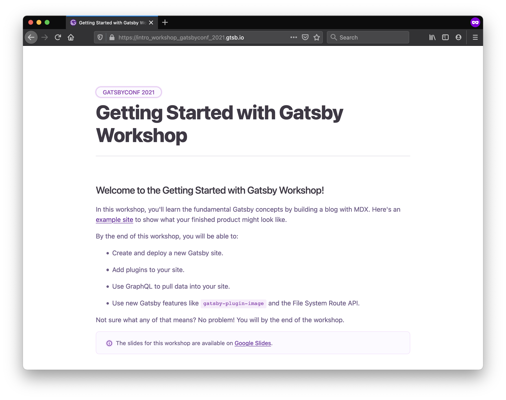

## Introduction

Earlier this month, I co-facilitated a four-hour workshop at GatsbyConf. Although I've led many workshops in the past, this was my first time teaching remotely. Overall, more than 1000 people tuned in, and attendance stayed pretty consistently around 250 participants for the full four hours. There were a few technical hiccups, but in general I think it went pretty well!

In this post, I'll share some strategies we used to design an engaging virtual experience for students, as well as some things I'd do differently next time.

> **Want to watch the workshop recording?** Check it out on YouTube: [Getting Started with Gatsby](https://www.youtube.com/watch?v=231bkZnebvo).
>
> Fair warning: there are some technical difficulties (at the beginning) and lots of sound effects from me (throughout).

// Create a graphic with two columns: before the workshop & during the workshop

## Before the Workshop: Preparation

### Create a curriculum companion site

One of the most impactful decisions we made was to create a [companion website](https://intro_workshop_gatsbyconf_2021.gtsb.io/) so that students could follow along with the workshop curriculum. When you're teaching, just because you say something once doesn't mean that every student will understand and retain it. By having the key points summarized in a curriculum site, students can refer back to the concepts or code snippets at their own pace, even if they missed it in your slides or demos.

Think of the site as a virtual replacement for a textbook or worksheets. You can add as much or as little information as you think students will find helpful. For our workshop, we broke up the curriculum site into different pages - one for each section in the workshop. Each page had two main sections: Background and Exercises.

The **Background** section included explanations of key concepts, code snippets, and links to relevant documentation. This content was largely pulled from the slides, with just enough extra description to put the ideas into context. To avoid overloading students, we only explained concepts that they'd need to be able to complete the exercises for that section.

The **Exercises** section included the prompts for all the student exercises, to help students stay on track. By giving students easy access to the exercise instructions, we avoided repeatedly answering the dreaded question: "What are we supposed to be doing right now?" Each exercise had the following pieces:

- **Instructions** for the exercise.
  - This should include a clear goal. What are students trying to accomplish in this exercise? How will they know when they're done?
- **Hints.**
  - Point students in the right direction, without giving them the exact answer. For example, you could list out the general steps students have to follow to finish the exercise, without telling them exactly what to type.
- **Solution.**
  - Reveal the full solution for the exercise. (In our case, we linked to a specific branch in the [GitHub repo for the example project](https://github.com/meganesu/gatsby-intro-workshop-example-site-with-v3).) If students finish early, they can check their work. Or, if they get stuck, they can use the solution to troubleshoot their own work.
- **Extra-credit challenges.** (Sometimes.)
  - Suggest ways to extend the original exercise. This piece isn't strictly necessary, but it's helpful for students who finish the main exercise early.

> **Tip:** You can use a [`
` element](https://developer.mozilla.org/en-US/docs/Web/HTML/Element/details) to initially hide the contents of the Hints and Solution sections. That way, students who want to challenge themselves can attempt the exercise on their own, while students who want the extra help can still have the information available to them.

If we'd had more time, I would have loved to add pre-recorded videos to each section, where we'd explain key concepts and walk through exercises. That way, students could work through the content at their own pace, and our facilitation could focus more on answering questions and addressing misconceptions. (This style of instruction is called the [flipped classroom model](https://study.com/teach/flipped-classroom.html).)

### Use polls to gauge student engagement

When you're teaching in person, you can read students' facial expressions in real time. You can sense whether the crowd is engaged, confused, or bored, and you can adjust your instruction to accommodate their needs. But when you're teaching remotely and can't see anyone, you have to be more intentional about checking in with your audience.

Polls are a great virtual replacement for "reading the room." With a short multiple-choice question, you can quickly assess whether students are following you or not.

When you're planning your workshop, build in multiple-choice polls strategically, similar to how you'd plan out exercises or examples. You can adjust your poll questions based on what you're hoping to learn about your students. For example, you might want to:

- **Gauge prior knowledge** of a topic. Check how comfortable students already are with a topic before you start teaching.
    - Example Question: "How much prior experience do you have with React?"
        - "This is my first time using it."
        - "I've tried it out but haven't used it extensively."
        - "I'm comfortable using it."
- **Check student progress.** Use these after students have been working on an exercise to see how far they got.
    - Example Question: "How far did you get?"
        - "I created a new site."
        - "I deployed my site."
        - "I got stuck."
- **Check for understanding.** Ask students to self-assess how comfortable they currently feel with the material. Ideally, ask this after a student exercise or question-and-answer session, so that students have had some hands-on time with the concepts.
    - Example Question: "How comfortable are you feeling with writing GraphQL queries?"
        - "I get it!"
        - "I sort of get it."
        - "I don't get it at all."

> **Wondering how to gather student responses?** Some conference hosting platforms have built-in audience polling features. But you can also use a tool like Google Forms or [Slido](https://www.sli.do/) to set up your questions ahead of time.

The way students answer a poll question should directly influence your next action as the instructor. For example, if most students say they didn't complete an exercise, you might decide to give them a few more minutes to work on it. Or, if many students said they weren't very comfortable with the material, you should probably find out what concept confused them and reexplain it with some different examples.

// TODO: Something about cultivating a classroom culture that normalizes making mistakes. Mistakes are opportunities to learn. Students should feel safe messing up and saying "I don't understand." Growth mindset. You can help with this by being excited when people make a mistake ("this means we're about to learn something new!") and/or making mistakes in front of students yourself (and modeling how to act about it).

### Test your **exact** technical setup

I present this cautionary tale, so you can learn from my mistakes:

A few weeks before our GatsbyConf workshop, we had a dress rehearsal to try out the conference-hosting platform with a fake test event. I practiced sharing my screen, audio, and video from my laptop, and everything worked as expected. Then, the night before the conference, I thought, "You know, I should add in an external monitor, so that I can have the chat and my notes open while I share my laptop screen." I'd still be sharing from my laptop, so everything would be fine, right?

Narrator voice: "Everything was _not_ fine."

On the day of the workshop, something about the resolution of my external monitor caused problems with screen sharing. Whenever I changed slides or switched between the presentation and my code editor, a bunch of weird visual artifacts showed up on the screen. Even though my screen looked fine to me, audience members couldn't actually see what I was presenting. And because I didn't see this issue until the actual workshop, my co-facilitator and I had to come up with a workaround on the fly so that we could actually teach the material. It wasn't ideal, and it significantly slowed down the initial pace of the workshop. Luckily, during one of the breaks, another teammate in the chat was able to help us troubleshoot and get us back on track (huge shoutout to Laurie Barth!).

The moral of this story is to test out your *exact* technical setup ahead of time, so that you don't have to fight with your technology on the day of the event. This includes monitors, microphones, headphones, internet connection, keyboards, lighting - any of the moving pieces that you're planning to use in the actual workshop.

## During the Workshop: Instruction

### Get teammates to help moderate the chat

If possible, have a few extra teammates hang out in the session to act as teaching assistants (TAs) and help moderate the chat. When specific issues come up (e.g., a student gets an unexpected error message), ask the TAs to help them troubleshoot in the chat while you continue teaching. That way, students can get the individualized attention they need without derailing the entire lesson.

I didn't always do a great job at this hand-off in our workshop. Sometimes, a question in chat would catch my eye, and I would stop what I was saying to answer the question myself, instead of passing it on to my other teammates in the chat. As a result, there were a few times when the rest of the students were stuck waiting for me to finish explaining something that wasn't relevant to them.

That's not to say that as the instructor you should never respond to the chat. If you see multiple people asking about the same topic, that's a good indicator that you may need to back up and re-explain something. But in general, try to consider the experience of the entire group before getting too far down a rabbit hole. Ask yourself, "Is answering this question in public going to help unblock enough people that it's worth taking the entire group on this detour?" If the answer is no, ask a TA to help debug, or revisit the question once the rest of the group has started work time for the next exercise.

### Be flexible

I'm a big fan of effective time management. Before all of my workshops, I time how long it takes me to complete each exercise, and I use those times to estimate how long each section will take to teach. When I facilitate, I display [timers](https://www.bigtimer.net/) during work time and breaks, so that students can self-regulate based on how much time they have left.

But in the end, it's also important to know when to throw out the schedule and make adjustments on the fly. If you see that students are confused, it's okay to take a few extra minutes to help them understand the big ideas. Show them another example or explain a concept with a different analogy, even if it means falling a bit behind schedule and skipping one of the later exercises. Personally, I'd rather cover a subset of the planned material with high rates of student understanding than rush to get through everything and lose students along the way.

It can be stressful to think on your feet in the moment, especially if things aren't going as planned. But do your best to stay calm and upbeat. Be kind to yourself. Remember, as the instructor, you're modeling the way students should behave when things go wrong. Show them that it's okay to make mistakes. Every mistake is an opportunity to learn something new. ([Growth mindset](https://www.youtube.com/watch?v=M1CHPnZfFmU)!)

### Bring your enthusiasm!

In my experience, the instructor always sets the upper bound for the group's enthusiasm. This applies to both remote and in-person teachers (and, more generally, leaders of any kind). Students will rarely be more excited about what you're teaching than you are. And even if they start out more excited than you, they're likely to tone down their energy level to meet yours. So it's important to set that bar high from the beginning.

Being an engaging speaker is just as much about *how* you say things as it is about *what* you say. If you sound bored by what you're talking about, odds are your students are also going to be bored and start reaching for their phones. Instead, speak clearly and confidently, in your best "teacher voice." If you feel comfortable showing your personality or incorporating some humor, do it! It might feel a little silly at first, but setting the right tone is especially important for virtual workshops, where it's easier for students to tune out without anyone noticing.

Showing enthusiasm doesn't have to mean being insincerely peppy. If that's not your style, think instead about ways you can highlight what's exciting or game-changing about the subject matter. Why is this topic important? How does it tie into what students already know, and how might it help them in the future?

> **Nervous about public speaking?** This is one way that virtual workshops are easier than in person: you don't have to see everyone! Try to do some calming exercises before the workshop starts, like taking deep breaths or stretching. I personally like doing a quick ["shake down"](https://www.youtube.com/watch?v=HP5qcA3ty1w) to loosen up and boost my energy.

## Things I'd Do Differently Next Time

Overall, I'm reasonably happy with how our GatsbyConf workshop went. But I do want to quickly touch on some changes I'd make the next time around:

- **Overcommunicate expectations about pre-work.**
  - Many of the issues that came up in the first part of the workshop were related to students trying to install the necessary tools. We'd included installation instructions in the workshop description and asked students to complete them ahead of time, but we could have been better about sending out reminders. Next time, I'd want to clearly communicate that we won't be spending time in the workshop helping people troubleshoot their setups. Instead, we could hold an office hours session a few days before the workshop, where folks can drop in and get individualized help with debugging.
- **Set up contingency plans** ahead of time, to unblock workshop attendees who have trouble setting up the tools or project on their own computers.
  - A few days before the workshop, I tried to test out the curriculum on my boyfriend, but he wasn't able to install Gatsby on his laptop, which blocked him from doing the rest of the workshop. I started setting up a CodeSandbox starter project, so that he and other participants could have a controlled environment where they could work on the project without fighting with installers. But I was new to CodeSandbox and couldn't figure it out in time for the workshop. Next time, I'd like to prepare the backup plan in advance.

## Wrap It Up

Teaching a workshop remotely can be a great opportunity to dramatically increase the number of people who see your work. But it also has its own set of unique challenges.

Here's a quick summary of the student engagement techniques outlined in this post:

- Before the workshop...
    - **Create a curriculum site** that students can use to follow along with the content.
    - **Prepare polls** that you can use to gauge student engagement.
    - **Test your _exact_ technical setup** to avoid technical difficulties.
- During the workshop...
    - **Get teammates to help moderate the chat**, to act as teaching assistants and help answer individual student questions.
    - **Be flexible**, and make adjustments to timing and content as needed.
    - **Maintain enthusiasm** to keep students engaged.

Do you have experience teaching remotely? Or have you attended a remote workshop as a student? I'd love to hear what other teaching techniques you've found especially helpful.
