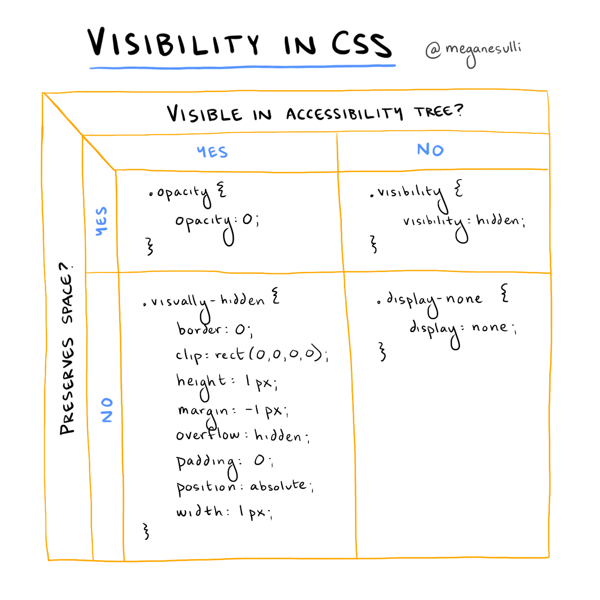

## Introduction

There are multiple ways to toggle visiblity in CSS. Personally, I didn't really understand why you'd choose one approach over another until I took [Marcy Sutton's](https://marcysutton.com/) Frontend Masters course: [Accessibility in JavaScript Applications](https://frontendmasters.com/courses/javascript-accessibility/).

Marcy highlights two considerations when choosing the right approach to hiding an element with CSS:

* **Should it still be visible in the [accessibility tree](https://developer.mozilla.org/en-US/docs/Glossary/Accessibility_tree)?**
    * Yes: The element should be announced by assistive technologies like screen readers.
    * No: The element should not be announced by assistive technologies.
* **Should it preserve space in the [DOM](https://developer.mozilla.org/en-US/docs/Web/API/Document_Object_Model/Introduction)?**
    * Yes: There should be empty space left behind where the element would have been rendered if it were visible.
    * No: The hidden element should get pulled out of the flow of the document entirely.

I drew up this diagram to show which CSS approach to use, depending on your answers to the two questions above:



> **Note:** The class names aren't important, they're just wrappers around the actual CSS properties. You could apply these styles using whatever CSS selector you want.

## Case 1: Visible in Accessibility Tree & Preserves Space

```css
.opacity {
  opacity: 0;
}
```

[Opacity](https://developer.mozilla.org/en-US/docs/Web/CSS/opacity) is a great property to use you want to animate the visibility of an element on your page. For example, you could add an animation to have an element fade in or fade out on the page.

Since opacity preserves space for the element, you don't have to worry about content lower down the page jumping up and down as your element becomes visible or invisible.

## Case 2: Visible in Accessibility Tree & Does _Not_ Preserve Space

```css
.visually-hidden {
	border: 0;
	clip: rect(0,0,0,0);
	height: 1px;
	margin: -1px;
	overflow: hidden;
	padding: 0;
	position: absolute;
	width: 1px;
}
```

To achieve this particular case, you have to use a combination of different CSS properties. An element styled with these properties will be visible to assistive technologies but won't be visible on the rendered page itself.

You might use these styles for screen-reader-only text or for headings that are needed semantically but aren't part of the page's design.

## Case 3: _Not_ Visible in Accessibility Tree & Preserves Space

```css
.visibility {
	visibility: hidden;
}
```

You can use the [visibility](https://developer.mozilla.org/en-US/docs/Web/CSS/visibility) property to hide an element from assistive technologies while still leaving behind empty space for that element on the rendered page.

This might be useful if you need to hide something from users but don't want to mess up the rest of the page layout. MDN uses the example of hiding a single cell in a table without messing up the alignment of the rest of the table cells. (Maybe if you were trying to build a digital periodic table of elements?)

## Case 4: _Not_ Visible in Accessibility Tree & Does _Not_ Preserve Space

```css
.display-none {
	display: none;
}
```

If you want an element to be hidden for both visual users and assistive technology users, you can set the [display](https://developer.mozilla.org/en-US/docs/Web/CSS/display) property to `none`. This will hide both the element and all its descendants from assistive technologies. 

This might be useful for something like hiding the contents of a hamburger menu or modal when it's closed. You don't want the element to be visible on the screen, and you also don't want screen readers to read out the content while it's invisible.

## Wrap It Up

Hopefully this diagram will help the next time you need to visually hide an element on your website. Let me know if there are other CSS techniques you use to toggle visibility!

If you're interested in learning more about how to build accessible JavaScript applications, I highly recommend checking out Marcy's course on Frontend Masters: [Accessibility in JavaScript Applications](https://frontendmasters.com/courses/javascript-accessibility/).

To stay updated on my writing, you can subscribe to the [RSS feed for my blog](/rss.xml), or you can [follow me on Twitter](https://twitter.com/meganesulli). See you around!

## Additional Resources

* [CSS in Action: Invisible Content Just for Screen Reader Users](https://webaim.org/techniques/css/invisiblecontent/) (WebAIM)